# Remove and Install Pull Rod - Stark VARG

Source video: `Remove and Install Pull Rod - Stark VARG` by Stark Future Official

Applicable models: `MX`

## Scope

This guide follows the original Stark Future video overlay sequence for the procedure shown in the original MX tutorial video. Each step below is aligned to the instruction text shown on screen.

## Preparation

- Place the bike on a stable stand or work area before starting the procedure.
- Prepare the correct tools for the fasteners, clips, brackets, and components shown in the video.
- Keep removed hardware organized in sequence so reassembly follows the same order as the video.
- Follow the torque values shown in the original Stark tutorial video wherever the video displays a torque on screen.

## Removal Procedure

### 1. Loosen brake pedal link bolt

Loosen brake pedal link bolt.

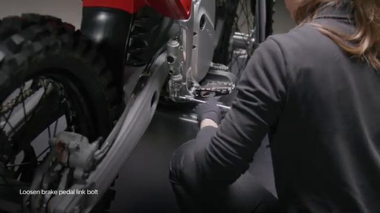

### 2. Hold spring

Hold spring.

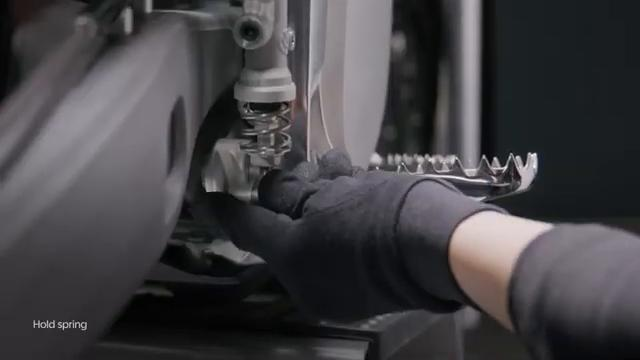

### 3. Remove sway bolt

Remove sway bolt.

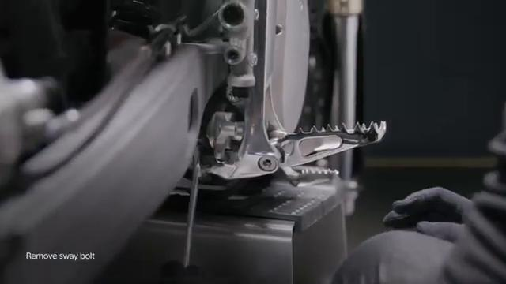

### 4. Remove chain link

Remove chain link.

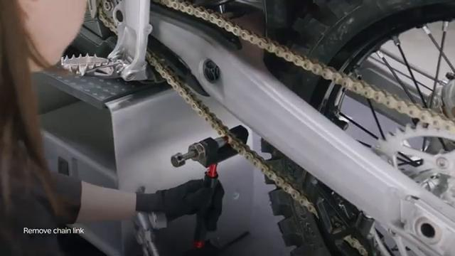

### 5. Remove chain link and release the chain

Remove chain link and release the chain.

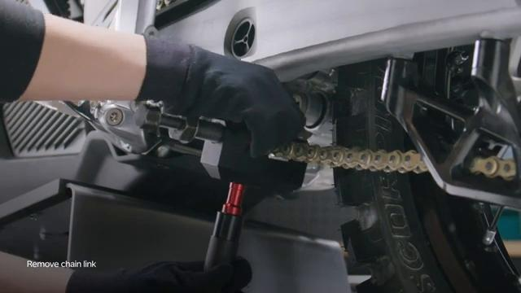

### 6. Run the chain through the front sprocket

Run the chain through the front sprocket.

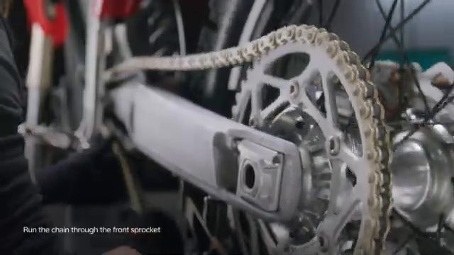

### 7. Loosen chain protector bolt

Loosen chain protector bolt.

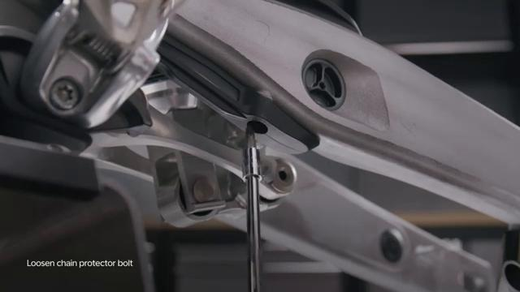

### 8. Remove pull rod lock nuts

Remove pull rod lock nuts.

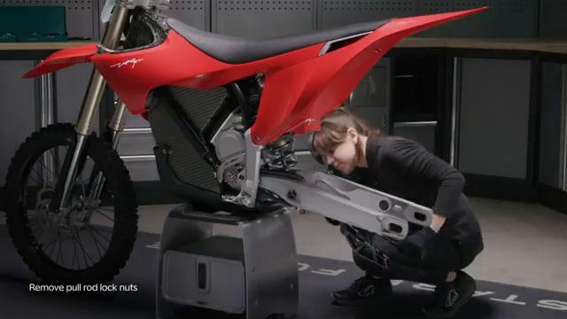

### 9. Start removing the pull rod

Start removing the pull rod.

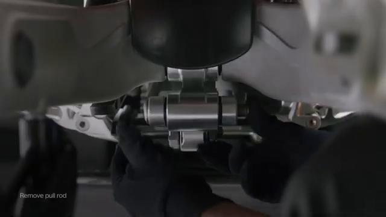

### 10. Remove the pull rod completely

Remove the pull rod completely.

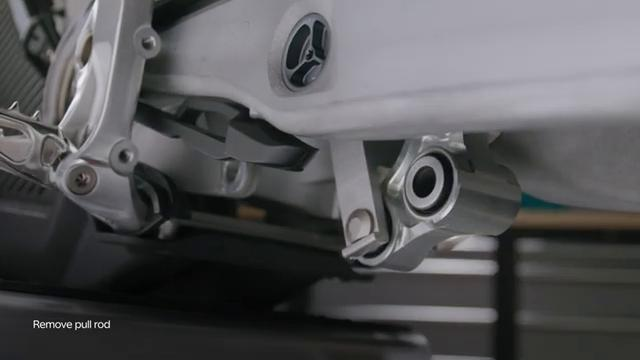

## Installation Procedure

### 11. Hold pull rod in place

Hold pull rod in place.

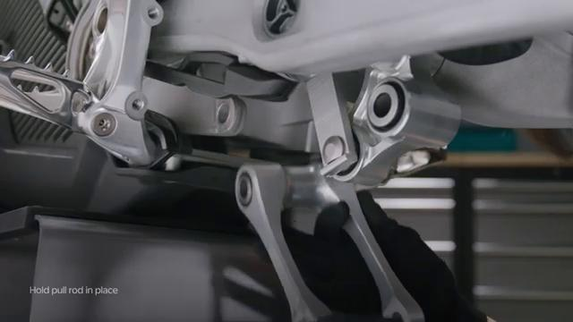

### 12. Insert the bolts

Insert the bolts.

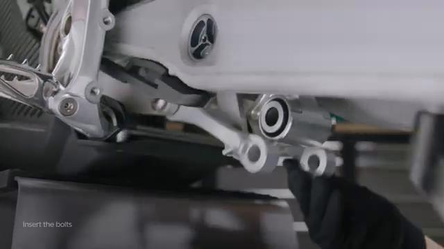

### 13. Tighten the first lock nut to 60 Nm

Tighten the first lock nut to **60 Nm**.

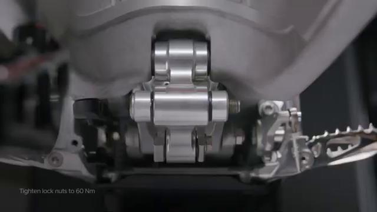

### 14. Tighten the second lock nut to 60 Nm

Tighten the second lock nut to **60 Nm**.

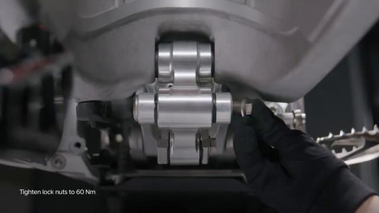

### 15. Route the chain through the front sprocket

Route the chain through the front sprocket.

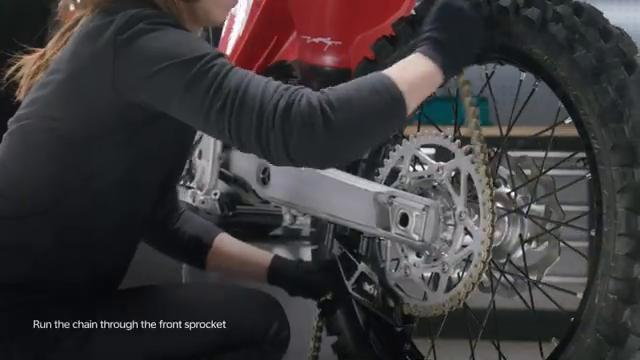

### 16. Install chain link

Install chain link.

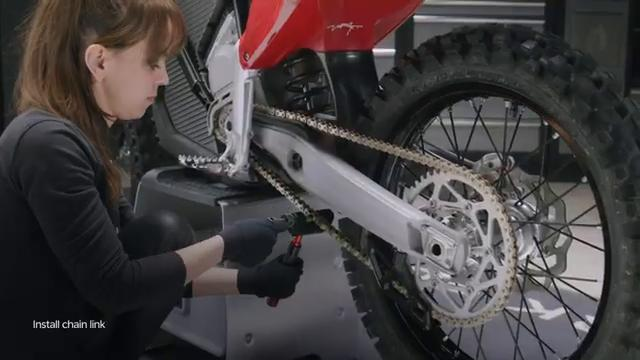

### 17. Install pedal

Install pedal.

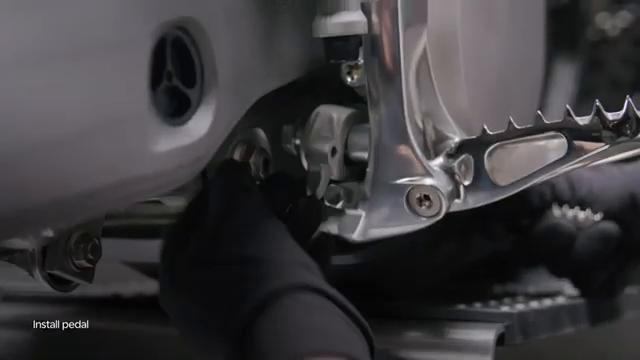

### 18. Tighten sway bolt to 20 Nm

Tighten sway bolt to **20 Nm**.

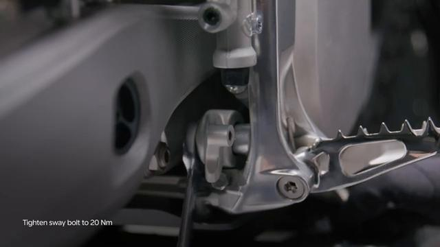

### 19. Install the rear brake pedal link

Install the rear brake pedal link.

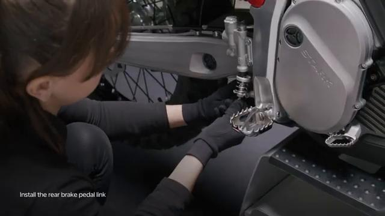

### 20. Tighten the link bolt to 10 Nm

Tighten the link bolt to **10 Nm**.

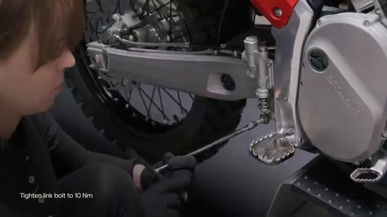

### 21. Recheck the link bolt at 10 Nm

Recheck the link bolt at **10 Nm**.

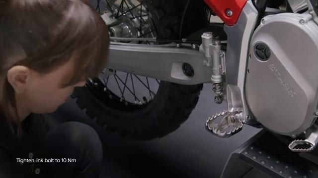

### 22. Check brake operation before operating the bike

Check brake operation before operating the bike.

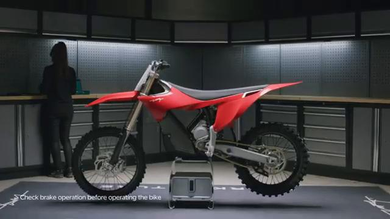

### 23. Perform a final brake operation check before operating the bike

Perform a final brake operation check before operating the bike.

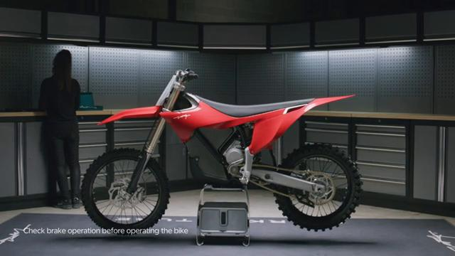

## Torque Summary

| Component | Torque |
| --- | ---: |
| Tighten lock nuts | 60 Nm |
| Tighten sway bolt | 20 Nm |
| Tighten link bolt | 10 Nm |

Verified torque items:

- Tighten lock nuts: **60 Nm** from the original Stark Future tutorial video text overlay.
- Tighten sway bolt: **20 Nm** from the original Stark Future tutorial video text overlay.
- Tighten link bolt: **10 Nm** from the original Stark Future tutorial video text overlay.

## Critical Checks Before Riding

- Confirm the serviced components are fully seated and all fasteners are tightened in the correct order.
- Recheck all torque-critical hardware before riding.
- Make sure all routed cables, clips, brackets, and surrounding parts are returned to their original positions.
- Inspect the bike visually for any missing hardware before returning it to service.
