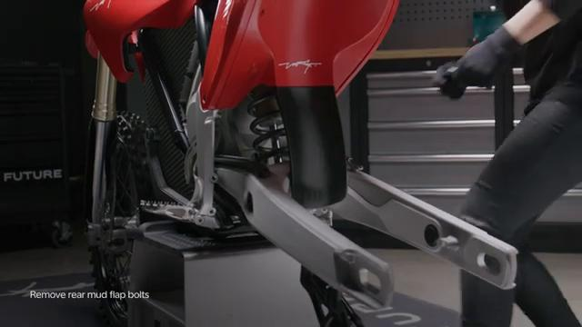
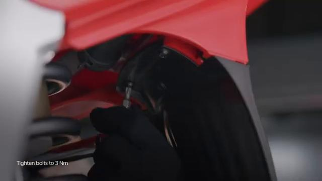

# Remove and Install Rear Mud Flap - Stark VARG

Source video: `Remove and Install Rear Mud Flap - Stark VARG` by Stark Future Official

Applicable models: `MX`

## Scope

This guide follows the original Stark Future video overlay sequence for the procedure shown in the original MX tutorial video. Each step below is aligned to the instruction text shown on screen.

## Preparation

- Place the bike on a stable stand or work area before starting the procedure.
- Prepare the correct tools for the fasteners, clips, brackets, and components shown in the video.
- Keep removed hardware organized in sequence so reassembly follows the same order as the video.
- Follow the torque values shown in the original Stark tutorial video wherever the video displays a torque on screen.

## Removal Procedure

### 1. Unscrew the mud flap bolts, 1x on each end of the mud flap

Unscrew the mud flap bolts, 1x on each end of the mud flap.

### 2. Remove the mud flap by pushing towards the bike’s front and sliding it out

Remove the mud flap by pushing towards the bike’s front and sliding it out.

## Installation Procedure

### 3. Install the mud flap by sliding it towards the rear of the bike in the rear fender grooves

Install the mud flap by sliding it towards the rear of the bike in the rear fender grooves.

### 4. Tighten the mud flap bolts to 2 Nm

Tighten the mud flap bolts to **2 Nm**.

## Torque Summary

| Component | Torque |
| --- | ---: |
| Tighten the mud flap bolts | 2 Nm |

Verified torque items:

- Tighten the mud flap bolts: **2 Nm** from the original Stark Future tutorial video text overlay.

## Critical Checks Before Riding

- Confirm the serviced components are fully seated and all fasteners are tightened in the correct order.
- Recheck all torque-critical hardware before riding.
- Make sure all routed cables, clips, brackets, and surrounding parts are returned to their original positions.
- Inspect the bike visually for any missing hardware before returning it to service.
