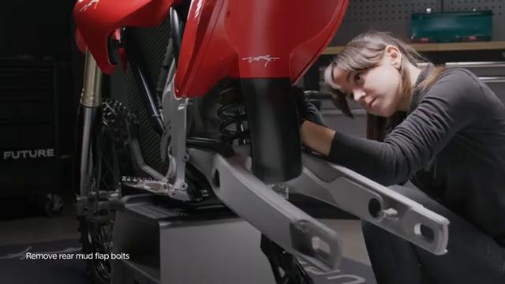
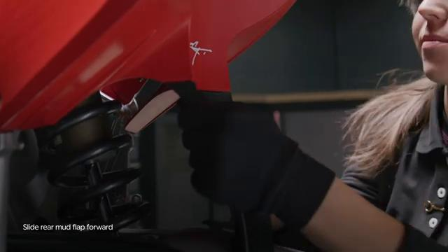
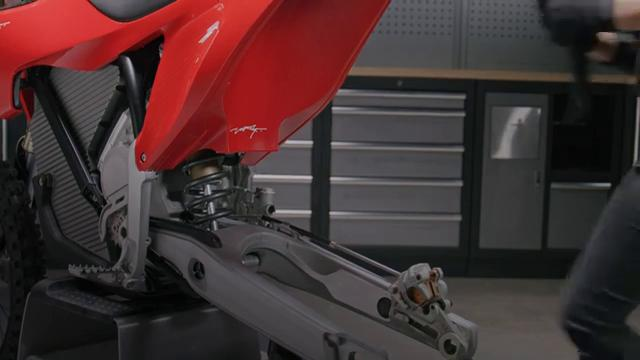
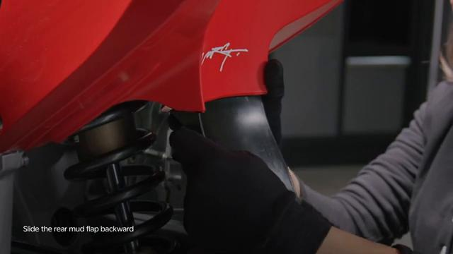
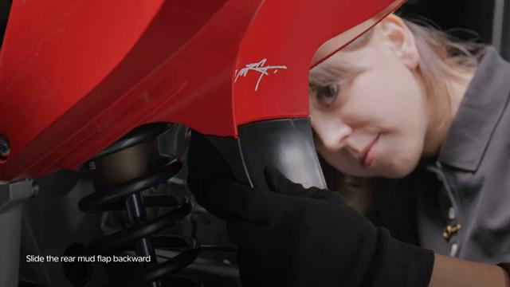
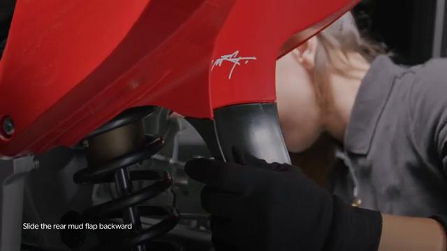
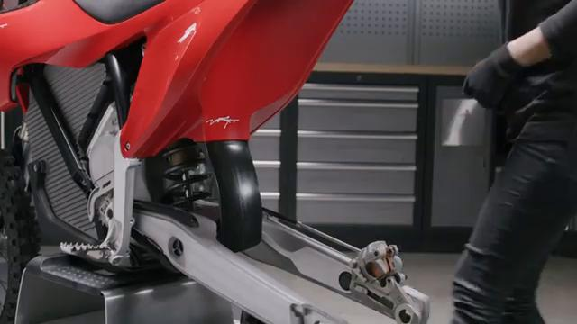

# Remove and Install Rear Mud Flap - Stark VARG

Source video: `Remove and Install Rear Mud Flap - Stark VARG` by Stark Future Official

Applicable models: `MX`

## Scope

This guide follows the same step-by-step workshop structure as the MX tutorials, but it is derived as a visual sequence from the official Stark Future ASMR video. Because the source video does not provide usable captions or narration, the procedure is documented through curated screenshots and concise action guidance.

## Preparation

- Place the bike on a stable stand or work area before starting the procedure.
- Prepare the correct tools for the fasteners, clips, brackets, and components shown in the video.
- Keep removed hardware organized in sequence so reassembly follows the same order as the video.
- Have a torque wrench ready for any tightening steps that specify a torque value.

## Removal Procedure

### 1. Prepare access to the Rear Mud Flap

Prepare access to the rear mud flap and the two retaining bolts, one on each side.

Keep the removed fasteners organized in sequence so reassembly matches the video.

### 2. Remove the visible retaining hardware for the Rear Mud Flap

Unscrew the rear mud flap bolts, one on each end of the flap.

Support the component as the last fastener is removed.

### 3. Release any bracket, clip, or coupling attached to the Rear Mud Flap

Push the mud flap toward the front of the bike and release it from the rear fender grooves.

Note the orientation of these supporting pieces before setting them aside.

### 4. Remove the Rear Mud Flap from the bike

Slide the rear mud flap fully out of the rear fender once it is free of the grooves.

Inspect the removed part and the mounting points before reassembly.

## Installation Procedure

### 5. Position the Rear Mud Flap for installation

Install the rear mud flap by sliding it toward the rear of the bike into the rear fender grooves.

Hold the component in place until the first retaining hardware is started.

### 6. Reconnect or refit the support pieces for the Rear Mud Flap

Align the mud flap in the grooves and start the retaining bolts by hand.

Make sure the flap is fully seated before tightening.

### 7. Install the retaining hardware for the Rear Mud Flap

Tighten the mud flap bolts evenly once the flap is seated in the rear fender grooves.

Tighten the mud flap bolts to **2 Nm**.

### 8. Verify the completed installation of the Rear Mud Flap

Inspect the final position of the Rear Mud Flap and confirm that all hardware, clips, and surrounding parts are back in place.

Check the component for correct fit and movement before returning the bike to service.

## Torque Summary

| Component | Torque |
| --- | ---: |
| Tighten the mud flap bolts | 2 Nm |

Verified torque items:

- Tighten the mud flap bolts: **2 Nm** from Stark technical manual `01.012.01 Remove and install mud flap`.

## Critical Checks Before Riding

- Confirm the serviced component is fully seated and all fasteners are tightened in the correct order.
- Recheck all torque-critical hardware before riding.
- Make sure all routed cables, clips, brackets, and surrounding parts are returned to their original positions.
- Inspect the bike visually for any missing hardware before returning it to service.
