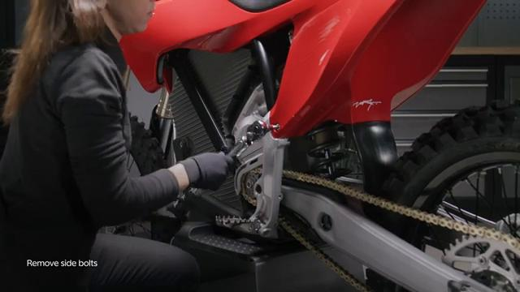
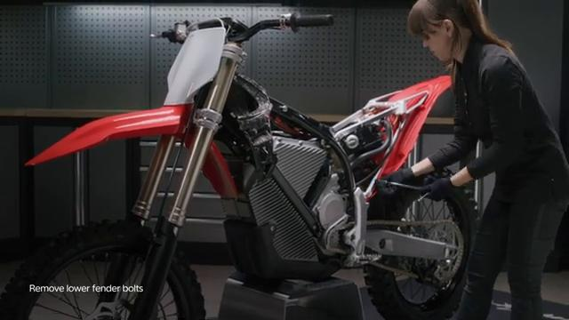
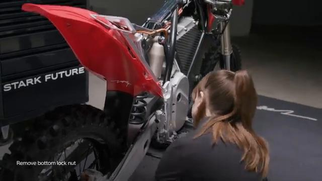
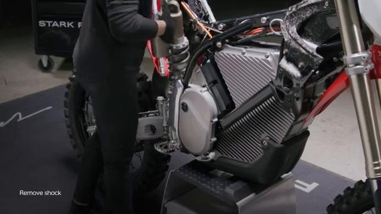
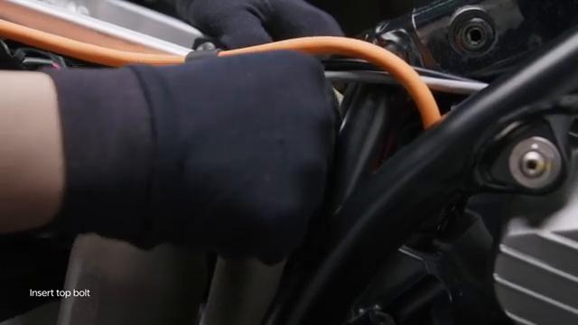
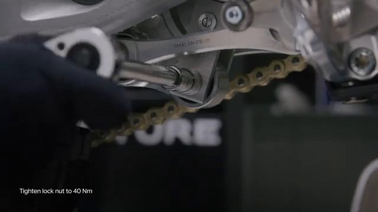
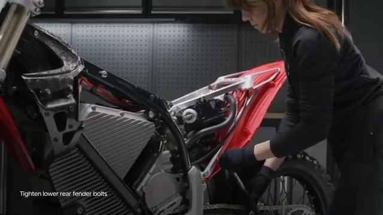
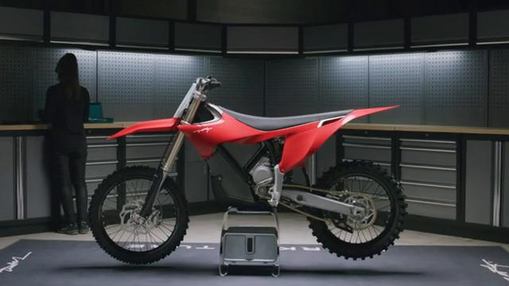

# Remove and Install Rear Shock - Stark VARG

Source video: `Remove and Install Rear Shock - Stark VARG` by Stark Future Official

Applicable models: `MX`

## Scope

This guide follows the same step-by-step workshop structure as the MX tutorials, but it is derived as a visual sequence from the official Stark Future ASMR video. Because the source video does not provide usable captions or narration, the procedure is documented through curated screenshots and concise action guidance.

## Preparation

- Place the bike on a stable stand or work area before starting the procedure.
- Prepare the correct tools for the fasteners, clips, brackets, and components shown in the video.
- Keep removed hardware organized in sequence so reassembly follows the same order as the video.
- Have a torque wrench ready for any tightening steps that specify a torque value.

## Removal Procedure

### 1. Prepare access to the Rear Shock

Remove the spoiler assembly and rear fender to gain access to the rear shock mounts.

Keep the removed fasteners organized in sequence so reassembly matches the video.

### 2. Remove the visible retaining hardware for the Rear Shock

Loosen the shock top bolt mount and remove the bottom lock nut.

Support the component as the last fastener is removed.

### 3. Release any bracket, clip, or coupling attached to the Rear Shock

Remove the top lock nut and bolt, then remove the bottom bolt from the shock mount.

Note the orientation of these supporting pieces before setting them aside.

### 4. Remove the Rear Shock from the bike

Remove the rear shock from the bike and ensure the subframe rests back in the subframe slots.

Inspect the removed part and the mounting points before reassembly.

## Installation Procedure

### 5. Position the Rear Shock for installation

Push the subframe out of the way, hold the shock in place, and clean and grease the shock bolts with lithium grease.

Insert the top bolt and nut first.

### 6. Reconnect or refit the support pieces for the Rear Shock

Align the bottom bolt housing by moving the rear wheel up and down, then insert the bottom bolt and nut.

Place the bike on the ground so the suspension can rest on its own weight before final torque.

### 7. Install the retaining hardware for the Rear Shock

Tighten the shock top nut to **40 Nm**.

Tighten the shock bottom nut to **40 Nm**.

### 8. Verify the completed installation of the Rear Shock

Place the bike back on the center stand, reinstall the rear fender and spoiler assembly, and inspect the final position of the rear shock.

Check brake operation and verify the shock hardware is fully seated before returning the bike to service.

## Torque Summary

| Component | Torque |
| --- | ---: |
| Tighten the shock top nut | 40 Nm |
| Tighten the shock bottom nut | 40 Nm |

Verified torque items:

- Tighten the shock top nut: **40 Nm** from Stark technical document `08.058.01` Remove and install shock.
- Tighten the shock bottom nut: **40 Nm** from Stark technical document `08.058.01` Remove and install shock.

## Critical Checks Before Riding

- Confirm the serviced component is fully seated and all fasteners are tightened in the correct order.
- Recheck all torque-critical hardware before riding.
- Make sure all routed cables, clips, brackets, and surrounding parts are returned to their original positions.
- Inspect the bike visually for any missing hardware before returning it to service.
