# Remove and Install Rear Shock - Stark VARG

Source video: `Remove and Install Rear Shock - Stark VARG` by Stark Future Official

Applicable models: `MX`

## Scope

This guide follows the original Stark Future video overlay sequence for the procedure shown in the original MX tutorial video. Each step below is aligned to the instruction text shown on screen.

## Preparation

- Place the bike on a stable stand or work area before starting the procedure.
- Prepare the correct tools for the fasteners, clips, brackets, and components shown in the video.
- Keep removed hardware organized in sequence so reassembly follows the same order as the video.
- Follow the torque values shown in the original Stark tutorial video wherever the video displays a torque on screen.

## Removal Procedure

### 1. Remove front bolts

Remove front bolts.

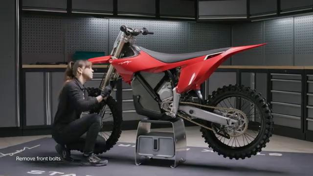

### 2. Remove rear center bolt

Remove rear center bolt.

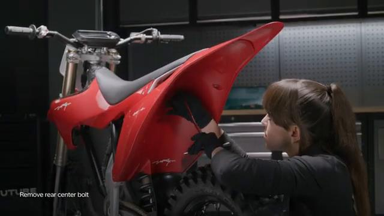

### 3. Remove the complete front spouier

Remove the complete front spouier.

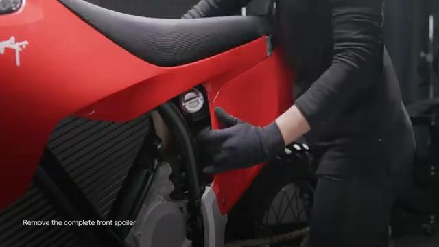

### 4. Loosen shock top lock nut

Loosen shock top lock nut.

### 5. Remove bottom lock nut

Remove bottom lock nut.

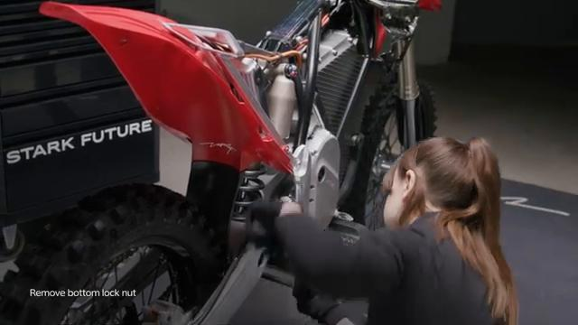

## Installation Procedure

### 6. Push subframe away and hold

Push subframe away and hold.

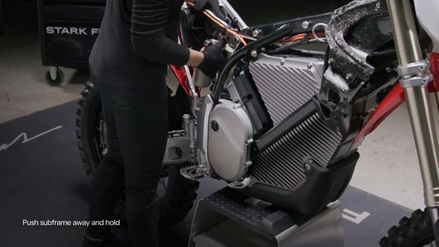

### 7. Remove shock

Remove shock.

### 8. Ensure the subframe rests in the subframe stots

Ensure the subframe rests in the subframe stots.

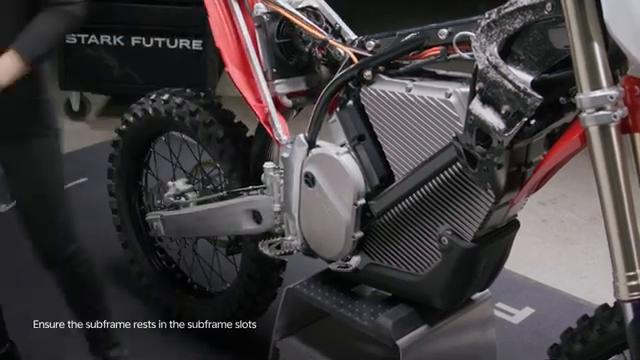

### 9. Push subframe away and hold

Push subframe away and hold.

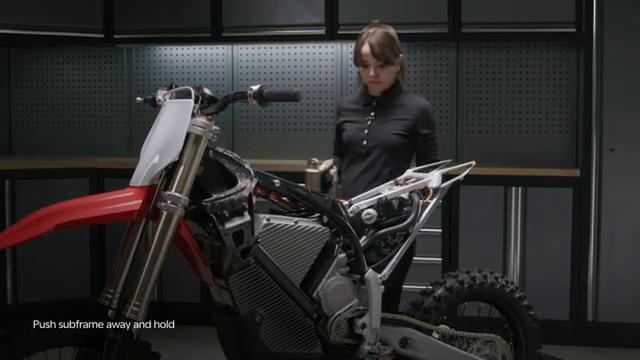

### 10. Hold shoct in olace

Hold shoct in olace.

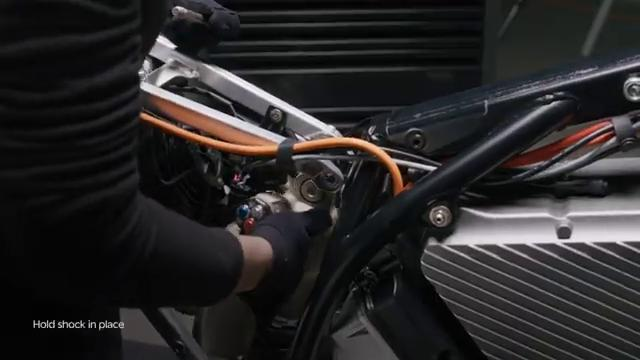

### 11. Insert topo

Insert topo.

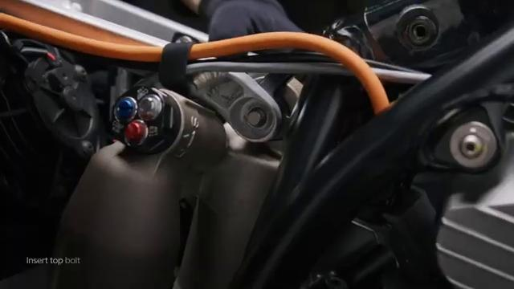

### 12. Tighten lock nut to 40

Tighten lock nut to 40.

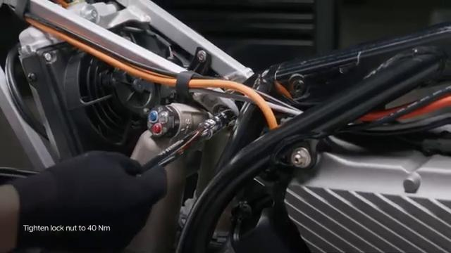

### 13. Insert bottom bolt

Insert bottom bolt.

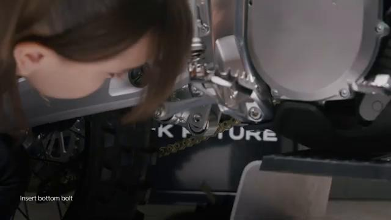

### 14. Tighten lock nut ta 40

Tighten lock nut ta 40.

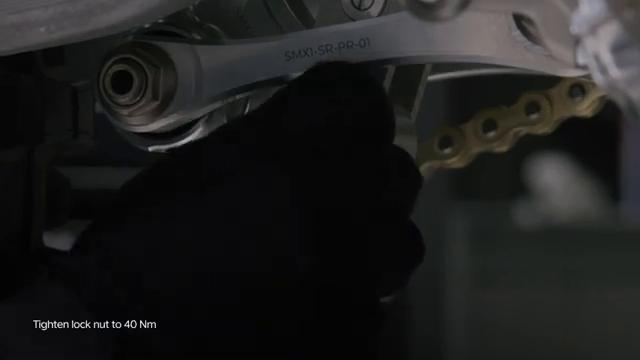

### 15. Tighten lower rear fender bolts

Tighten lower rear fender bolts.

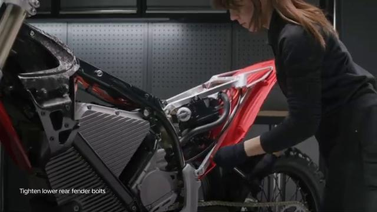

## Critical Checks Before Riding

- Confirm the serviced components are fully seated and all fasteners are tightened in the correct order.
- Recheck all torque-critical hardware before riding.
- Make sure all routed cables, clips, brackets, and surrounding parts are returned to their original positions.
- Inspect the bike visually for any missing hardware before returning it to service.
