# Remove and Install Rear Wheel - Stark VARG

Source video: `Remove and Install Rear Wheel - Stark VARG` by Stark Future Official

Applicable models: `MX`

## Scope

This guide follows the original Stark Future video overlay sequence for the procedure shown in the original MX tutorial video. Each step below is aligned to the instruction text shown on screen.

## Preparation

- Place the bike on a stable stand or work area before starting the procedure.
- Prepare the correct tools for the fasteners, clips, brackets, and components shown in the video.
- Keep removed hardware organized in sequence so reassembly follows the same order as the video.
- Follow the torque values shown in the original Stark tutorial video wherever the video displays a torque on screen.

## Removal Procedure

### 1. Loosen rear axle lock bolt

Loosen rear axle lock bolt.

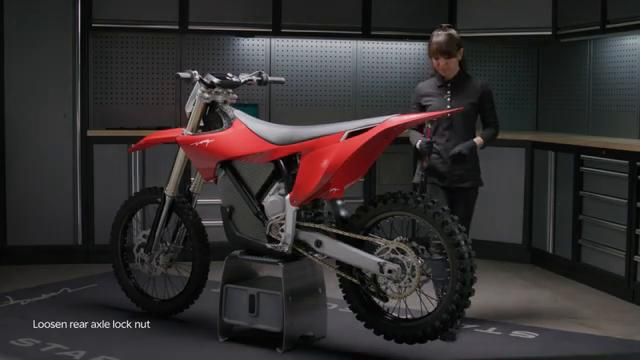

### 2. Push the lock bolt to be able to pull from the opposite side

Push the lock bolt to be able to pull from the opposite side.

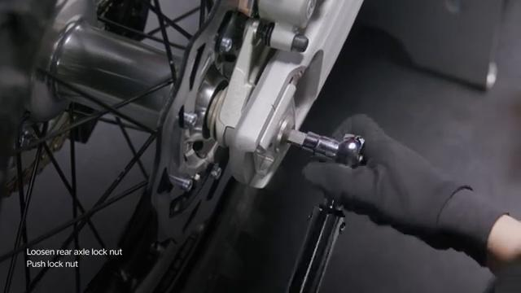

### 3. Remove the lock bolt and chain tension adjuster

Remove the lock bolt and chain tension adjuster.

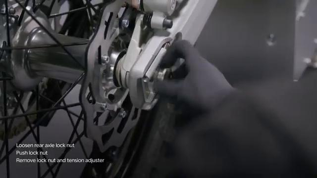

### 4. Remove axle

Remove axle.

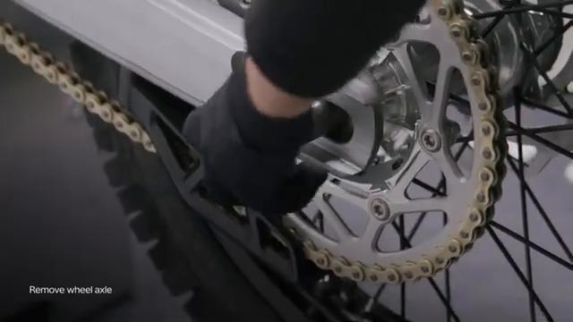

### 5. Release chain from the rear sprocket

Release chain from the rear sprocket.

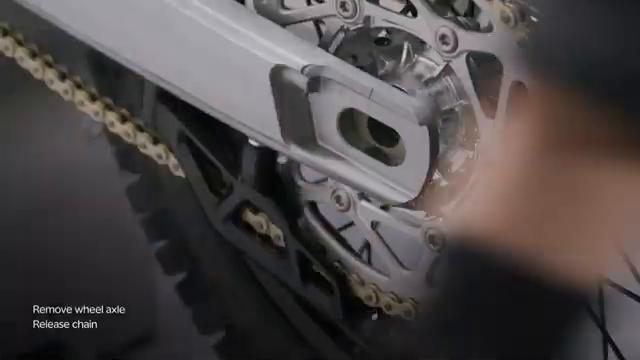

### 6. Slide the wheel out

Slide the wheel out.

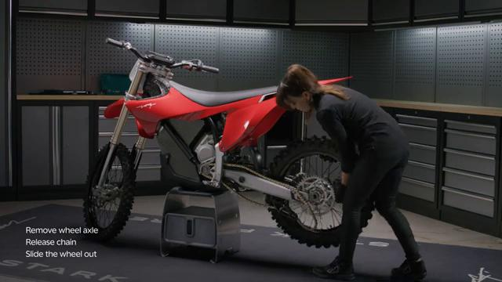

## Installation Procedure

### 7. Clean the wheel axle from any debris and apply lithium grease

Clean the wheel axle from any debris and apply lithium grease.

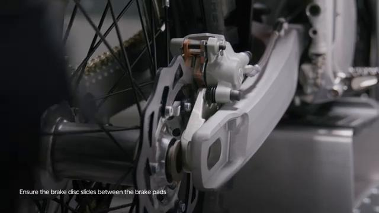

### 8. Slide the wheel in place Ensure the brake disc is on the brake caliper side and slides between the brake pads

Slide the wheel in place Ensure the brake disc is on the brake caliper side and slides between the brake pads.

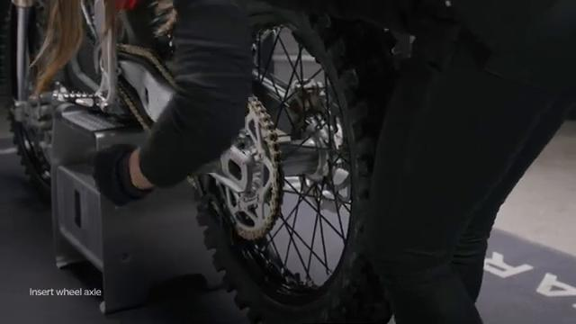

### 9. Fit the chain in the rear sprocket Gently wiggle the wheel to make it easier to slide the axle in

Fit the chain in the rear sprocket Gently wiggle the wheel to make it easier to slide the axle in.

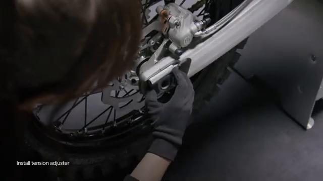

### 10. Insert the rear axle

Insert the rear axle.

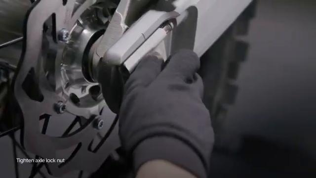

### 11. Install the chain tension adjuster Be carefull not to catch your hand between the chain and the rear sprocket when procceding with step #6

Install the chain tension adjuster Be carefull not to catch your hand between the chain and the rear sprocket when procceding with step #6.

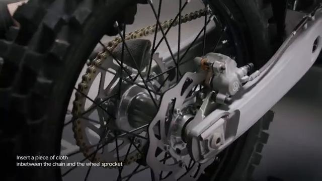

### 12. Insert a cloth between the chain and rear sprocket and spin the rear wheel backwards until the chain is tensioned

Insert a cloth between the chain and rear sprocket and spin the rear wheel backwards until the chain is tensioned.

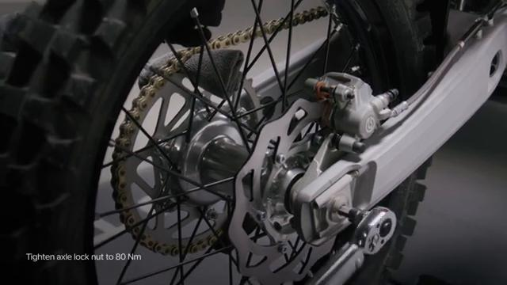

### 13. Tighten the axle nut to 80 Nm

Tighten the axle nut to 80 Nm.

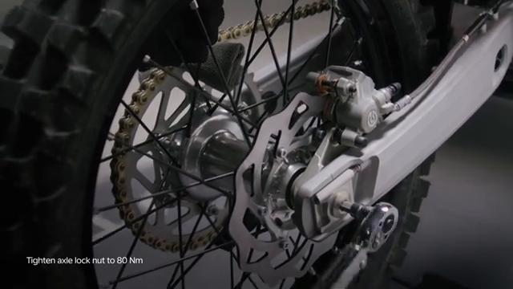

### 14. Remove the cloth

Remove the cloth.

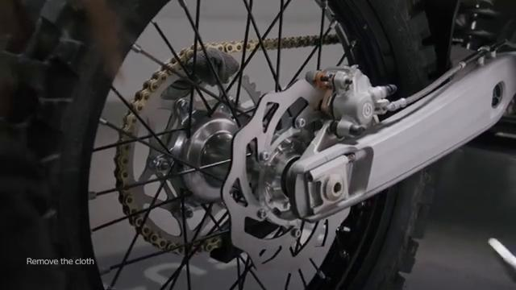

### 15. Spin the wheel by hand a few times and check the brake operation Check brakes operation before operating the bike

Spin the wheel by hand a few times and check the brake operation Check brakes operation before operating the bike. is permitted only with the express written permission.

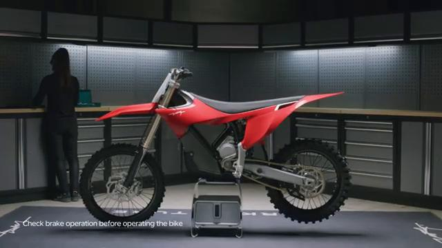

## Torque Summary

| Component | Torque |
| --- | ---: |
| Tighten the axle nut | 80 Nm |

Verified torque items:

- Tighten the axle nut: **80 Nm** from the original Stark Future tutorial video text overlay.

## Critical Checks Before Riding

- Confirm the serviced components are fully seated and all fasteners are tightened in the correct order.
- Recheck all torque-critical hardware before riding.
- Make sure all routed cables, clips, brackets, and surrounding parts are returned to their original positions.
- Inspect the bike visually for any missing hardware before returning it to service.
