# Remove and Install right Side Plate - Stark VARG

Source video: `Remove and Install right Side Plate - Stark VARG` by Stark Future Official

Applicable models: `MX`

## Scope

This guide follows the original Stark Future video overlay sequence for the right side plate procedure. Each step below is aligned to the instruction text shown on screen in the original MX tutorial video.

## Preparation

- Place the bike on a stable stand or work area before starting the procedure.
- Prepare the correct tools for the bodywork, shock mounts, brake hardware, and side plate fasteners shown in the video.
- Keep removed hardware organized in sequence so reassembly follows the same order as the video.
- Follow the torque values shown in the original Stark tutorial video wherever the video displays a torque on screen.

## Removal Procedure

### 1. Remove front bolts

Remove the front bolts.

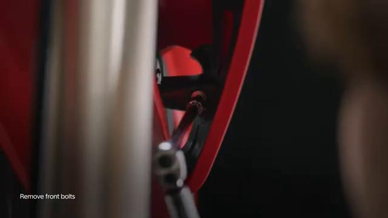

### 2. Remove rear center bolt

Remove the rear center bolt.

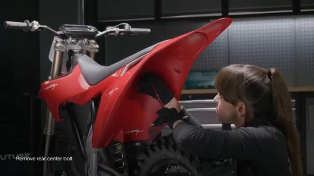

### 3. Remove side bolts

Remove the side bolts.

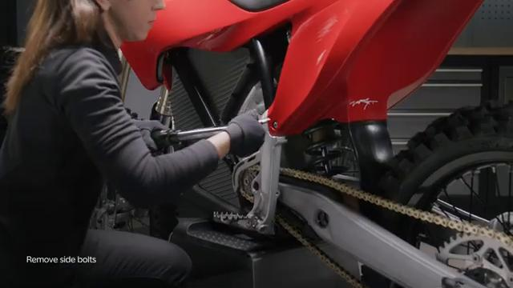

### 4. Remove the complete front spoiler

Remove the complete front spoiler.

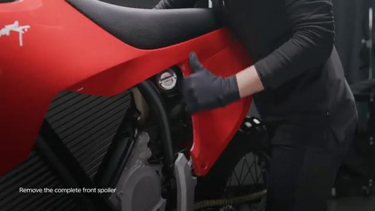

### 5. Remove lower fender bolts

Remove the lower fender bolts.

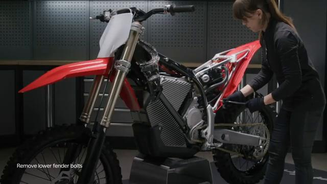

### 6. Remove lower rear fender

Remove the lower rear fender.

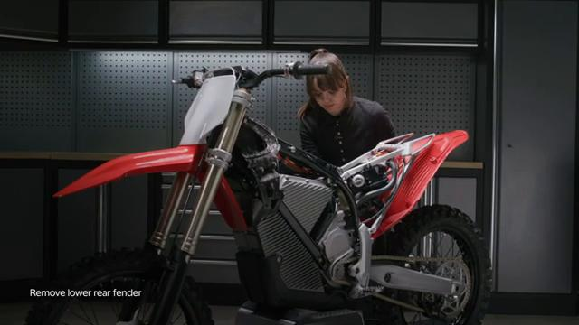

### 7. Remove bottom lock nut

Remove the bottom lock nut.

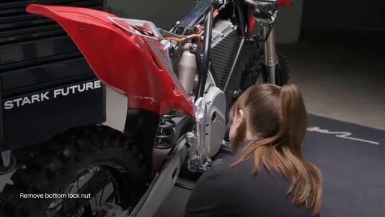

### 8. Remove top lock nut and bolt

Remove the top lock nut and bolt.

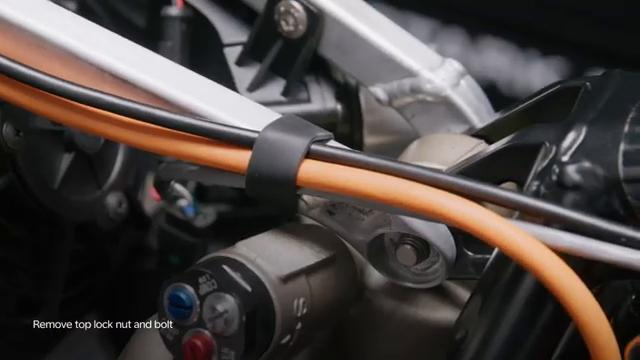

### 9. Remove bottom lock nut and bolt

Remove the bottom lock nut and bolt.

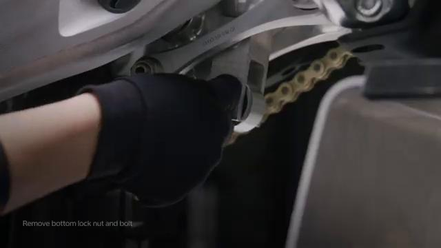

### 10. Push subframe away and hold

Push the subframe away and hold it as shown in the video.

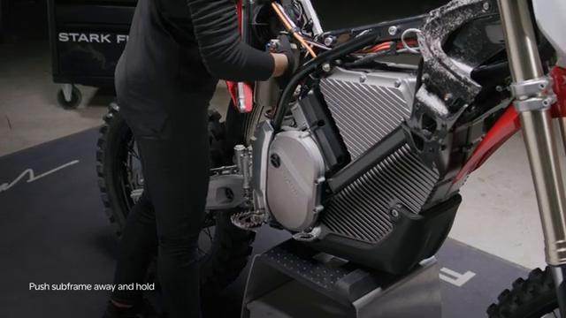

### 11. Ensure the subframe rests in the subframe slots

Ensure the subframe rests in the subframe slots.

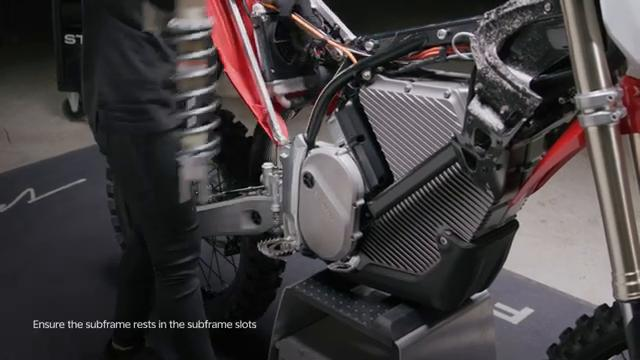

### 12. Remove the rear brake pedal peg bolts

Remove the rear brake pedal peg bolts.

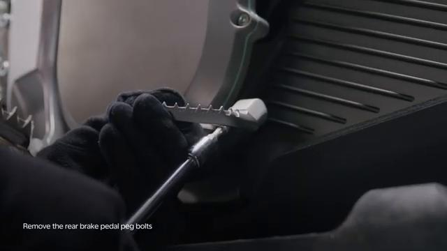

### 13. Loosen brake pump bolts

Loosen the brake pump bolts.

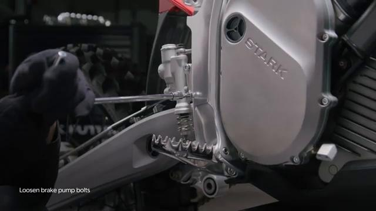

### 14. Remove side plate bolts

Remove the side plate bolts.

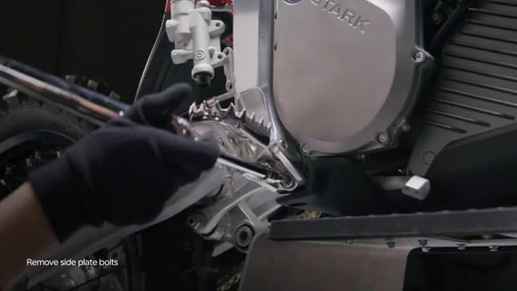

### 15. Remove side plate

Remove the right side plate.

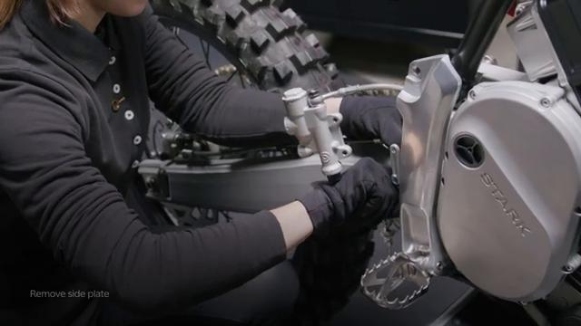

## Installation Procedure

### 16. Install the side plate in place

Install the side plate in place.

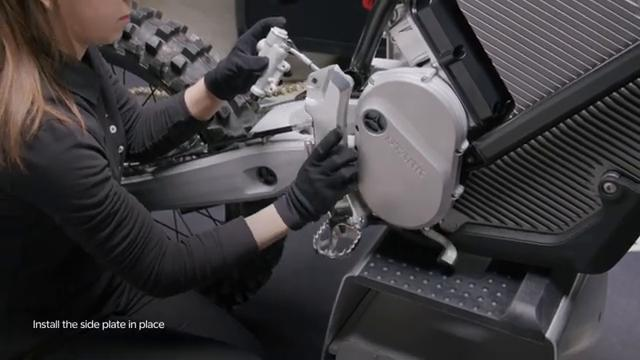

### 17. Tighten top bolt to 45 Nm

Tighten the top bolt to **45 Nm**.

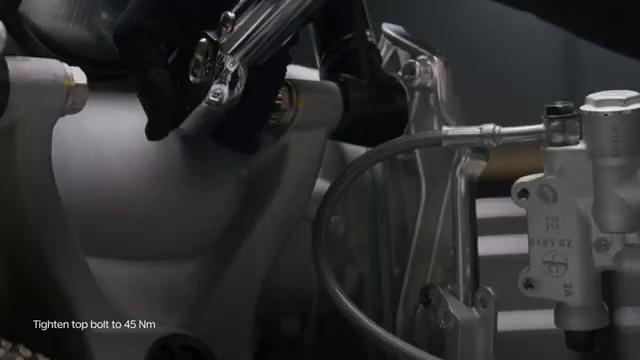

### 18. Tighten middle bolt to 45 Nm

Tighten the middle bolt to **45 Nm**.

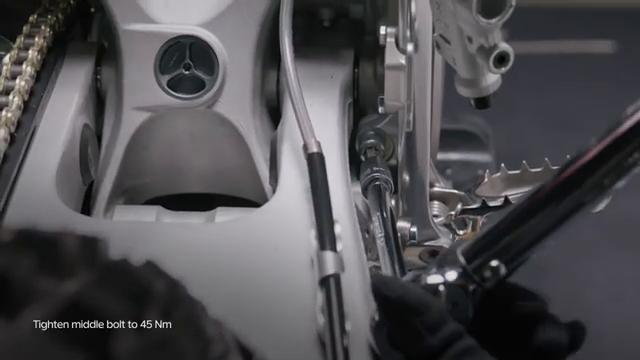

### 19. Tighten bottom bolt to 40 Nm

Tighten the bottom bolt to **40 Nm**.

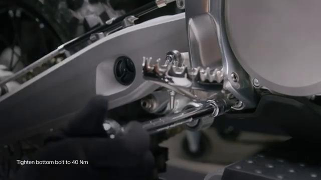

### 20. Hold the brake pump in place

Hold the brake pump in place for installation.

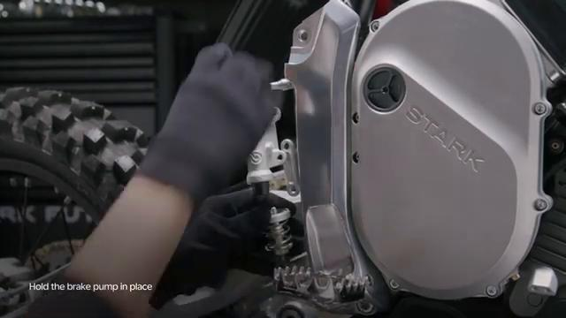

### 21. Tighten bolts to 10 Nm

Tighten the brake pump bolts to **10 Nm**.

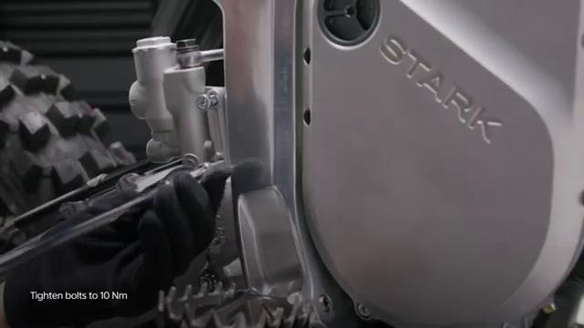

### 22. Install the rear brake pedal link

Install the rear brake pedal link.

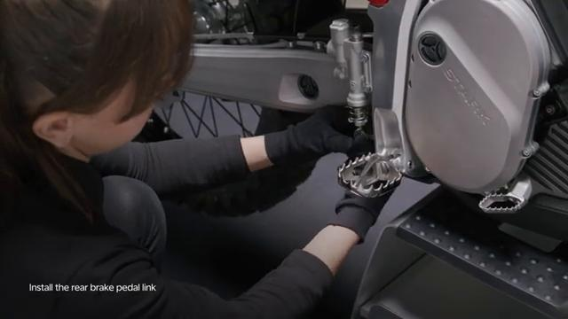

### 23. Tighten link bolt to 10 Nm

Tighten the rear brake pedal link bolt to **10 Nm**.

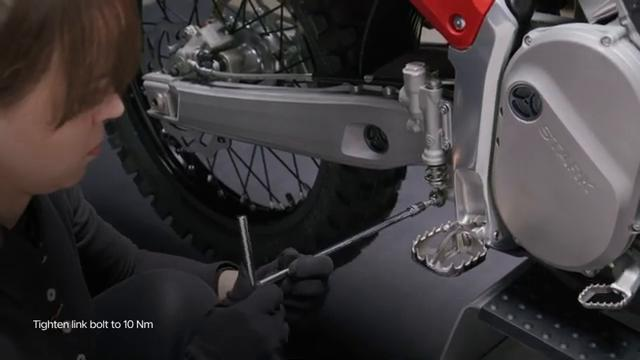

### 24. Hold the rear brake pedal peg in place

Hold the rear brake pedal peg in place.

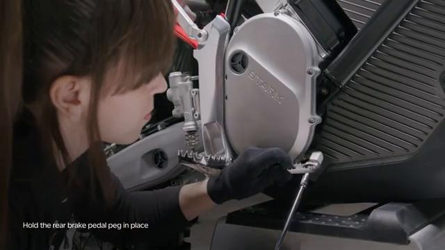

### 25. Tighten the rear brake pedal peg bolts to 5 Nm

Tighten the rear brake pedal peg bolts to **5 Nm**.

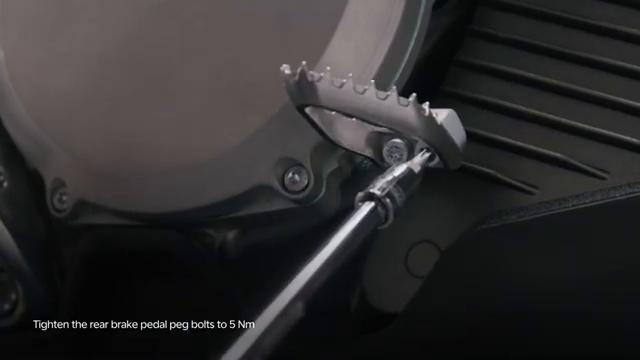

### 26. Push subframe away and hold again

Push the subframe away and hold it again while refitting the mounting hardware.

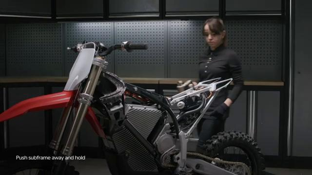

### 27. Insert top bolt

Insert the top bolt.

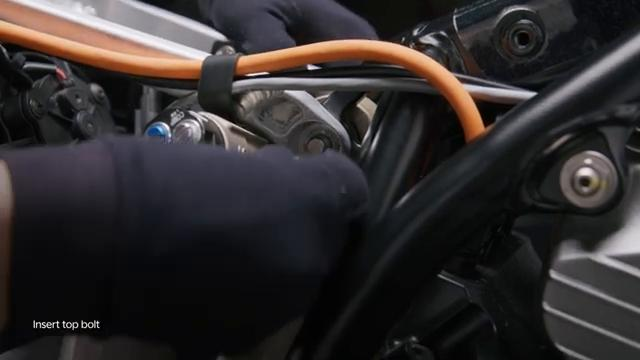

### 28. Tighten lock nut to 40 Nm

Tighten the lock nut to **40 Nm**.

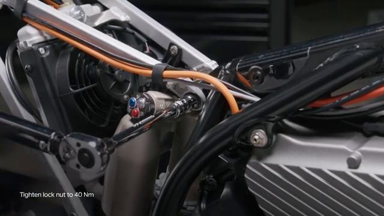

### 29. Insert bottom bolt

Insert the bottom bolt.

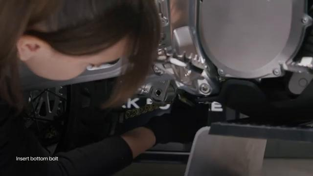

### 30. Tighten lock nut to 40 Nm again

Tighten the lower lock nut to **40 Nm**.

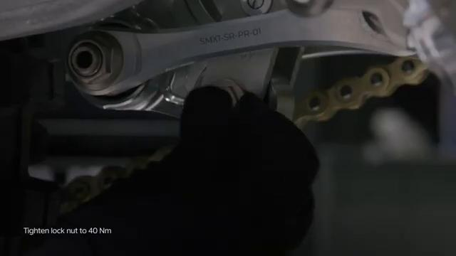

### 31. Tighten lower rear fender bolts

Tighten the lower rear fender bolts. The torque value is not shown in the video; verify the official Stark specification before final tightening.

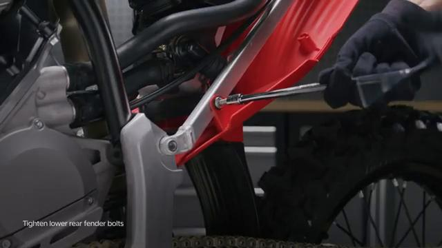

### 32. Tighten rear center bolt to 8 Nm

Tighten the rear center bolt to **8 Nm**.

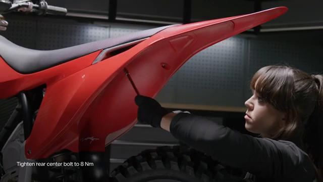

### 33. Tighten side bolts to 40 Nm

Tighten the side bolts to **40 Nm**.

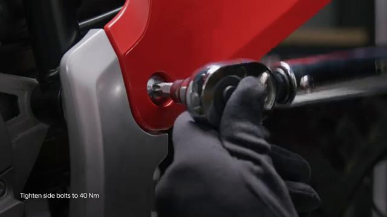

### 34. Tighten front bolts to 5 Nm

Tighten the front bolts to **5 Nm**.

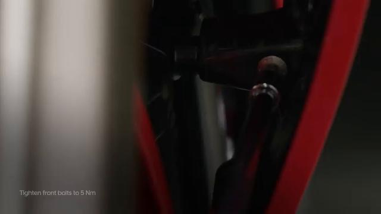

### 35. Check brake operation before operating the bike

Check brake operation before operating the bike.

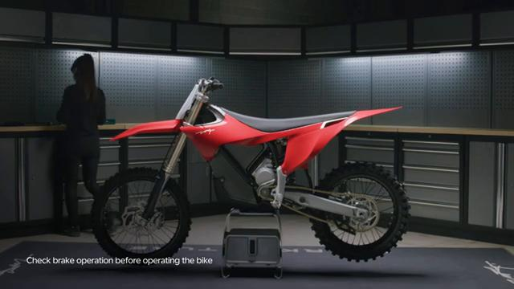

## Torque Summary

| Component | Torque |
| --- | ---: |
| Tighten top bolt | 45 Nm |
| Tighten middle bolt | 45 Nm |
| Tighten bottom bolt | 40 Nm |
| Tighten brake pump bolts | 10 Nm |
| Tighten rear brake pedal link bolt | 10 Nm |
| Tighten rear brake pedal peg bolts | 5 Nm |
| Tighten lock nuts | 40 Nm |
| Tighten rear center bolt | 8 Nm |
| Tighten side bolts | 40 Nm |
| Tighten front bolts | 5 Nm |

Verified torque items:

- Tighten the top bolt: **45 Nm** from the original Stark Future tutorial video text overlay.
- Tighten the middle bolt: **45 Nm** from the original Stark Future tutorial video text overlay.
- Tighten the bottom bolt: **40 Nm** from the original Stark Future tutorial video text overlay.
- Tighten the brake pump bolts: **10 Nm** from the original Stark Future tutorial video text overlay.
- Tighten the rear brake pedal link bolt: **10 Nm** from the original Stark Future tutorial video text overlay.
- Tighten the rear brake pedal peg bolts: **5 Nm** from the original Stark Future tutorial video text overlay.
- Tighten the lock nuts: **40 Nm** from the original Stark Future tutorial video text overlay.
- Tighten the rear center bolt: **8 Nm** from the original Stark Future tutorial video text overlay.
- Tighten the side bolts: **40 Nm** from the original Stark Future tutorial video text overlay.
- Tighten the front bolts: **5 Nm** from the original Stark Future tutorial video text overlay.

## Critical Checks Before Riding

- Confirm the side plate, lower rear fender, brake pump, brake pedal link, and pedal peg are fully seated.
- Recheck all torque-critical hardware before riding.
- Make sure the subframe is seated correctly in the subframe slots.
- Check brake operation before riding.
