# Remove and Install Rocker Arm - Stark VARG

Source video: `Remove and Install Rocker Arm - Stark VARG` by Stark Future Official

Applicable models: `MX`

## Scope

This guide follows the original Stark Future video overlay sequence for the rocker arm procedure. Each step below is aligned to the instruction text shown on screen in the original MX tutorial video.

## Preparation

- Place the bike on a stable stand or work area before starting the procedure.
- Prepare the correct tools for the rear wheel, pull rod, rocker arm shaft, and linkage hardware shown in the video.
- Keep removed hardware organized in sequence so reassembly follows the same order as the video.
- Follow the torque values shown in the original Stark tutorial video wherever the video displays a torque on screen.

## Removal Procedure

### 1. Remove chain link

Remove the chain link.

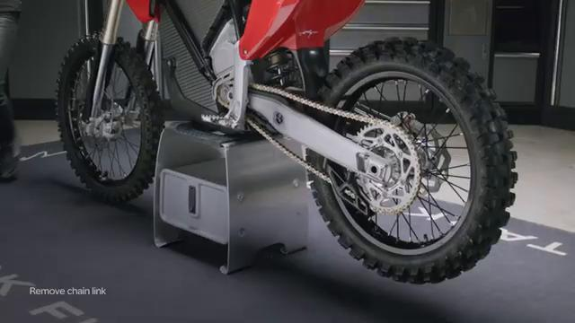

### 2. Run chain through front sprocket

Run the chain through the front sprocket to free it from the rear wheel area.

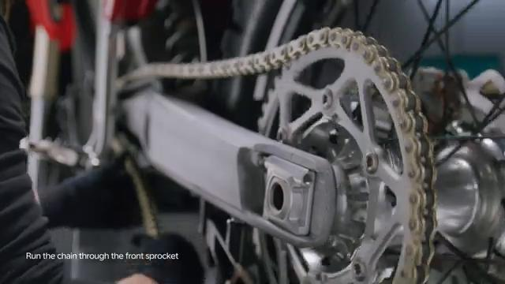

### 3. Loosen rear axle lock nut

Loosen the rear axle lock nut.

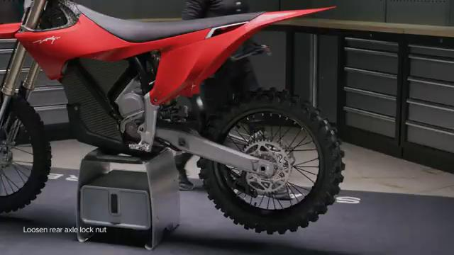

### 4. Push lock nut

Push the lock nut inward.

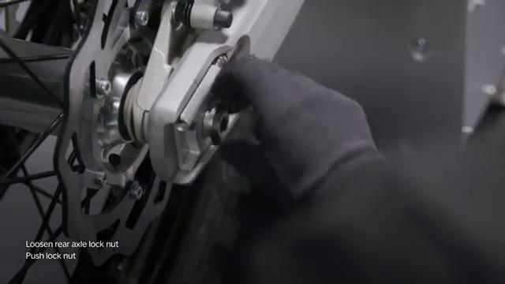

### 5. Remove lock nut and tension adjuster

Remove the lock nut and tension adjuster.

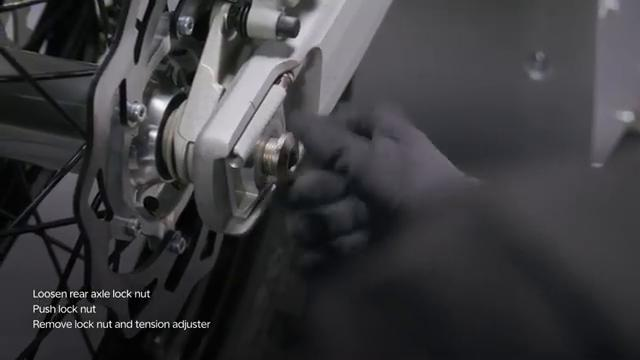

### 6. Remove wheel axle

Remove the rear wheel axle.

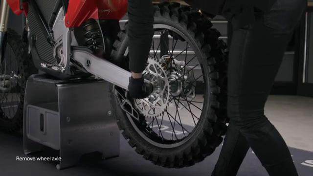

### 7. Loosen chain protector bolt

Loosen the chain protector bolt.

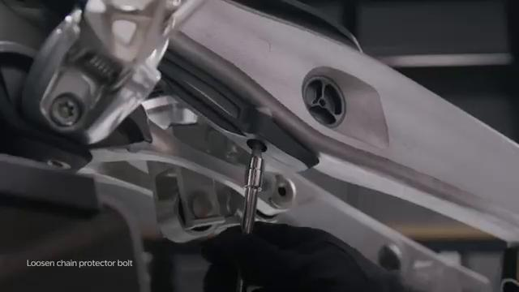

### 8. Remove pull rod lock nuts

Remove the pull rod lock nuts.

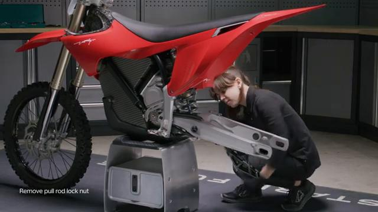

### 9. Pull bolts out

Pull the linkage bolts out.

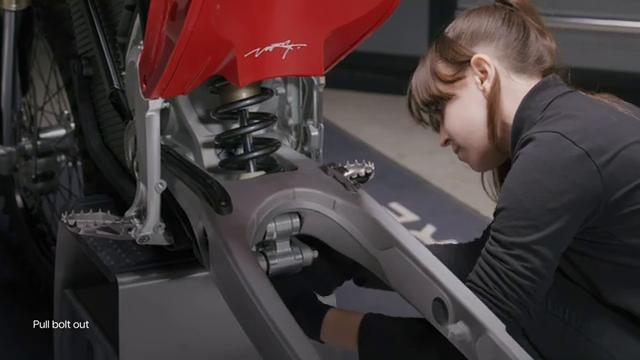

### 10. Remove shaft lids

Remove the shaft lids.

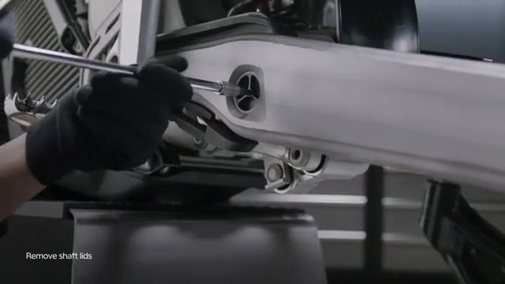

### 11. Remove shaft

Remove the rocker arm shaft.

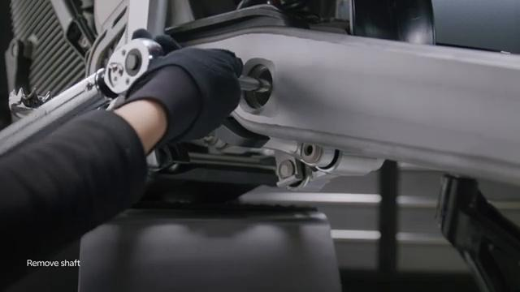

### 12. Loosen reversed thread lock nut

Hold the rocker arm and loosen the reversed-thread lock nut.

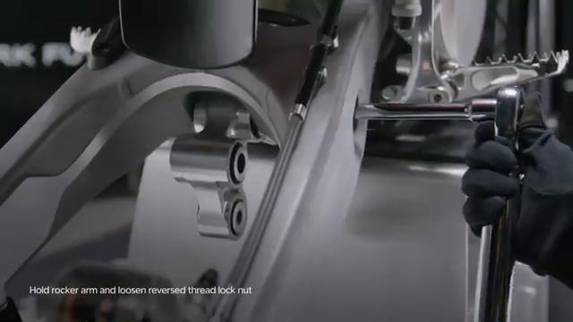

### 13. Remove rocker arm

Remove the rocker arm.

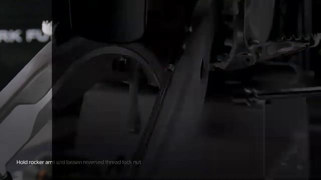

## Installation Procedure

### 14. Hold rocker arm in place

Hold the rocker arm in place for installation.

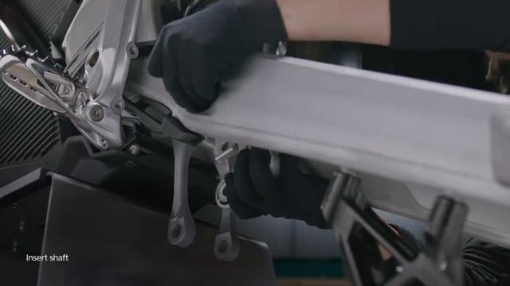

### 15. Tighten reversed thread lock nut to 5 Nm

Tighten the reversed-thread lock nut to **5 Nm**.

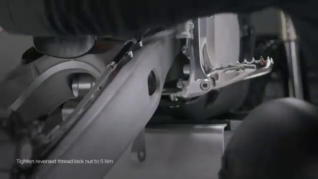

### 16. Tighten shaft to 60 Nm

Tighten the rocker arm shaft to **60 Nm**.

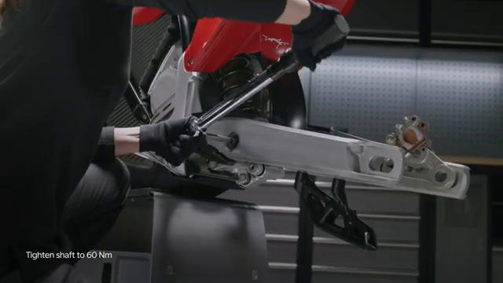

### 17. Insert bolts

Insert the linkage bolts.

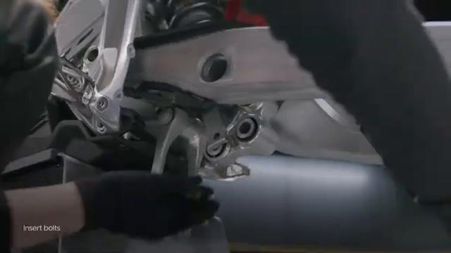

### 18. Tighten lock nuts to 60 Nm

Tighten the lock nuts to **60 Nm**.

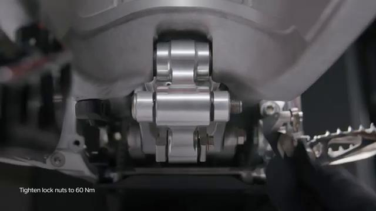

### 19. Tighten shaft lids to 5 Nm

Tighten the shaft lids to **5 Nm**.

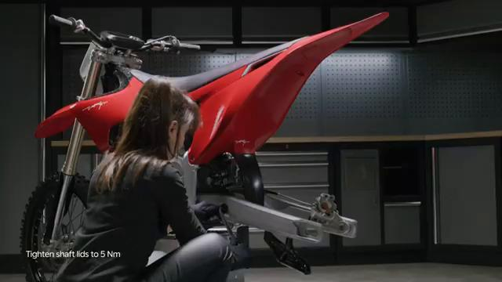

### 20. Slide the wheel in

Slide the rear wheel back into position.

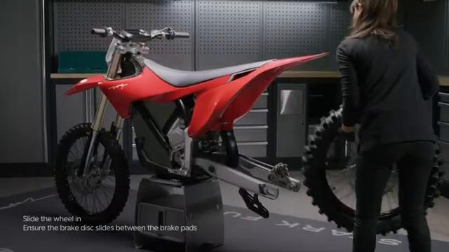

### 21. Ensure brake disc slides between pads

Ensure the brake disc slides between the brake pads.

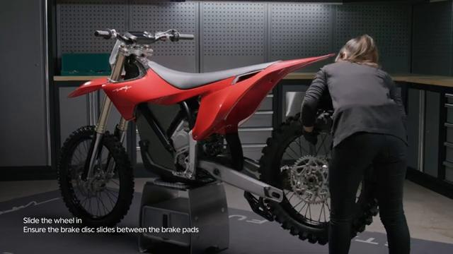

### 22. Insert wheel axle

Insert the rear wheel axle.

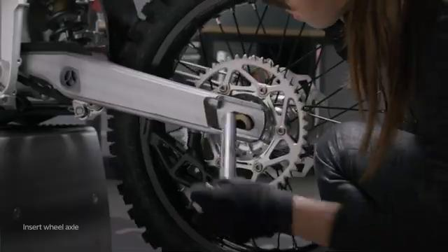

### 23. Install tension adjuster

Install the tension adjuster.

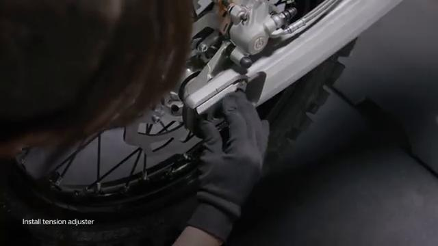

### 24. Tighten axle lock nut

Tighten the axle lock nut by hand until seated.

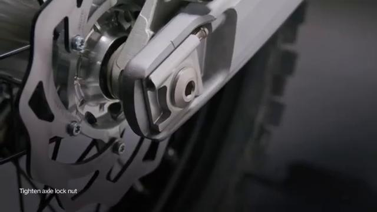

### 25. Run chain through front sprocket again

Run the chain through the front sprocket again.

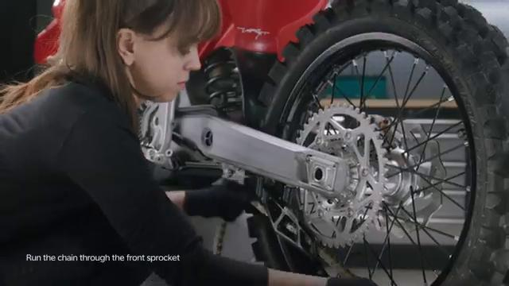

### 26. Install chain link

Install the chain link.

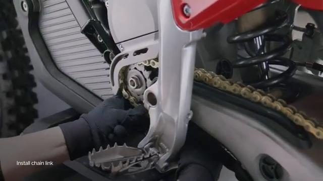

### 27. Insert cloth between chain and sprocket

Insert a piece of cloth between the chain and the wheel sprocket.

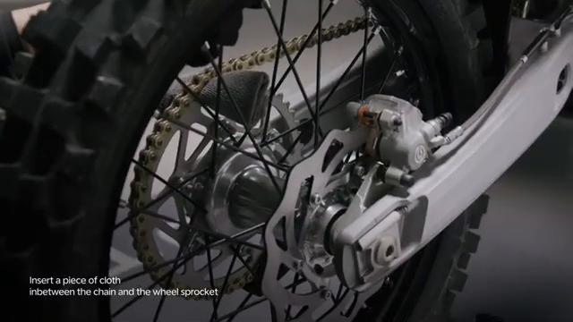

### 28. Tighten axle lock nut to 80 Nm

Tighten the axle lock nut to **80 Nm**.

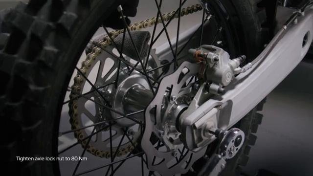

### 29. Remove the cloth

Remove the cloth.

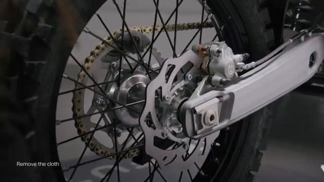

## Torque Summary

| Component | Torque |
| --- | ---: |
| Tighten reversed-thread lock nut | 5 Nm |
| Tighten rocker arm shaft | 60 Nm |
| Tighten lock nuts | 60 Nm |
| Tighten shaft lids | 5 Nm |
| Tighten axle lock nut | 80 Nm |

Verified torque items:

- Tighten the reversed-thread lock nut: **5 Nm** from the original Stark Future tutorial video text overlay.
- Tighten the rocker arm shaft: **60 Nm** from the original Stark Future tutorial video text overlay.
- Tighten the lock nuts: **60 Nm** from the original Stark Future tutorial video text overlay.
- Tighten the shaft lids: **5 Nm** from the original Stark Future tutorial video text overlay.
- Tighten the axle lock nut: **80 Nm** from the original Stark Future tutorial video text overlay.

## Critical Checks Before Riding

- Confirm the rocker arm, linkage hardware, chain, and rear wheel are fully seated.
- Recheck all torque-critical hardware before riding.
- Make sure the brake disc is centered between the pads and the chain is installed correctly.
- Inspect the bike visually for any missing hardware before returning it to service.
