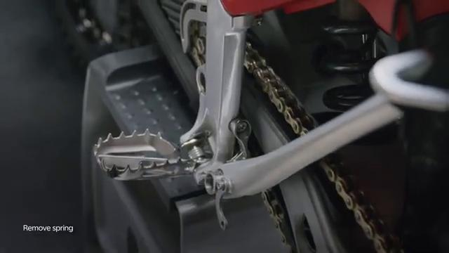
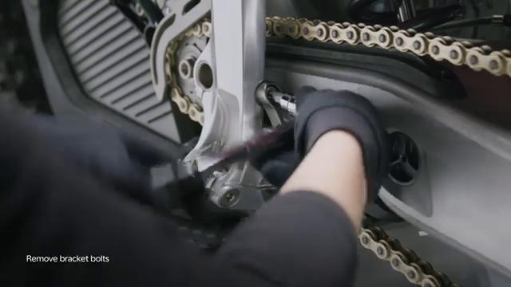
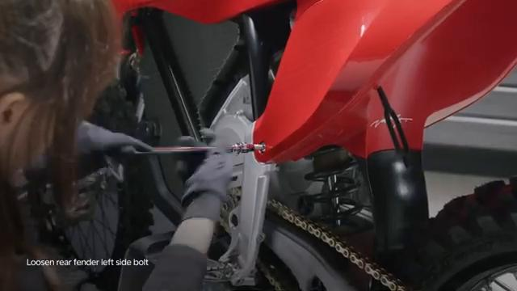
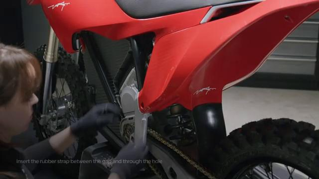
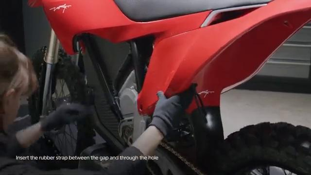
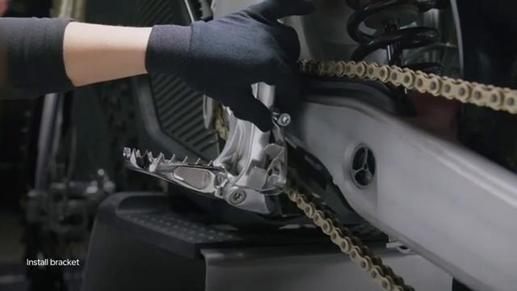
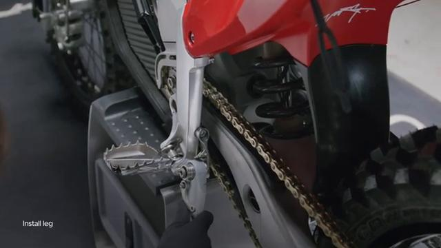
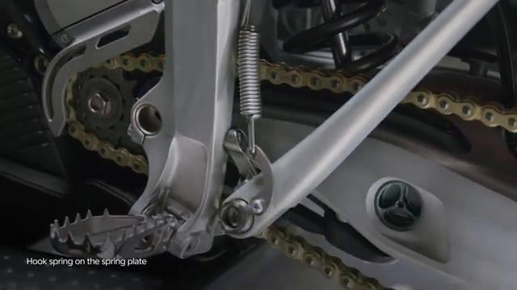

# Remove and Install Side Stand - Stark VARG

Source video: `Remove and Install Side Stand - Stark VARG` by Stark Future Official

Applicable models: `MX`

## Scope

This guide follows the same step-by-step workshop structure as the MX tutorials, but it is derived as a visual sequence from the official Stark Future ASMR video. Because the source video does not provide usable captions or narration, the procedure is documented through curated screenshots and concise action guidance.

## Preparation

- Place the bike on a stable stand or work area before starting the procedure.
- Prepare the correct tools for the fasteners, clips, brackets, and components shown in the video.
- Keep removed hardware organized in sequence so reassembly follows the same order as the video.
- Have a torque wrench ready for any tightening steps that specify a torque value.

## Removal Procedure

### 1. Prepare access to the Side Stand

Remove the surrounding parts needed to expose the Side Stand mounting points shown in the video.

Keep the removed fasteners organized in sequence so reassembly matches the video.

### 2. Remove the visible retaining hardware for the Side Stand

Remove the visible fasteners that secure the Side Stand and keep the hardware in removal order.

Support the component as the last fastener is removed.

### 3. Release any bracket, clip, or coupling attached to the Side Stand

Free any bracket, clip, spacer, linkage, or connector that still ties the Side Stand to the bike.

Note the orientation of these supporting pieces before setting them aside.

### 4. Remove the Side Stand from the bike

Remove the Side Stand from the bike once the remaining supports and fasteners are free.

Inspect the removed part and the mounting points before reassembly.

## Installation Procedure

### 5. Position the Side Stand for installation

Return the Side Stand and rubber strap to their mounting position and align the holes, tabs, or locating surfaces.

Hold the component in place until the first retaining hardware is started.

### 6. Reconnect or refit the support pieces for the Side Stand

Reinstall the side stand bracket and related support pieces for the Side Stand.

Apply grease to the bushing and O-rings before the bracket is fully seated.

### 7. Install the retaining hardware for the Side Stand

Install the Side Stand retaining hardware by hand first so the part stays aligned in its mounting points.

Clean the side stand leg bolt, apply medium strength thread locker, and fit the side stand leg through the rubber strap before final tightening.

Tighten the side stand bracket bolts to **20 Nm**.

Tighten the side stand leg bolt to **35 Nm**.

### 8. Verify the completed installation of the Side Stand

Hook the side stand springs back onto the top bolt and spring plate, then inspect the final position of the Side Stand.

Confirm the springs are rehooked correctly and check the component for correct fit and movement before returning the bike to service.

## Torque Summary

| Component | Torque |
| --- | ---: |
| Tighten the side stand bracket bolts | 20 Nm |
| Tighten the side stand leg bolt | 35 Nm |

Verified torque items:

- Tighten the side stand bracket bolts: **20 Nm** from Stark technical manual `05.038.01 Remove and install side stand`.
- Tighten the side stand leg bolt: **35 Nm** from Stark technical manual `05.038.01 Remove and install side stand`.

## Critical Checks Before Riding

- Confirm the serviced component is fully seated and all fasteners are tightened in the correct order.
- Recheck all torque-critical hardware before riding.
- Make sure all routed cables, clips, brackets, and surrounding parts are returned to their original positions.
- Inspect the bike visually for any missing hardware before returning it to service.
