# Remove and Install Side Stand - Stark VARG

Source video: `Remove and Install Side Stand - Stark VARG` by Stark Future Official

Applicable models: `MX`

## Scope

This guide follows the original Stark Future video overlay sequence for the procedure shown in the original MX tutorial video. Each step below is aligned to the instruction text shown on screen.

## Preparation

- Place the bike on a stable stand or work area before starting the procedure.
- Prepare the correct tools for the fasteners, clips, brackets, and components shown in the video.
- Keep removed hardware organized in sequence so reassembly follows the same order as the video.
- Follow the torque values shown in the original Stark tutorial video wherever the video displays a torque on screen.

## Removal Procedure

### 1. Unhook the side stand springs from the side stand spring plate

Unhook the side stand springs from the side stand spring plate.

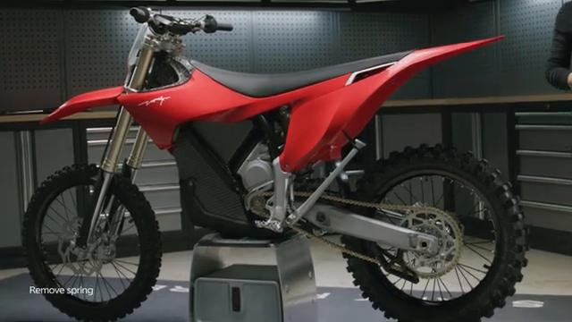

### 2. Unhook the side stand springs from the side stand spring bolt

Unhook the side stand springs from the side stand spring bolt.

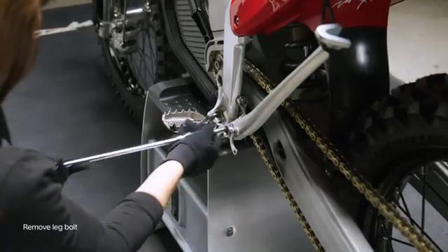

### 3. Unscrew the side stand leg bolt

Unscrew the side stand leg bolt.

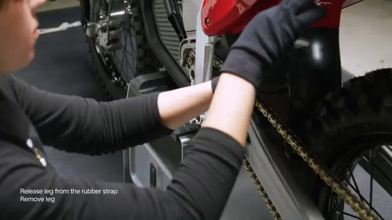

### 4. Release the side stand leg from the rubber strap

Release the side stand leg from the rubber strap.

### 5. Remove the side stand leg

Remove the side stand leg.

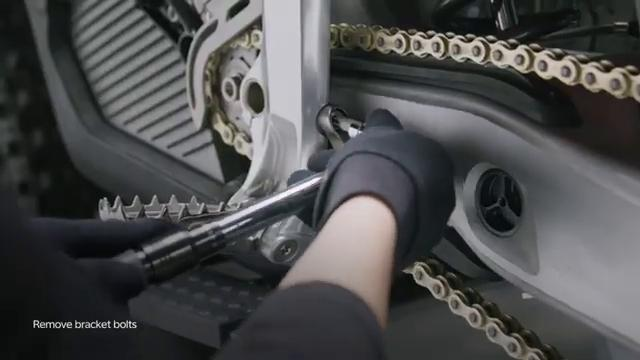

### 6. Unscrew the side stand bracket bolts

Unscrew the side stand bracket bolts.

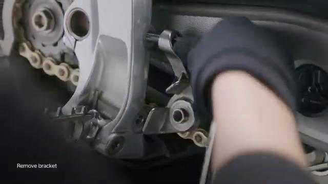

### 7. Remove the side stand bracket

Remove the side stand bracket.

### 8. Remove the side stand rubber strap

Remove the side stand rubber strap. Refer to: 05.075.01 rubber strap ↗.

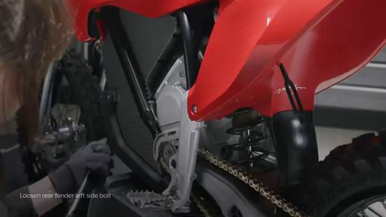

## Installation Procedure

### 9. Install the side stand rubber strap

Install the side stand rubber strap. Refer to: 05.075.01 rubber strap ↗.

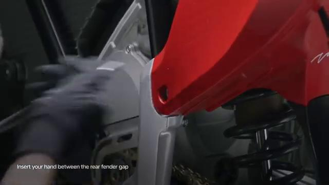

### 10. Install the side stand bracket

Install the side stand bracket.

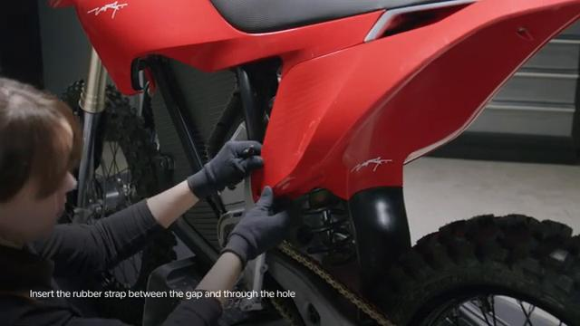

### 11. Apply grease to the bushing and the o-rings

Apply grease to the bushing and the o-rings.

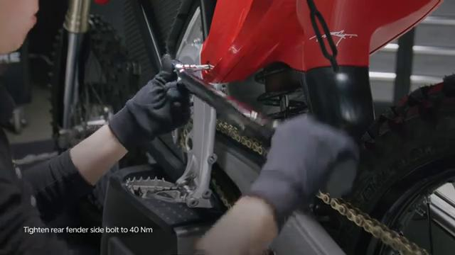

### 12. Tighten the side stand bracket bolts to 20 Nm

Tighten the side stand bracket bolts to 20 Nm.

### 13. Install the side stand leg

Install the side stand leg.

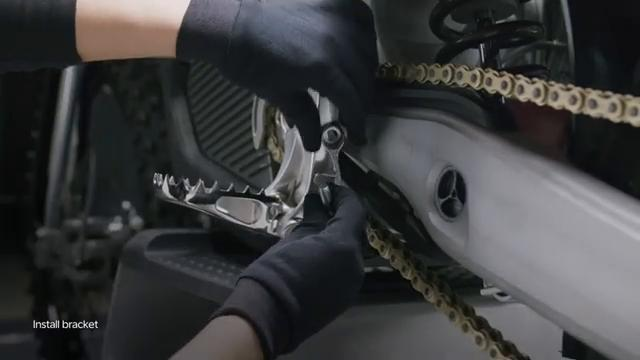

### 14. Clean the side stand leg bolt from any debris and apply medium strength thread locker

Clean the side stand leg bolt from any debris and apply medium strength thread locker.

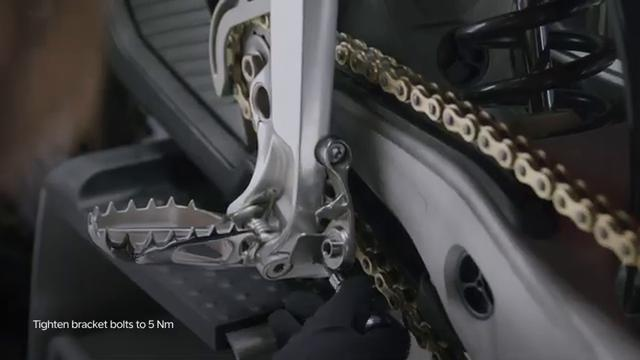

### 15. Tighten the side stand leg bolt by hand until it holds in place

Tighten the side stand leg bolt by hand until it holds in place.

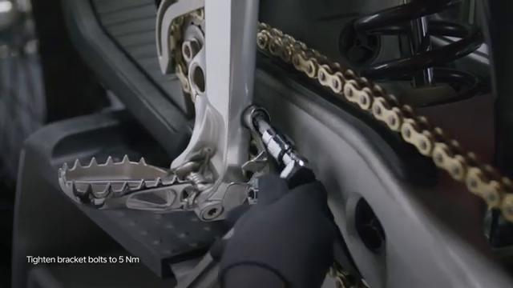

### 16. Fit the side stand leg through the rubber strap

Fit the side stand leg through the rubber strap.

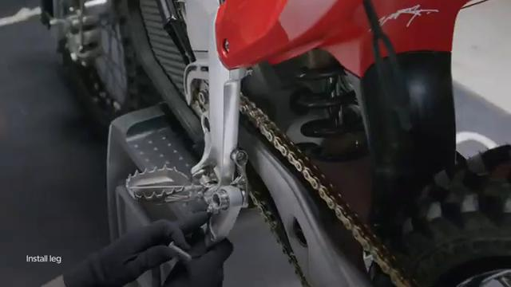

### 17. Tighten the side stand leg bolt to 35 Nm

Tighten the side stand leg bolt to 35 Nm.

### 18. Hook the springs on the top bolt by the left side plate

Hook the springs on the top bolt by the left side plate.

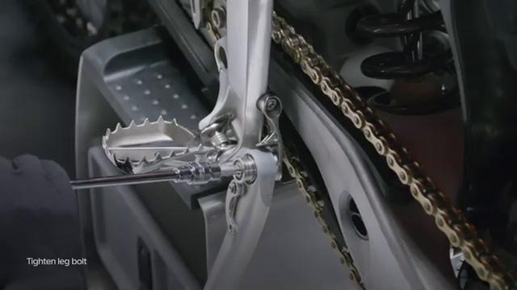

### 19. Hook the springs on the side stand leg’s spring plate

Hook the springs on the side stand leg's spring plate.

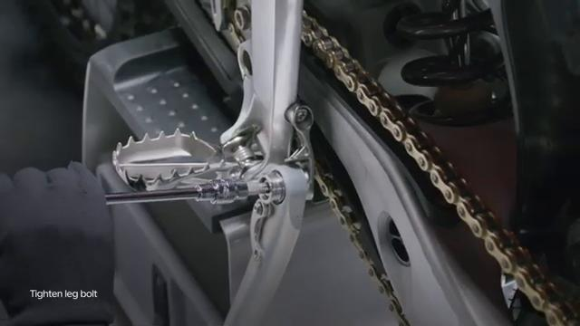

## Torque Summary

| Component | Torque |
| --- | ---: |
| Tighten the side stand bracket bolts | 20 Nm |
| Tighten the side stand leg bolt | 35 Nm |

Verified torque items:

- Tighten the side stand bracket bolts: **20 Nm** from the original Stark Future tutorial video text overlay.
- Tighten the side stand leg bolt: **35 Nm** from the original Stark Future tutorial video text overlay.

## Critical Checks Before Riding

- Confirm the serviced components are fully seated and all fasteners are tightened in the correct order.
- Recheck all torque-critical hardware before riding.
- Make sure all routed cables, clips, brackets, and surrounding parts are returned to their original positions.
- Inspect the bike visually for any missing hardware before returning it to service.
