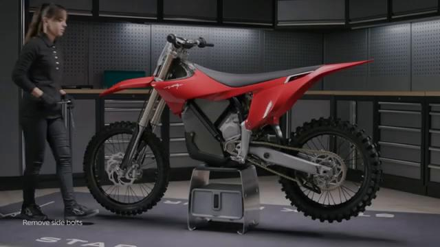
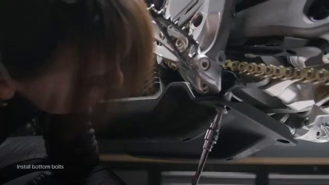
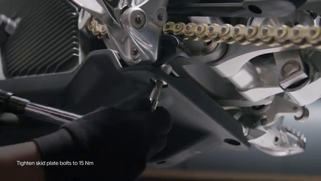
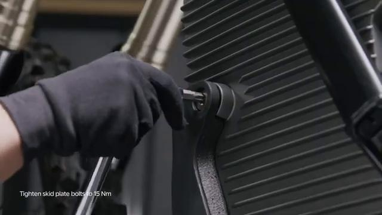

# Remove and Install Skid Plate - Stark VARG

Source video: `Remove and Install Skid Plate - Stark VARG` by Stark Future Official

Applicable models: `MX`

## Scope

This guide follows the original Stark Future video overlay sequence for the procedure shown in the original MX tutorial video. Each step below is aligned to the instruction text shown on screen.

## Preparation

- Place the bike on a stable stand or work area before starting the procedure.
- Prepare the correct tools for the fasteners, clips, brackets, and components shown in the video.
- Keep removed hardware organized in sequence so reassembly follows the same order as the video.
- Follow the torque values shown in the original Stark tutorial video wherever the video displays a torque on screen.

## Removal Procedure

### 1. Unscrew the skid plate bolts, 1x on each side and 2x at the rear underneath

Unscrew the skid plate bolts, 1x on each side and 2x at the rear underneath.

### 2. Push the skid plate downwards

Push the skid plate downwards.

## Installation Procedure

### 3. Push the skid plate into place until the holes are aligned

Push the skid plate into place until the holes are aligned.

### 4. Tighten the bolts to 15 Nm

Tighten the bolts to 15 Nm. is permitted only with the express written permission.

## Torque Summary

| Component | Torque |
| --- | ---: |
| Tighten the bolts | 15 Nm |

Verified torque items:

- Tighten the bolts: **15 Nm** from the original Stark Future tutorial video text overlay.

## Critical Checks Before Riding

- Confirm the serviced components are fully seated and all fasteners are tightened in the correct order.
- Recheck all torque-critical hardware before riding.
- Make sure all routed cables, clips, brackets, and surrounding parts are returned to their original positions.
- Inspect the bike visually for any missing hardware before returning it to service.
