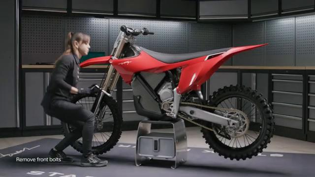

# Remove and Install Spoiler Assembly - Stark VARG

Source video: `Remove and Install Spoiler Assembly - Stark VARG` by Stark Future Official

Applicable models: `MX`

## Scope

This guide follows the original Stark Future video overlay sequence for the procedure shown in the original MX tutorial video. Each step below is aligned to the instruction text shown on screen.

## Preparation

- Place the bike on a stable stand or work area before starting the procedure.
- Prepare the correct tools for the fasteners, clips, brackets, and components shown in the video.
- Keep removed hardware organized in sequence so reassembly follows the same order as the video.
- Follow the torque values shown in the original Stark tutorial video wherever the video displays a torque on screen.

## Removal Procedure

### 1. Unscrew the front spoiler bolts, 2x on each side

Unscrew the front spoiler bolts, 2x on each side.

### 2. Unscrew the seat rear center bolt

Unscrew the seat rear center bolt.

### 3. Unscrew the side panel bolts, 1x on each side

Unscrew the side panel bolts, 1x on each side.

### 4. Grab the side panels and pull outwards to unclip it

Grab the side panels and pull outwards to unclip it.

### 5. Pull the complete spoiler assembly backward and upward

Pull the complete spoiler assembly backward and upward.

## Installation Procedure

### 6. Slide the spoiler assembly forward and downward

Slide the spoiler assembly forward and downward.

### 7. If necessary, press down and forward on the seat to align the rear center holes

If necessary, press down and forward on the seat to align the rear center holes.

### 8. Tighten the spoiler assembly bolts

Tighten the spoiler assembly bolts.

Tighten the rear center bolt to **8 Nm**.

Tighten the side bolts to **20 Nm**.

Tighten the front bolts to **5 Nm**.

## Torque Summary

| Component | Torque |
| --- | ---: |
| Tighten rear center bolt | 8 Nm |
| Tighten side bolts | 20 Nm |
| Tighten front bolts | 5 Nm |

Verified torque items:

- Tighten the rear center bolt: **8 Nm** from Stark technical manual `01.007.01 Remove and install spoiler assembly`.
- Tighten the side bolts: **20 Nm** from Stark technical manual `01.007.01 Remove and install spoiler assembly`.
- Tighten the front bolts: **5 Nm** from Stark technical manual `01.007.01 Remove and install spoiler assembly`.

## Critical Checks Before Riding

- Confirm the serviced components are fully seated and all fasteners are tightened in the correct order.
- Recheck all torque-critical hardware before riding.
- Make sure all routed cables, clips, brackets, and surrounding parts are returned to their original positions.
- Inspect the bike visually for any missing hardware before returning it to service.
