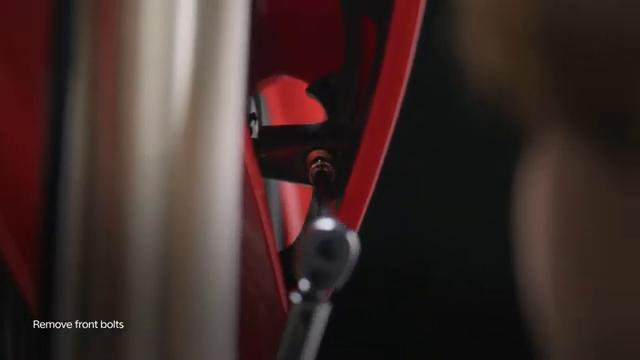
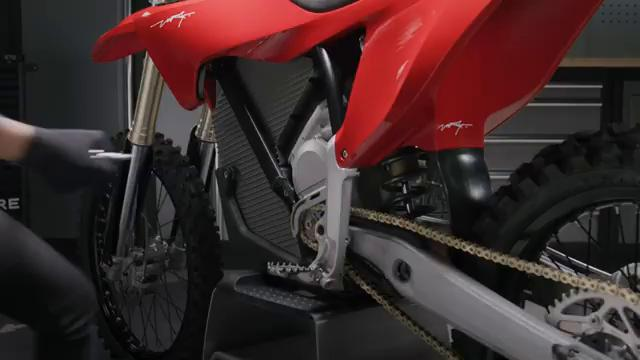
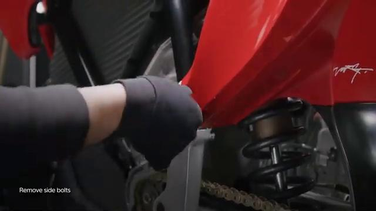
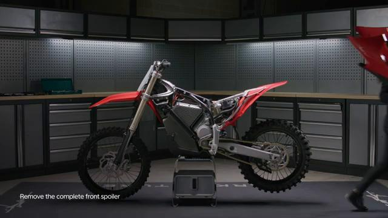
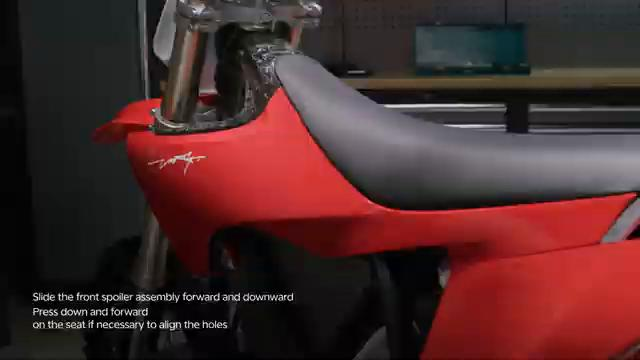
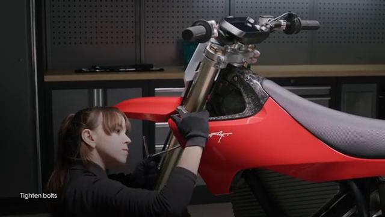
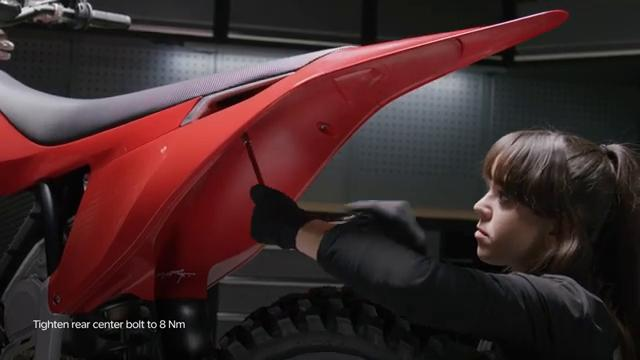
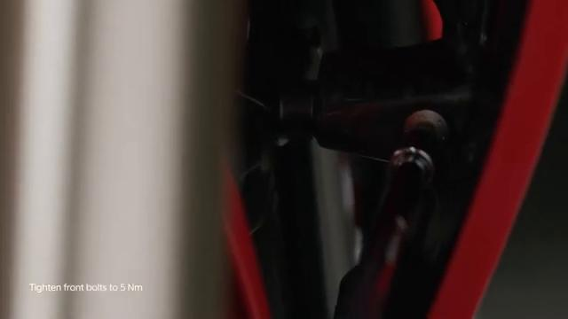

# Remove and Install Spoiler Assembly - Stark VARG

Source video: `Remove and Install Spoiler Assembly - Stark VARG` by Stark Future Official

Applicable models: `MX`

## Scope

This guide follows the same step-by-step workshop structure as the MX tutorials, but it is derived as a visual sequence from the official Stark Future ASMR video. Because the source video does not provide usable captions or narration, the procedure is documented through curated screenshots and concise action guidance.

## Preparation

- Place the bike on a stable stand or work area before starting the procedure.
- Prepare the correct tools for the fasteners, clips, brackets, and components shown in the video.
- Keep removed hardware organized in sequence so reassembly follows the same order as the video.
- Have a torque wrench ready for any tightening steps that specify a torque value.

## Removal Procedure

### 1. Prepare access to the Spoiler Assembly

Remove or move aside the surrounding part, cover, or hardware needed to reach the Spoiler Assembly.

Keep the removed fasteners organized in sequence so reassembly matches the video.

### 2. Remove the visible retaining hardware for the Spoiler Assembly

Remove the bolts, screws, nuts, or clips that directly secure the Spoiler Assembly.

Support the component as the last fastener is removed.

### 3. Release any bracket, clip, or coupling attached to the Spoiler Assembly

Free any bracket, clip, spacer, linkage, or connector that still ties the Spoiler Assembly to the bike.

Note the orientation of these supporting pieces before setting them aside.

### 4. Remove the Spoiler Assembly from the bike

Lift, slide, or guide the Spoiler Assembly out of its mounting position once the retaining hardware is removed.

Inspect the removed part and the mounting points before reassembly.

## Installation Procedure

### 5. Position the Spoiler Assembly for installation

Return the Spoiler Assembly to its mounting position and align the holes, tabs, or locating surfaces.

Press the assembly forward and downward, and if needed press the seat down and forward to align the rear center holes.

### 6. Reconnect or refit the support pieces for the Spoiler Assembly

Reinstall any bracket, clip, spacer, linkage, or coupling associated with the Spoiler Assembly.

Make sure the spoiler assembly fittings are clear of wiring and debris before final tightening.

### 7. Install the retaining hardware for the Spoiler Assembly

Install the main retaining hardware for the Spoiler Assembly by hand first, then tighten it evenly.

Check that the component remains aligned while the hardware is brought fully home.

Tighten the spoiler assembly rear center bolt to **8 Nm**.

Tighten the spoiler assembly side bolts to **20 Nm**.

Tighten the spoiler assembly front bolts to **5 Nm**.

### 8. Verify the completed installation of the Spoiler Assembly

Inspect the final position of the Spoiler Assembly and confirm that all hardware, clips, and surrounding parts are back in place.

Check the component for correct fit and movement before returning the bike to service.

## Torque Summary

| Component | Torque |
| --- | ---: |
| Tighten the spoiler assembly rear center bolt | 8 Nm |
| Tighten the spoiler assembly side bolts | 20 Nm |
| Tighten the spoiler assembly front bolts | 5 Nm |

Verified torque items:

- Tighten the spoiler assembly rear center bolt: **8 Nm** from Stark technical manual `01.007.01 Remove and install spoiler assembly`.
- Tighten the spoiler assembly side bolts: **20 Nm** from Stark technical manual `01.007.01 Remove and install spoiler assembly`.
- Tighten the spoiler assembly front bolts: **5 Nm** from Stark technical manual `01.007.01 Remove and install spoiler assembly`.

## Critical Checks Before Riding

- Confirm the serviced component is fully seated and all fasteners are tightened in the correct order.
- Recheck all torque-critical hardware before riding.
- Make sure all routed cables, clips, brackets, and surrounding parts are returned to their original positions.
- Inspect the bike visually for any missing hardware before returning it to service.
