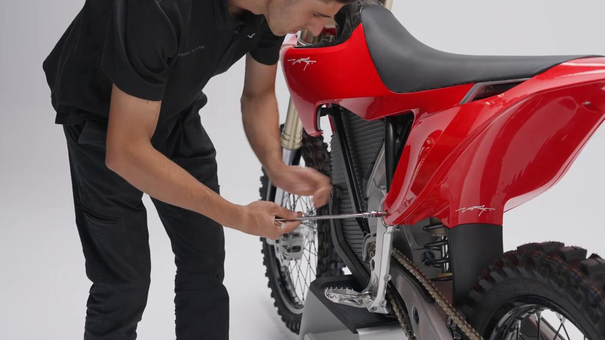
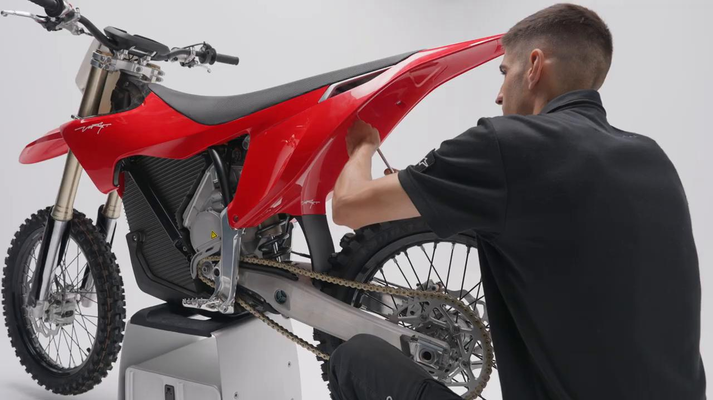
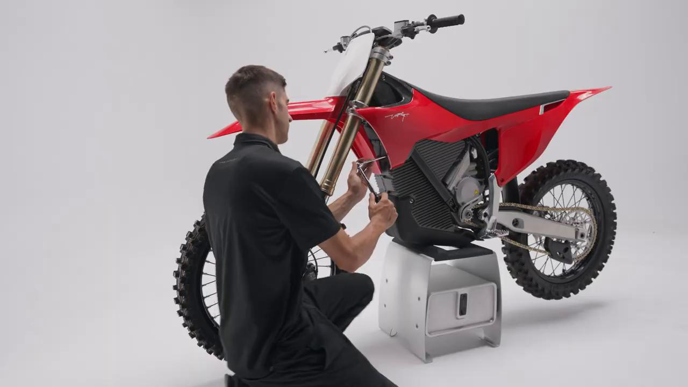
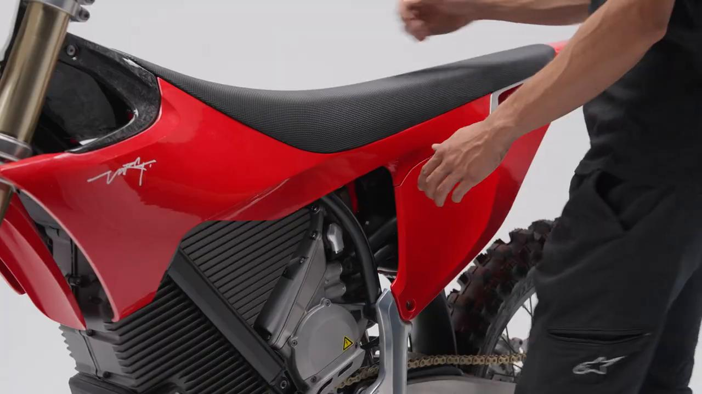
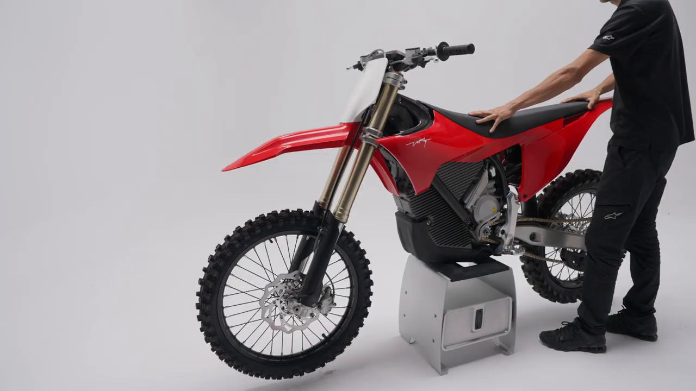
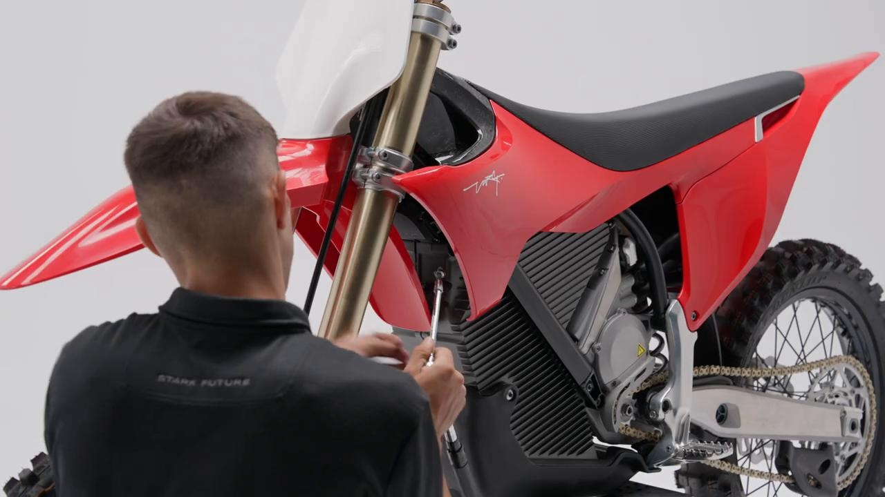
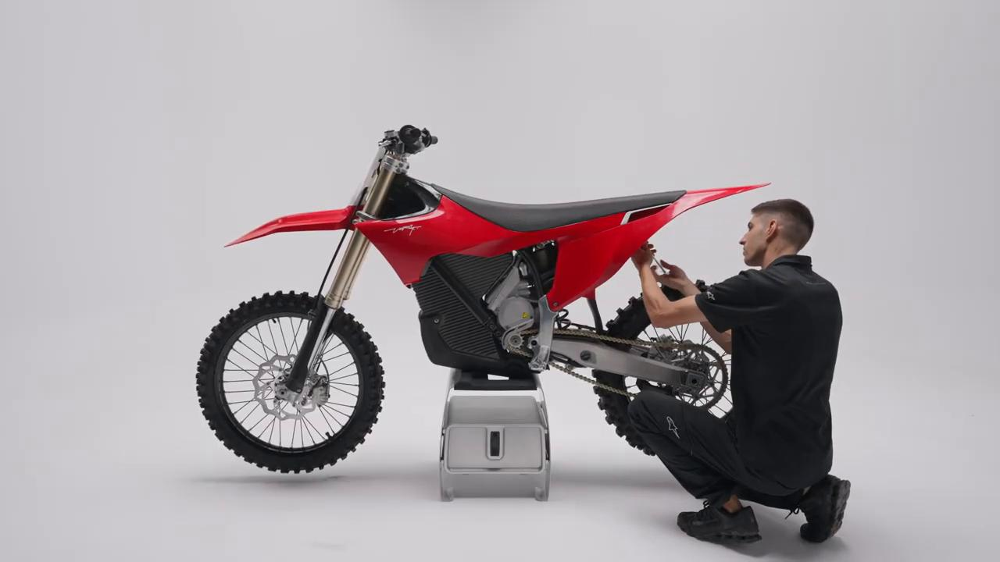
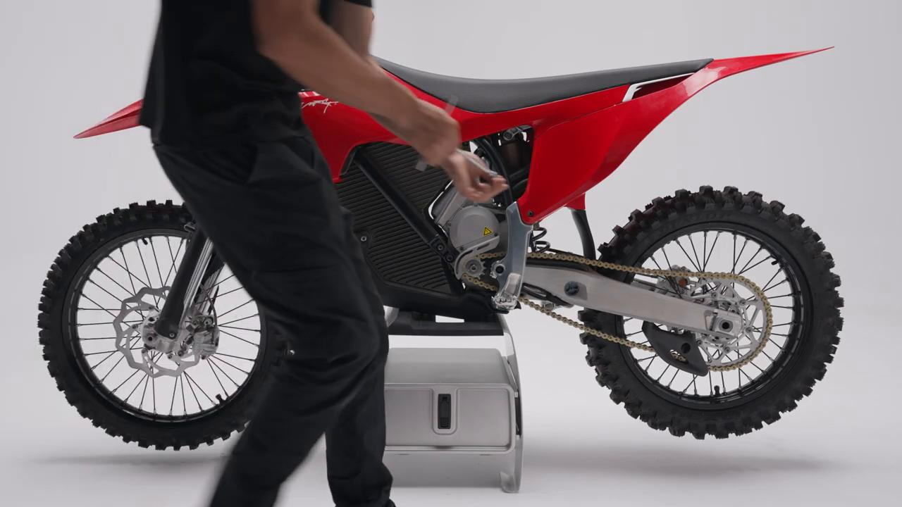

# Remove and Install Spoiler - Stark VARG MX 1.2

Source video: `Remove and Install Spoiler  - Stark VARG MX 1.2` by Stark Future Official

## Scope

This guide converts the official Stark Future tutorial video into a step-by-step workshop procedure. It documents each action shown in the video in sequence and pairs every step with a dedicated screenshot.

## Preparation

- Place the bike on a stable stand or work area before starting the procedure.
- Prepare the correct tools for the fasteners, clips, brackets, and components shown in the video.
- Keep removed hardware organized in sequence so reassembly follows the same order as the video.
- Have a torque wrench ready for any tightening steps that specify a torque value.

## Removal Procedure

### 1. Unscrew the side plate bolts

Unscrew the side plate bolts.

### 2. Unscrew the subframe to seat base bolt under the rear fender

Unscrew the subframe to seat base bolt under the rear fender.

### 3. Unscrew the four front bolts on the side spoilers

Unscrew the four front bolts on the side spoilers.

### 4. Carefully remove the spoiler assembly by sliding it backwards

Carefully remove the spoiler assembly by sliding it backwards.

## Installation Procedure

### 5. Position the spoiler assembly on top of the bike and slide it forward and downward

Position the spoiler assembly on top of the bike and slide it forward and downward.

### 6. Tighten the four front bolts to 5 Nm

Tighten the four front bolts to **5 Nm**.

### 7. Tighten the subframe to seat base bolt to 10 Nm

Tighten the subframe to seat base bolt to **10 Nm**.

### 8. Tighten the side plate bolts to 20 Nm

Tighten the side plate bolts to **20 Nm**.

## Torque Summary

| Component | Torque |
| --- | ---: |
| Tighten the four front bolts | 5 Nm |
| Tighten the subframe to seat base bolt | 10 Nm |
| Tighten the side plate bolts | 20 Nm |

Video-sourced torque items:

- Tighten the four front bolts: **5 Nm** from the official Stark tutorial video.
- Tighten the subframe to seat base bolt: **10 Nm** from the official Stark tutorial video.
- Tighten the side plate bolts: **20 Nm** from the official Stark tutorial video.

## Critical Checks Before Riding

- Confirm the serviced component is fully seated and all fasteners are tightened in the correct order.
- Recheck all torque-critical hardware before riding.
- Make sure all routed cables, clips, brackets, and surrounding parts are returned to their original positions.
- Inspect the bike visually for any missing hardware before returning it to service.
