# Remove and Install Swingarm - Stark Future

Source video: `Remove and Install Swingarm - Stark Future` by Stark Future Official

Applicable models: `MX`

## Scope

This guide follows the same step-by-step workshop structure as the MX tutorials, but it is derived as a visual sequence from the official Stark Future ASMR video. Because the source video does not provide usable captions or narration, the procedure is documented through curated screenshots and concise action guidance.

## Preparation

- Place the bike on a stable stand or work area before starting the procedure.
- Prepare the correct tools for the fasteners, clips, brackets, and components shown in the video.
- Keep removed hardware organized in sequence so reassembly follows the same order as the video.
- Have a torque wrench ready because this guide follows the torque values shown in Stark's original video overlays.

## Removal Procedure

### 1. Remove chain link

Remove the chain link and free the chain before starting swingarm removal.

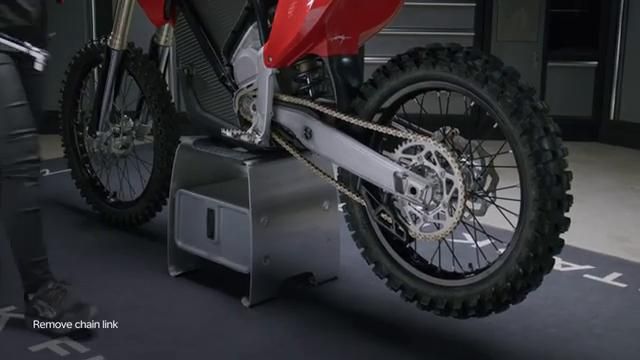

### 2. Run the chain through the front sprocket

Guide the chain through the front sprocket so the rear end can be disassembled.

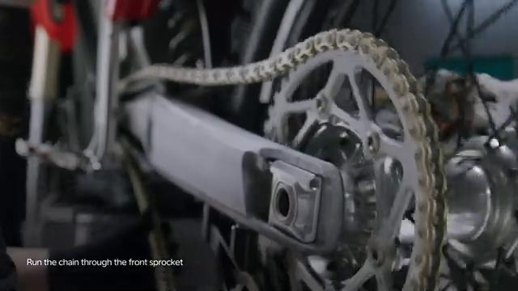

### 3. Loosen rear axle lock nut

Loosen the rear axle lock nut.

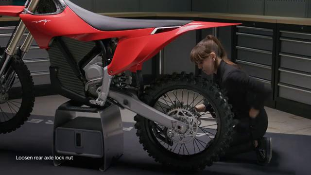

### 4. Push lock nut

Push the lock nut inward as shown in the video.

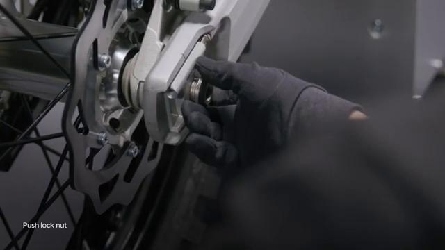

### 5. Remove lock nut and tension adjuster

Remove the lock nut and the tension adjuster.

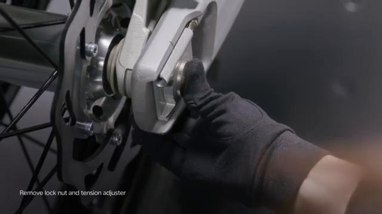

### 6. Remove wheel axle

Remove the wheel axle.

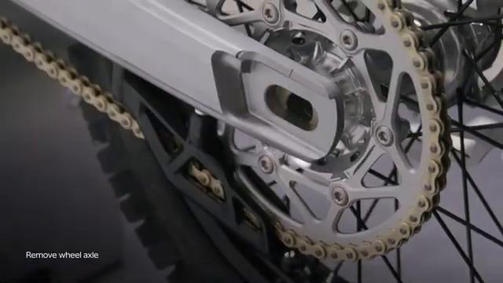

### 7. Loosen brake pedal link bolt

Loosen the brake pedal link bolt.

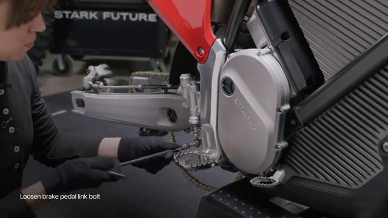

### 8. Hold spring

Hold the spring while removing the rear brake pedal link hardware.

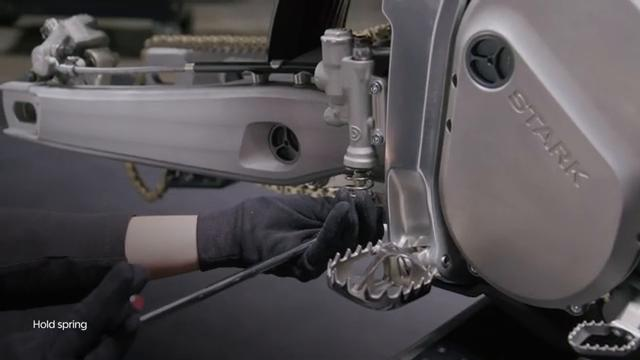

### 9. Loosen brake pump bolts

Loosen the brake pump bolts.

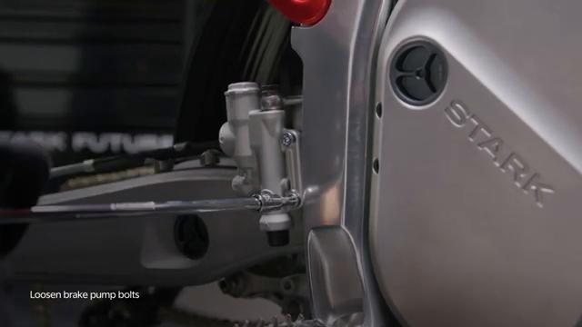

### 10. Remove brake assembly

Remove the brake assembly from the swingarm area.

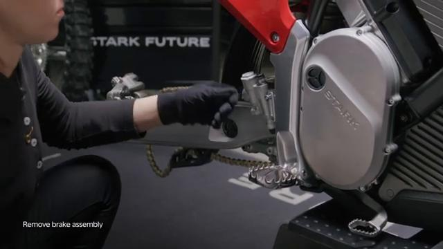

### 11. Remove rear mud flap bolts

Remove the rear mud flap bolts.

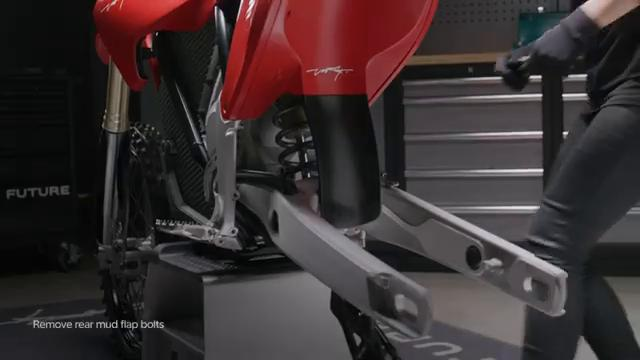

### 12. Loosen chain protector bolt

Loosen the chain protector bolt.

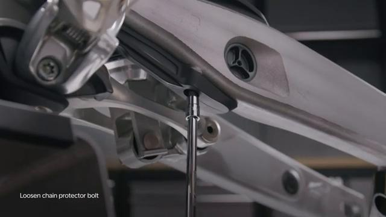

### 13. Remove pull rod lock nuts

Remove the pull rod lock nuts.

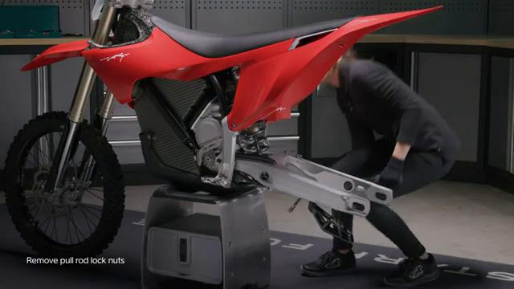

### 14. Pull bolts out

Pull the linkage bolts out.

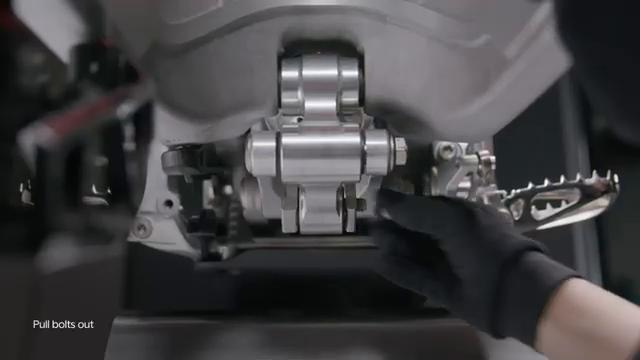

### 15. Loosen axle clamp bolt

Loosen the axle clamp bolt.

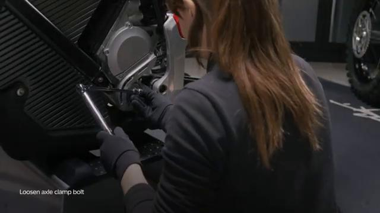

### 16. Remove axle

Remove the swingarm axle.

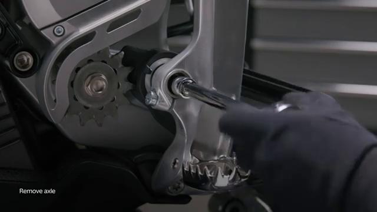

### 17. Remove swingarm

Remove the swingarm from the bike.

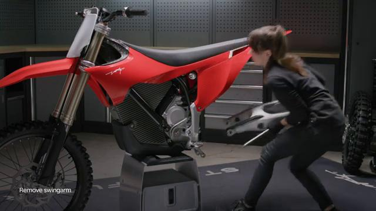

## Installation Procedure

### 18. Hold swingarm in place

Hold the swingarm in position for installation.

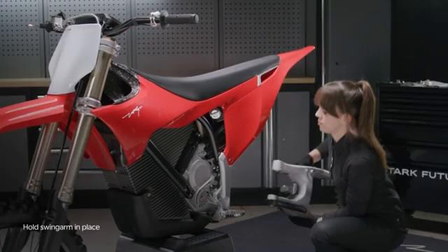

### 19. Insert axle

Insert the swingarm axle.

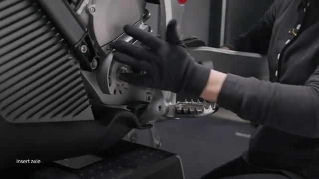

### 20. Tighten axle to 45 Nm

Tighten the swingarm axle to **45 Nm**.

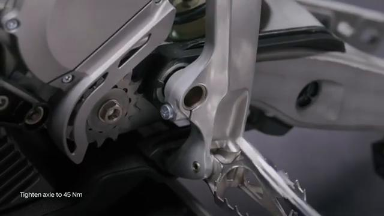

### 21. Tighten clamp bolt to 35 Nm

Tighten the axle clamp bolt to **35 Nm**.

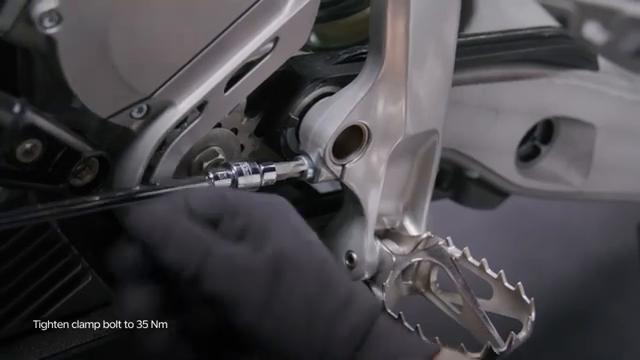

### 22. Tighten lock nuts to 60 Nm

Tighten the pull rod lock nuts to **60 Nm**.

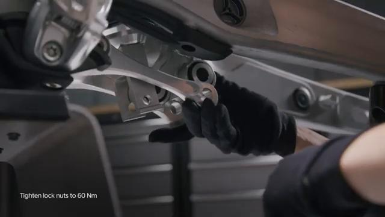

### 23. Tighten chain protector bolt to 5 Nm

Tighten the chain protector bolt to **5 Nm**.

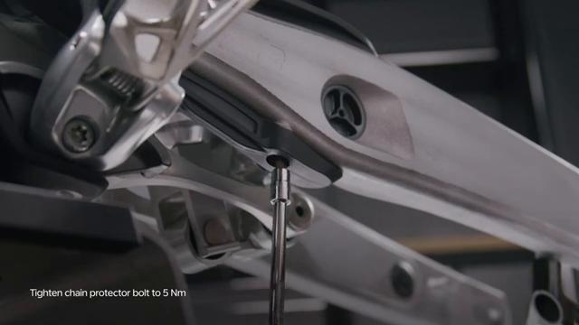

### 24. Slide the rear mud flap backward

Slide the rear mud flap backward into position.

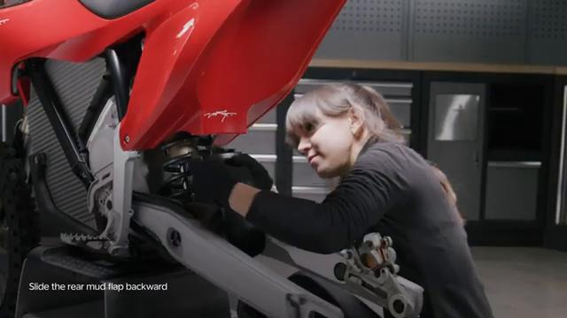

### 25. Tighten bolts to 3 Nm

Tighten the rear mud flap bolts to **3 Nm**.

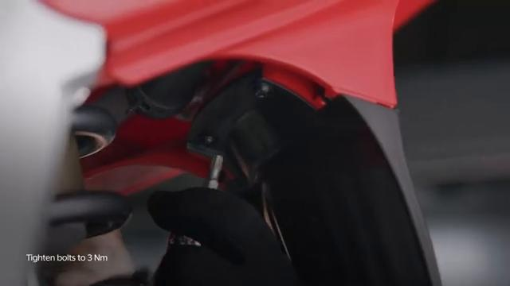

### 26. Insert the brake line in the bracket

Insert the brake line in the bracket.

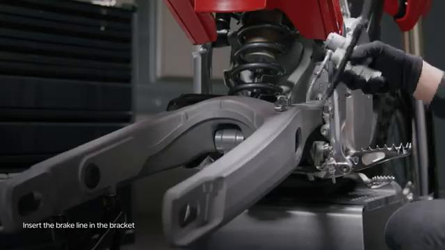

### 27. Install brake caliper

Install the rear brake caliper.

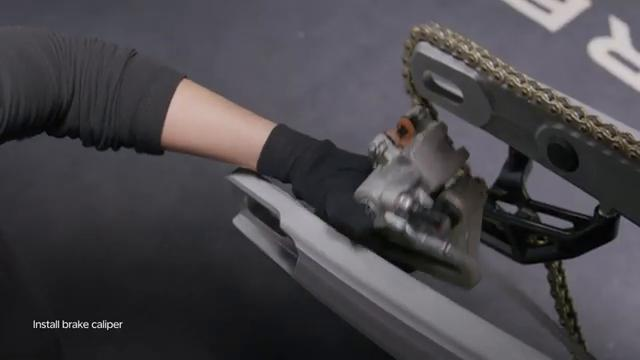

### 28. Hold the brake pump in place

Hold the brake pump in place for installation.

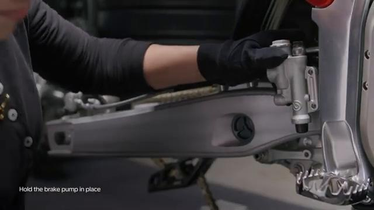

### 29. Tighten bolts to 10 Nm

Tighten the brake pump bolts to **10 Nm**.

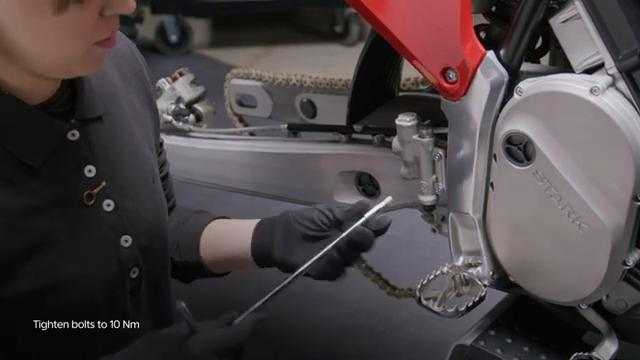

### 30. Install the rear brake pedal link

Install the rear brake pedal link.

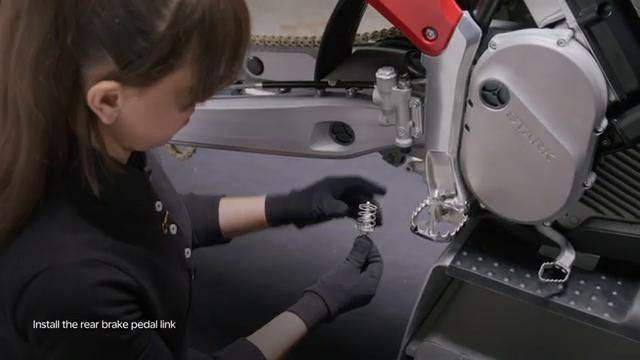

### 31. Tighten link bolt to 10 Nm

Tighten the rear brake pedal link bolt to **10 Nm**.

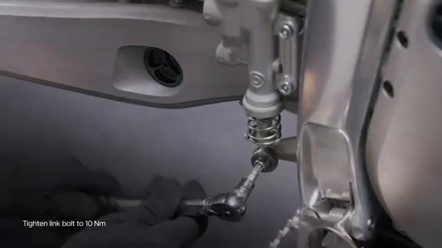

### 32. Ensure the brake disc slides between the brake pads

Make sure the brake disc slides between the brake pads before the wheel is fully installed.

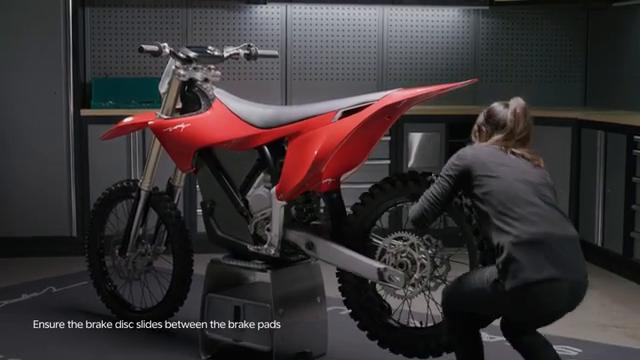

### 33. Insert wheel axle

Insert the wheel axle.

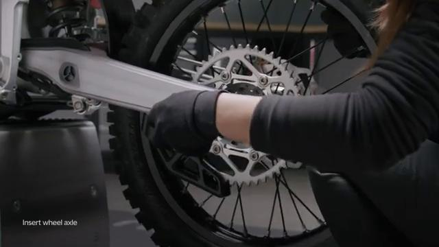

### 34. Install tension adjuster

Install the tension adjuster.

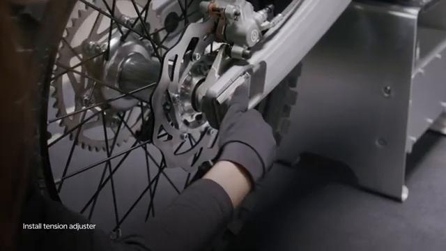

### 35. Run the chain through the front sprocket again

Run the chain through the front sprocket.

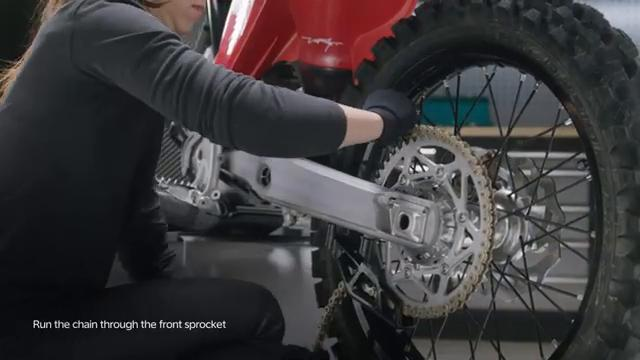

### 36. Install chain link

Install the chain link.

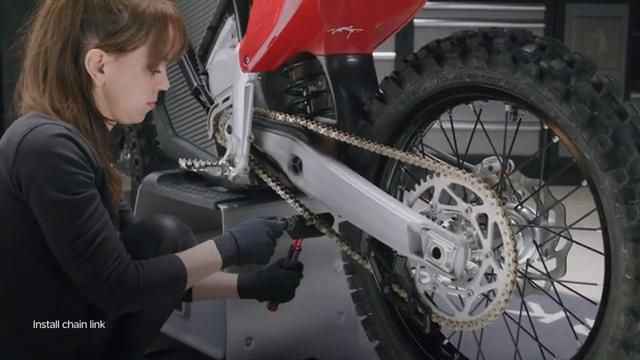

### 37. Insert a piece of cloth between the chain and the wheel sprocket

Insert a piece of cloth between the chain and the wheel sprocket before final axle lock nut torque.

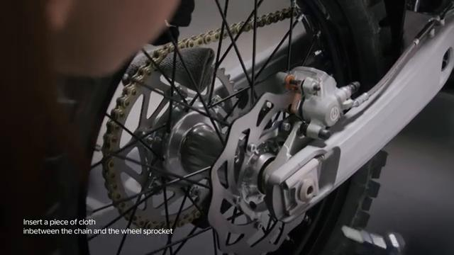

### 38. Tighten axle lock nut to 80 Nm

Tighten the axle lock nut to **80 Nm**.

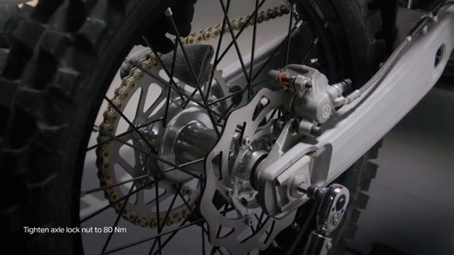

### 39. Remove the cloth

Remove the cloth after the axle lock nut is tightened.

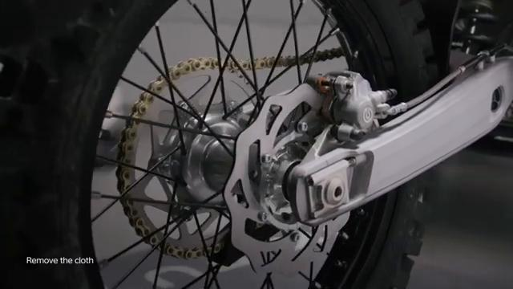

## Torque Summary

| Component | Torque |
| --- | ---: |
| Tighten the swingarm axle | 45 Nm |
| Tighten the axle clamp bolt | 35 Nm |
| Tighten the pull rod lock nuts | 60 Nm |
| Tighten the chain protector bolt | 5 Nm |
| Tighten the rear mud flap bolts | 3 Nm |
| Tighten the brake pump bolts | 10 Nm |
| Tighten the rear brake pedal link bolt | 10 Nm |
| Tighten the axle lock nut | 80 Nm |

Verified torque items:

- Tighten the swingarm axle: **45 Nm** from the original Stark Future tutorial video text overlay.
- Tighten the axle clamp bolt: **35 Nm** from the original Stark Future tutorial video text overlay.
- Tighten the pull rod lock nuts: **60 Nm** from the original Stark Future tutorial video text overlay.
- Tighten the chain protector bolt: **5 Nm** from the original Stark Future tutorial video text overlay.
- Tighten the rear mud flap bolts: **3 Nm** from the original Stark Future tutorial video text overlay.
- Tighten the brake pump bolts: **10 Nm** from the original Stark Future tutorial video text overlay.
- Tighten the rear brake pedal link bolt: **10 Nm** from the original Stark Future tutorial video text overlay.
- Tighten the axle lock nut: **80 Nm** from the original Stark Future tutorial video text overlay.

## Critical Checks Before Riding

- Confirm the serviced component is fully seated and all fasteners are tightened in the correct order.
- Recheck all torque-critical hardware before riding.
- Make sure all routed cables, clips, brackets, and surrounding parts are returned to their original positions.
- Inspect the bike visually for any missing hardware before returning it to service.
