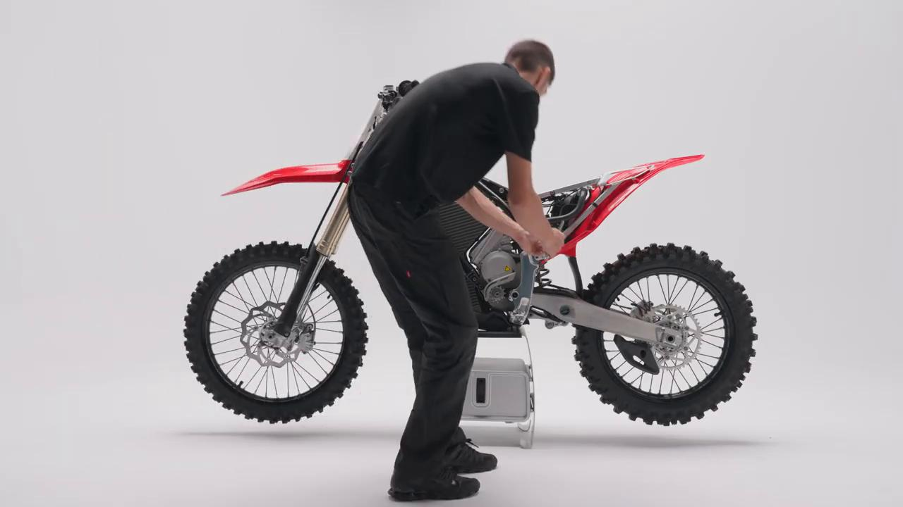
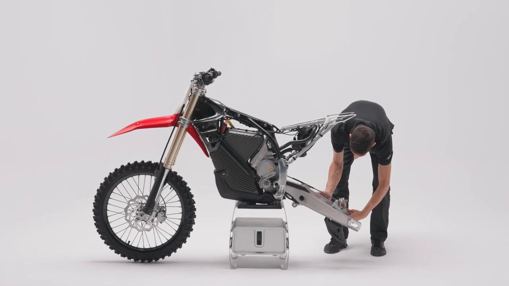
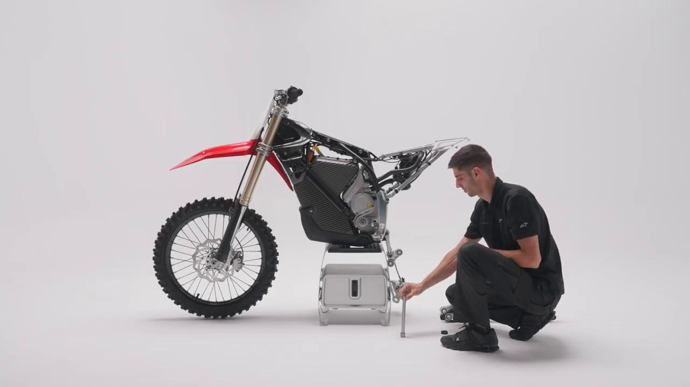
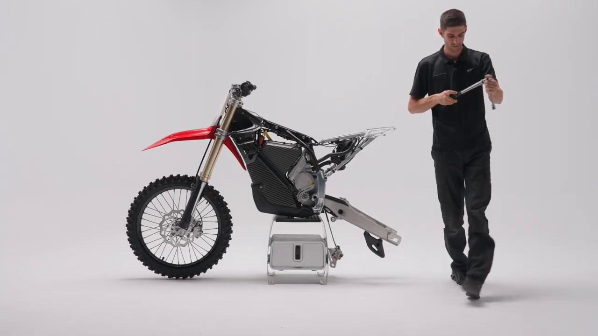
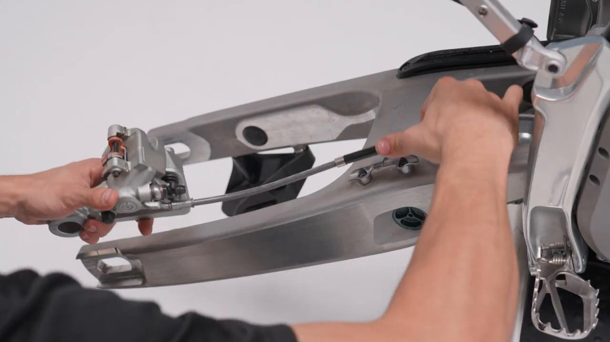
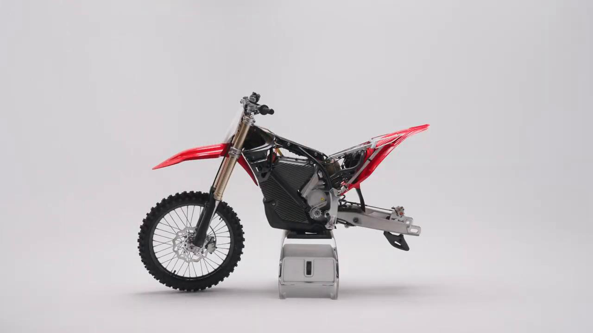
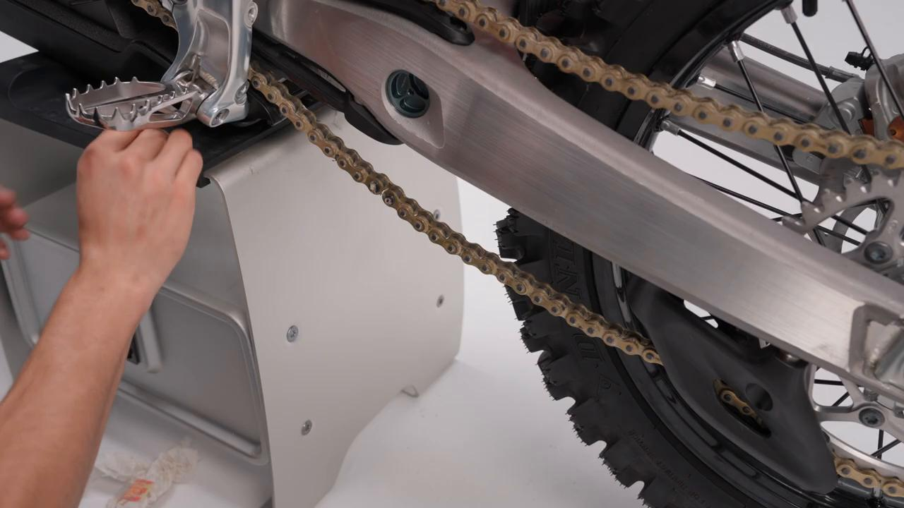
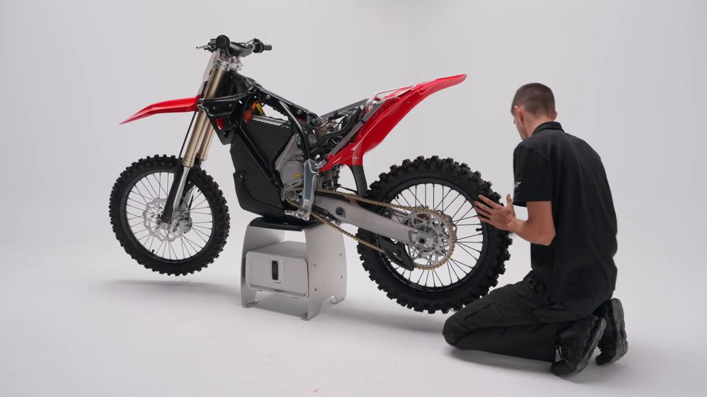

# Remove and Install Swingarm - Stark VARG MX 1.2 / EX

Source video: `Remove and Install Swingarm - Stark VARG MX 1.2` by Stark Future Official

Applicable models: `MX 1.2 / EX`

## Scope

This guide follows the same step-by-step workshop structure as the MX tutorials, but it is derived as a visual sequence from the official Stark Future ASMR video. Because the source video does not provide usable captions or narration, the procedure is documented through curated screenshots and concise action guidance.

## Preparation

- Place the bike on a stable stand or work area before starting the procedure.
- Prepare the correct tools for the fasteners, clips, brackets, and components shown in the video.
- Keep removed hardware organized in sequence so reassembly follows the same order as the video.
- Have a torque wrench ready for any tightening steps that specify a torque value.

## Removal Procedure

### 1. Prepare access to the Swingarm

Prepare access to the Swingarm.

### 2. Remove the visible fasteners securing the Swingarm

Remove the visible fasteners securing the Swingarm.

### 3. Release the Swingarm from its mounting position

Release the Swingarm from its mounting position.

### 4. Remove or free any related clip, bracket, or connector

Remove or free any related clip, bracket, or connector.

## Installation Procedure

### 5. Position the Swingarm for installation

Position the Swingarm for installation.

### 6. Install the retaining hardware for the Swingarm

Install the retaining hardware for the Swingarm.

Tighten the swingarm axle to **45 Nm**.

Tighten the swingarm clamp bolt to **25 Nm**.

### 7. Align the Swingarm in its final position

Align the Swingarm in its final position.

### 8. Verify the completed installation

Verify the completed installation.

## Torque Summary

| Component | Torque |
| --- | ---: |
| Tighten the swingarm axle | 45 Nm |
| Tighten the swingarm clamp bolt | 25 Nm |

Verified torque items:

- Tighten the swingarm axle: **45 Nm** from the official Stark documentation.
- Tighten the swingarm clamp bolt: **25 Nm** from the official Stark documentation.

## Critical Checks Before Riding

- Confirm the serviced component is fully seated and all fasteners are tightened in the correct order.
- Recheck all torque-critical hardware before riding.
- Make sure all routed cables, clips, brackets, and surrounding parts are returned to their original positions.
- Inspect the bike visually for any missing hardware before returning it to service.
