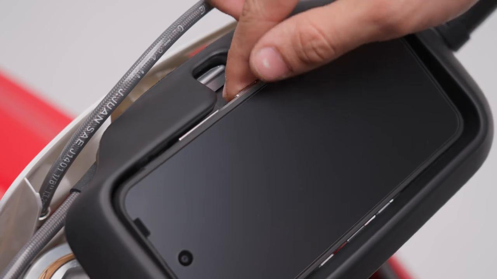
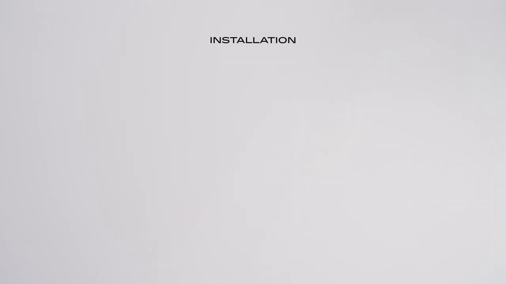
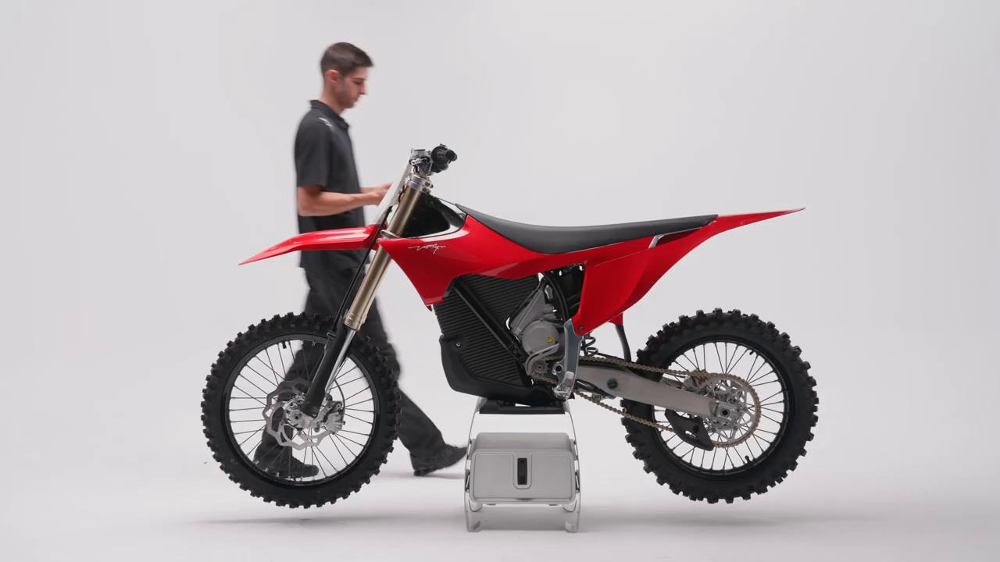
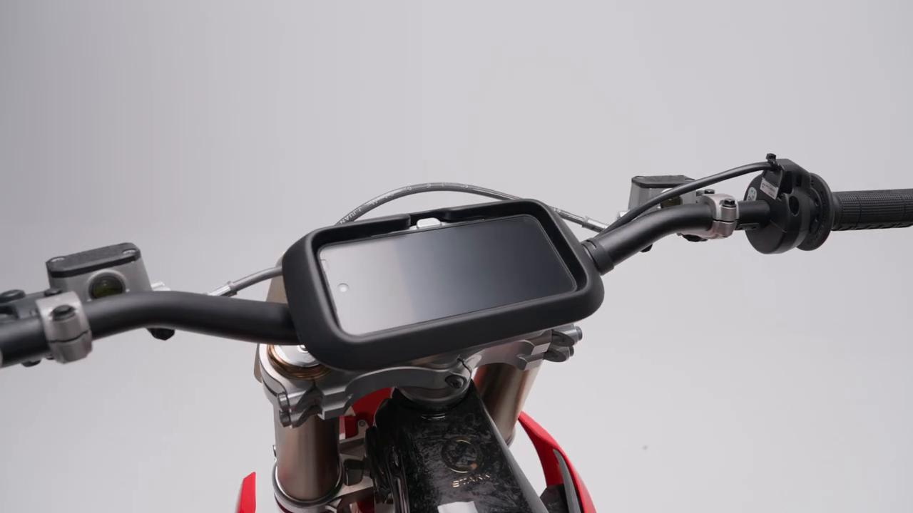

# Remove and Install The Arkenstone Phone - Stark VARG MX 1.2 / EX

Source video: `Remove and Install The Arkenstone Phone - Stark VARG MX 1.2` by Stark Future Official

Applicable models: `MX 1.2 / EX`

## Scope

This guide follows the same step-by-step workshop structure as the MX tutorials, but it is derived as a visual sequence from the official Stark Future ASMR video. Because the EX video does not provide usable captions or narration, the procedure is documented through curated screenshots and concise action guidance.

## Preparation

- Place the bike on a stable stand or work area before starting the procedure.
- Prepare the correct tools for the fasteners, clips, brackets, and components shown in the video.
- Keep removed hardware organized in sequence so reassembly follows the same order as the video.
- Have a torque wrench ready for any tightening steps that specify a torque value.

## Removal Procedure

### 1. Prepare access to the Arkenstone Phone

Prepare access to the Arkenstone Phone.

### 2. Remove the visible fasteners securing the Arkenstone Phone

Remove the visible fasteners securing the Arkenstone Phone.

### 3. Release the Arkenstone Phone from its mounting position

Release the Arkenstone Phone from its mounting position.

### 4. Remove or free any related clip, bracket, or connector

Remove or free any related clip, bracket, or connector.

## Installation Procedure

### 5. Position the Arkenstone Phone for installation

Position the Arkenstone Phone for installation.

### 6. Install the retaining hardware for the Arkenstone Phone

Install the retaining hardware for the Arkenstone Phone.

### 7. Align the Arkenstone Phone in its final position

Align the Arkenstone Phone in its final position.

### 8. Verify the completed installation

Verify the completed installation.

## Critical Checks Before Riding

- Confirm the serviced component is fully seated and all fasteners are tightened in the correct order.
- Recheck all torque-critical hardware before riding.
- Make sure all routed cables, clips, brackets, and surrounding parts are returned to their original positions.
- Inspect the bike visually for any missing hardware before returning it to service.
