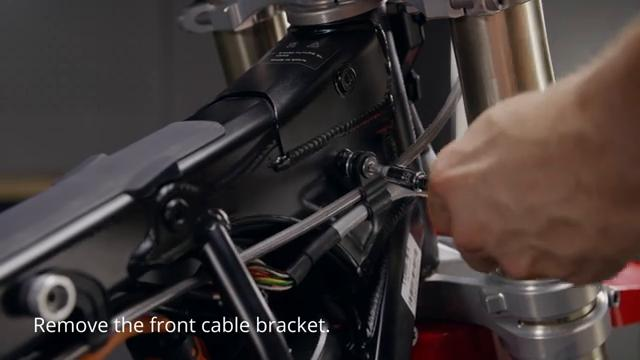
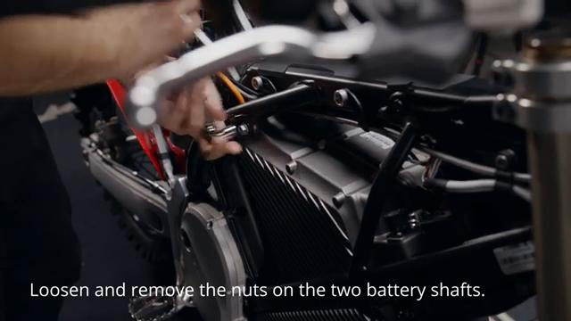
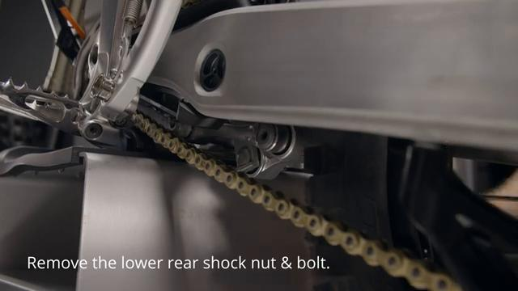
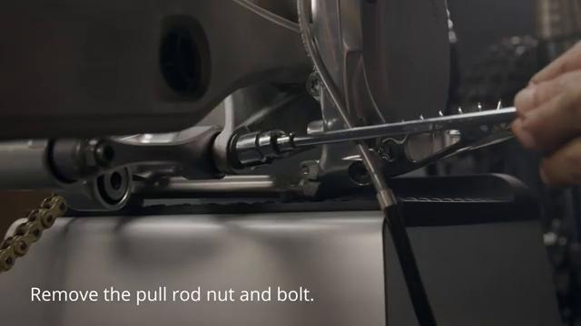
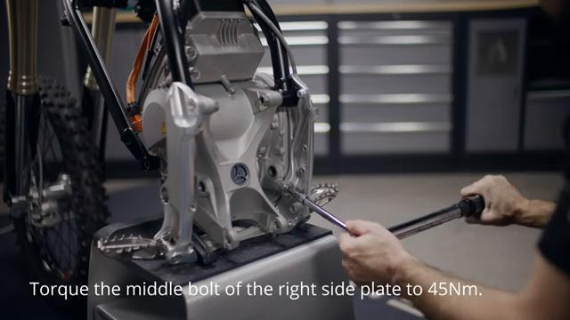
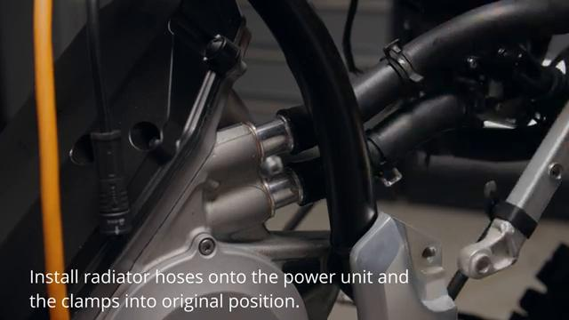
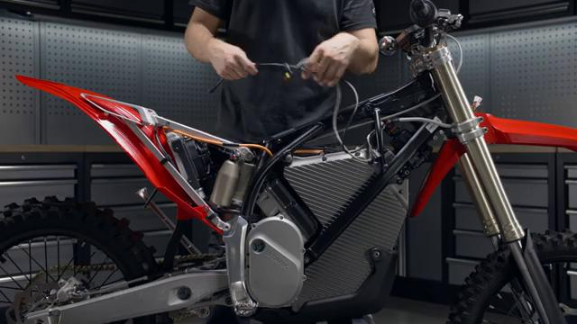
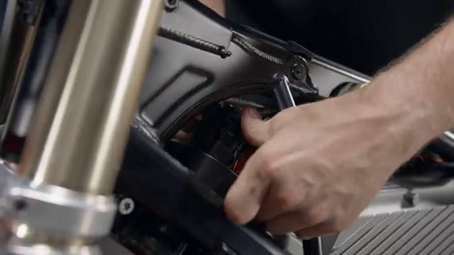

# Remove and Install the Power Train Unit - Stark VARG

Source video: `Remove and Install the Power Train Unit - Stark VARG` by Stark Future Official

Applicable models: `MX`

## Scope

This guide follows the same step-by-step workshop structure as the MX tutorials, but it is derived as a visual sequence from the official Stark Future ASMR video. Because the source video does not provide usable captions or narration, the procedure is documented through curated screenshots and concise action guidance.

## Preparation

- Place the bike on a stable stand or work area before starting the procedure.
- Prepare the correct tools for the fasteners, clips, brackets, and components shown in the video.
- Keep removed hardware organized in sequence so reassembly follows the same order as the video.
- Have a torque wrench ready for any tightening steps that specify a torque value.

## Removal Procedure

### 1. Prepare access to the Power Train Unit

Remove or move aside the surrounding part, cover, or hardware needed to reach the Power Train Unit.

Keep the removed fasteners organized in sequence so reassembly matches the video.

### 2. Remove the visible retaining hardware for the Power Train Unit

Remove the bolts, screws, nuts, or clips that directly secure the Power Train Unit.

Support the component as the last fastener is removed.

### 3. Release any bracket, clip, or coupling attached to the Power Train Unit

Free any bracket, clip, spacer, linkage, or connector that still ties the Power Train Unit to the bike.

Note the orientation of these supporting pieces before setting them aside.

### 4. Remove the Power Train Unit from the bike

Lift, slide, or guide the Power Train Unit out of its mounting position once the retaining hardware is removed.

Inspect the removed part and the mounting points before reassembly.

## Installation Procedure

### 5. Position the Power Train Unit for installation

Return the Power Train Unit to its mounting position and align the holes, tabs, or locating surfaces.

Hold the component in place until the first retaining hardware is started.

### 6. Reconnect or refit the support pieces for the Power Train Unit

Reinstall any bracket, clip, spacer, linkage, or coupling associated with the Power Train Unit.

Make sure each supporting piece is seated correctly before final tightening.

### 7. Install the retaining hardware for the Power Train Unit

Install the main retaining hardware for the Power Train Unit by hand first, then tighten it evenly.

Check that the component remains aligned while the hardware is brought fully home.

### 8. Verify the completed installation of the Power Train Unit

Inspect the final position of the Power Train Unit and confirm that all hardware, clips, and surrounding parts are back in place.

Check the component for correct fit and movement before returning the bike to service.

## Critical Checks Before Riding

- Confirm the serviced component is fully seated and all fasteners are tightened in the correct order.
- Recheck all torque-critical hardware before riding.
- Make sure all routed cables, clips, brackets, and surrounding parts are returned to their original positions.
- Inspect the bike visually for any missing hardware before returning it to service.
