# Remove and Install the Power Train Unit - Stark VARG

Source video: `Remove and Install the Power Train Unit - Stark VARG` by Stark Future Official

Applicable models: `MX`

## Scope

This guide follows the original Stark Future video overlay sequence for the procedure shown in the original MX tutorial video. Each step below is aligned to the instruction text shown on screen.

## Preparation

- Place the bike on a stable stand or work area before starting the procedure.
- Prepare the correct tools for the fasteners, clips, brackets, and components shown in the video.
- Keep removed hardware organized in sequence so reassembly follows the same order as the video.
- Follow the torque values shown in the original Stark tutorial video wherever the video displays a torque on screen.

## Removal Procedure

### 1. Remove the spoiler assembly

Remove the spoiler assembly. 01.007.01 Remove and install spoiler assembly ↗.

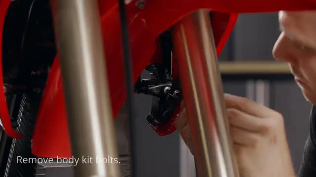

### 2. Remove the carbon fiber spoiler assembly

Remove the carbon fiber spoiler assembly. Refer to: 01.021.01 Remove and install carbon fiber spoiler assembly ↗.

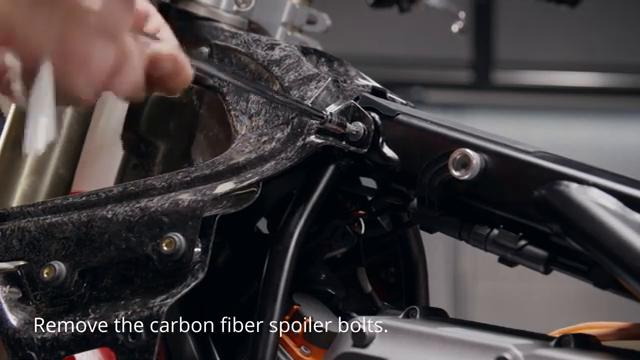

### 3. Remove the front fender

Remove the front fender. Refer to: 01.005.01 Remove and install front fender ↗. Please take all the necessary precautionary measures to handle high voltage components. High voltage components should only be handled by qualified personnel.

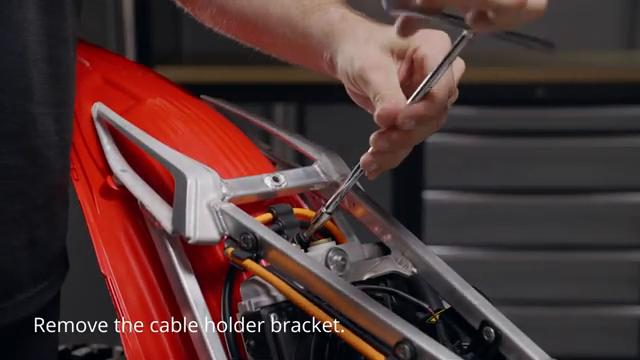

### 4. Disconnect the CAN BUS connector

Disconnect the CAN BUS connector.

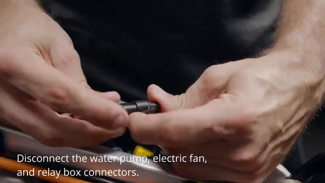

### 5. Install the protective cover onto the CAN BUS socket on the battery

Install the protective cover onto the CAN BUS socket on the battery.

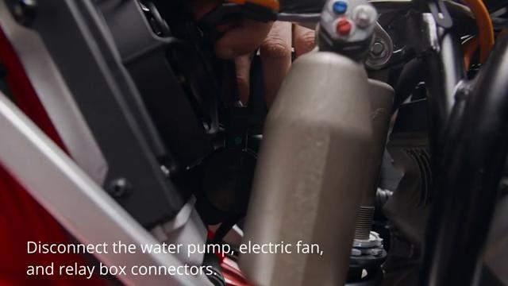

### 6. Disconnect the battery power plug

Disconnect the battery power plug.

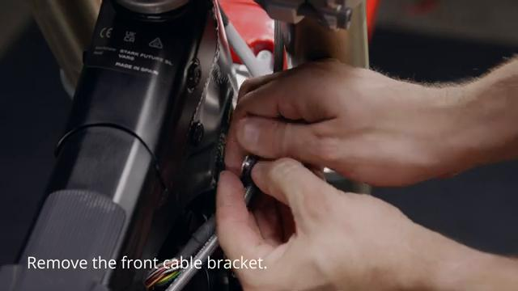

### 7. Install the protective cover onto the power socket on the battery

Install the protective cover onto the power socket on the battery.

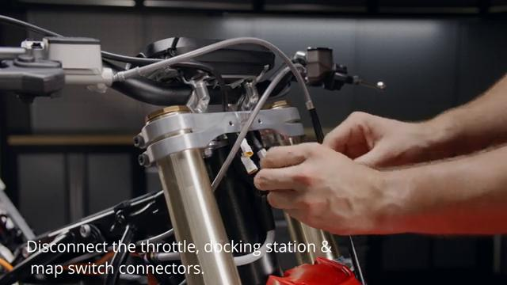

### 8. Drain the coolant

Drain the coolant. Refer to: 10.002.04 Draining and filing cooling system ↗.

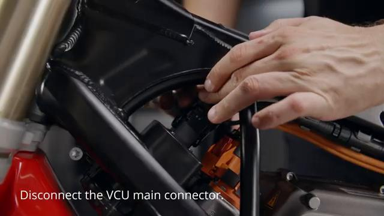

### 9. Remove the battery

Remove the battery. Refer to: 07.005.01 Remove and install the battery ↗.

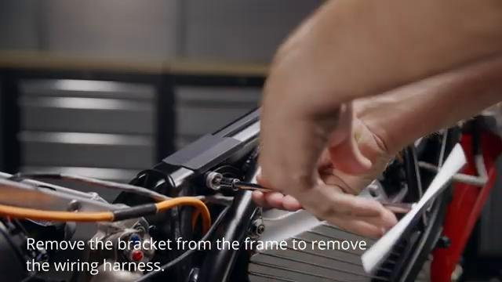

### 10. Remove the forks

Remove the forks. Refer to: 08.022.01 Remove and install forks ↗.

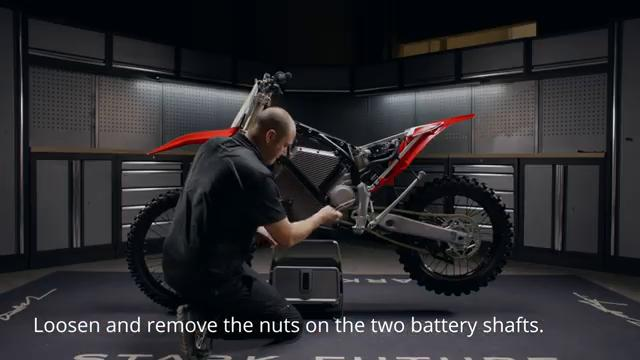

### 11. Remove the subframe

Remove the subframe. Refer to: 05.022.01 Remove and install subframe ↗.

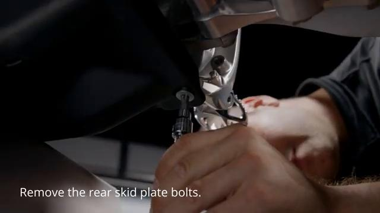

### 12. Remove the shock

Remove the shock. Refer to: 08.058.01 Remove and install shock ↗.

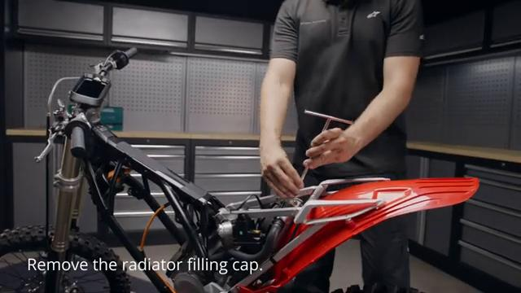

### 13. Remove the chain

Remove the chain. Refer to: 03.011.01 Remove and install chain ↗.

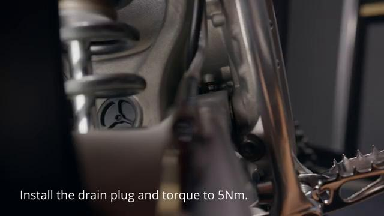

### 14. Remove the rear brake caliper

Remove the rear brake caliper. Refer to: 02.024.01 Remove and install rear brake caliper ↗. Secure the rear brake caliper onto the frame.

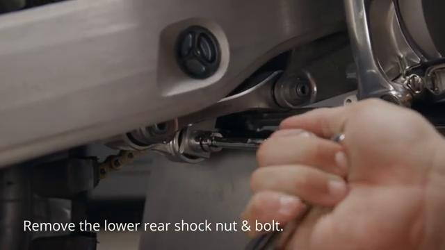

### 15. Remove the side plates

Remove the side plates. Refer to: 05.005.01 Remove and install left side plate ↗. 05.006.01 Remove and install right side plate ↗.

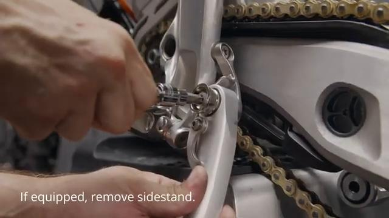

### 16. Remove the swingarm

Remove the swingarm. Refer to: 05.052.01 Remove and install swingarm ↗.

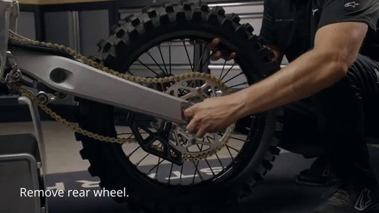

### 17. Loosen the inverter to battery wiring harness from the holding brackets

Loosen the inverter to battery wiring harness from the holding brackets.

### 18. Loosen the frame-to-motor shaft

Loosen the frame-to-motor shaft.

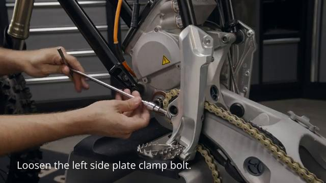

### 19. Carefully lift the frame off the powertrain unit

Carefully lift the frame off the powertrain unit. Secure the rear brake caliper onto the frame.

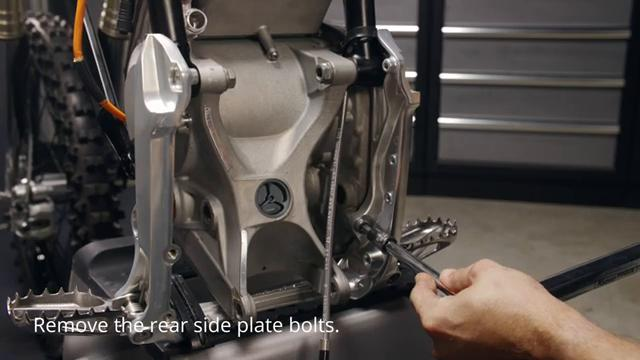

## Installation Procedure

### 20. Place the powertrain unit firmly on the stand

Place the powertrain unit firmly on the stand.

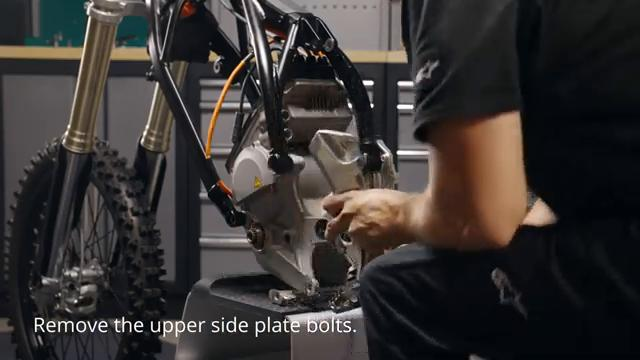

### 21. Place the frame over the powertrain unit and align the mounting holes

Place the frame over the powertrain unit and align the mounting holes.

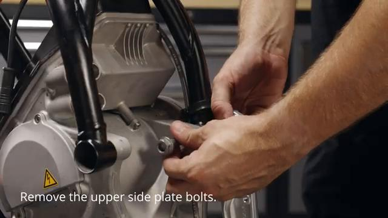

### 22. Insert and tighten the frame to motor shaft enough to secure it in place

Insert and tighten the frame-to-motor shaft enough to secure it in place. Final torque is applied in step 30.

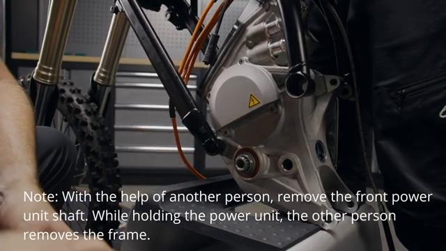

### 23. Install the side plates

Install the side plates. Refer to: 05.005.01 Remove and install left side plate ↗. 05.006.01 Remove and install right side plate ↗.

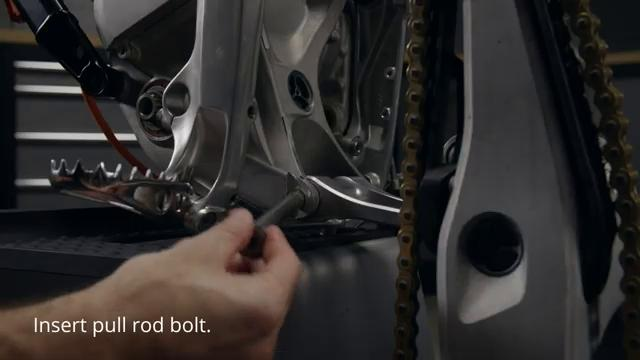

### 24. Install swingarm

Install swingarm. Refer to: 05.052.01 Remove and install swingarm ↗. If the bike is fitted with rear foot brake, skip steps 6 and 7.

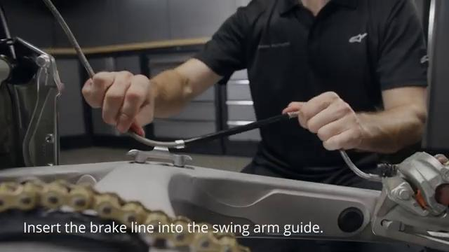

### 25. Install the rear brake caliper

Install the rear brake caliper. Refer to: 02.024.01 Remove and install rear brake caliper ↗.

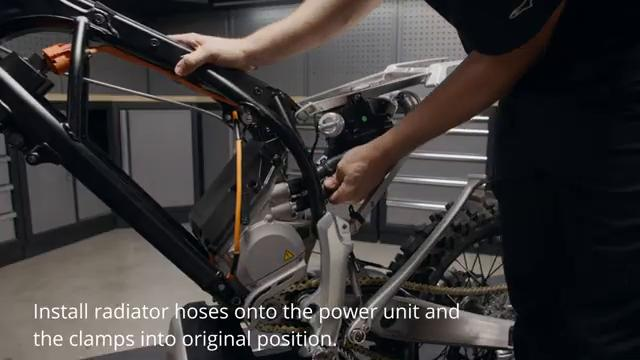

### 26. Install the shock

Install the shock. Refer to: 08.058.01 Remove and install shock ↗.

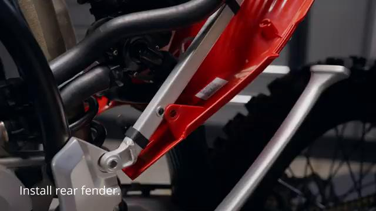

### 27. Install the subframe

Install the subframe. Refer to: 05.022.01 Remove and install subframe ↗.

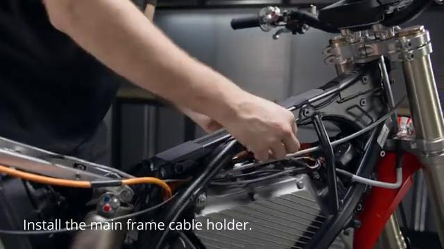

### 28. Install the forks

Install the forks. Refer to: 08.022.01 Remove and install forks ↗.

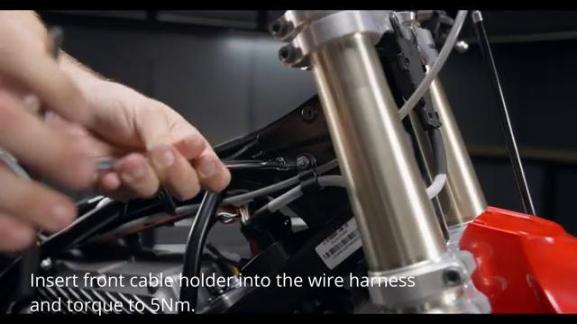

### 29. Install the battery

Install the battery. Refer to: 07.005.01 Remove and install the battery ↗.

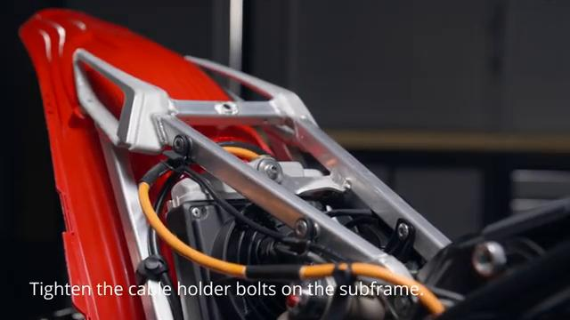

### 30. Tighten the frame to motor shaft to 60 Nm

Tighten the frame to motor shaft to **60 Nm**.

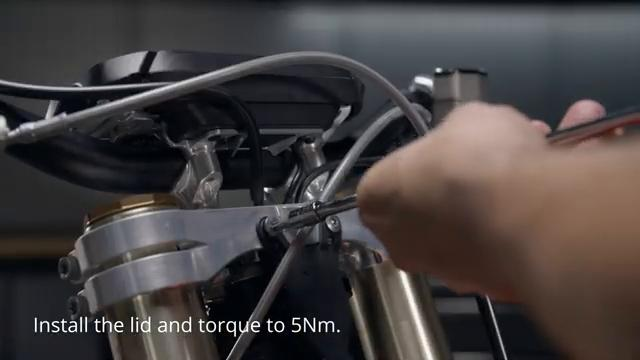

### 31. Filling the coolant

Filling the coolant. Refer to: 10.002.04 Draining and filling cooling system ↗.

### 32. Install the carbon fiber spoiler assembly

Install the carbon fiber spoiler assembly. Refer to: 01.021.01 Remove and install carbon fiber spoiler assembly ↗.

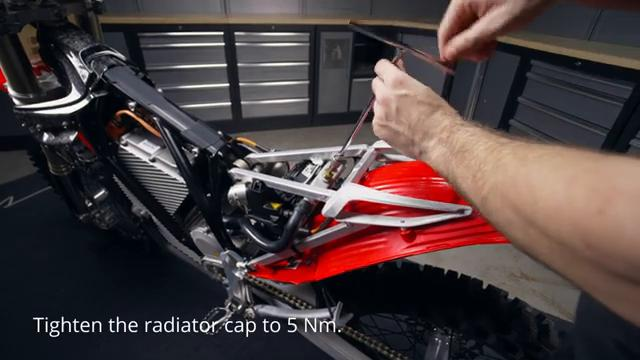

### 33. Install the spoiler assembly

Install the spoiler assembly. 01.007.01 Remove and install spoiler assembly ↗.

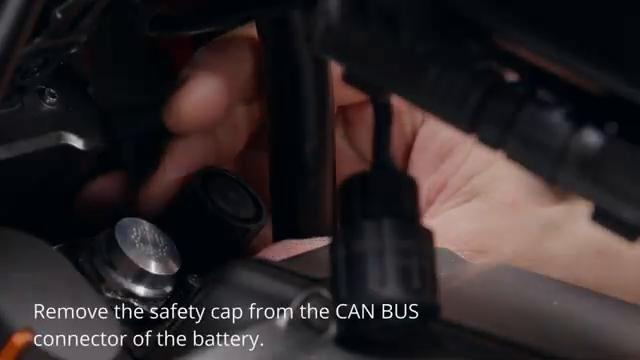

### 34. Install the front fender

Install the front fender. Refer to: 01.005.01 Remove and install front fender ↗. Confirm the bike operates normally before riding.

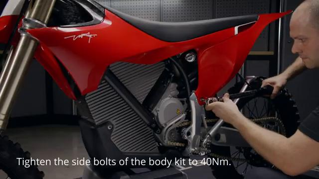

## Torque Summary

| Component | Torque |
| --- | ---: |
| Tighten the frame to motor shaft | 60 Nm |

Verified torque items:

- Tighten the frame to motor shaft: **60 Nm** from the original Stark Future tutorial video text overlay.

## Critical Checks Before Riding

- Confirm the serviced components are fully seated and all fasteners are tightened in the correct order.
- Recheck all torque-critical hardware before riding.
- Make sure all routed cables, clips, brackets, and surrounding parts are returned to their original positions.
- Inspect the bike visually for any missing hardware before returning it to service.
