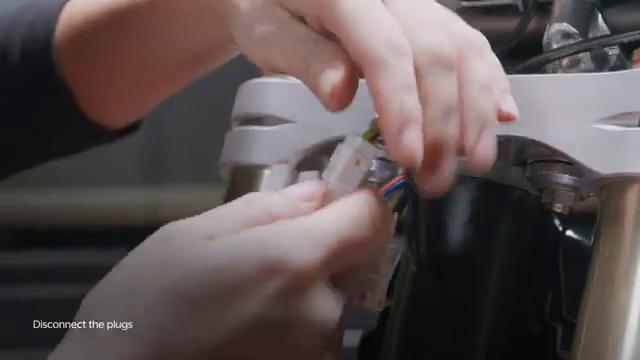
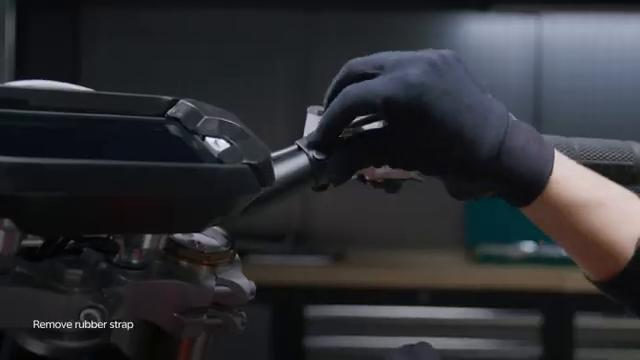
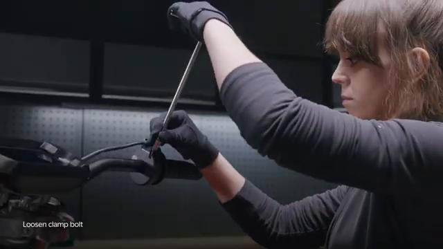
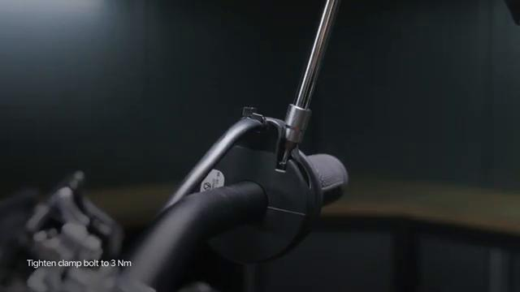
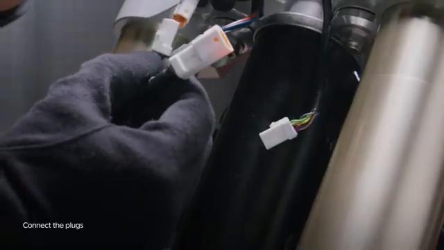
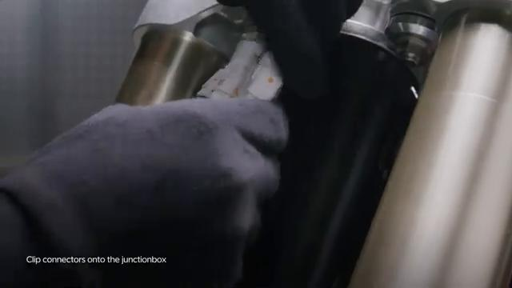
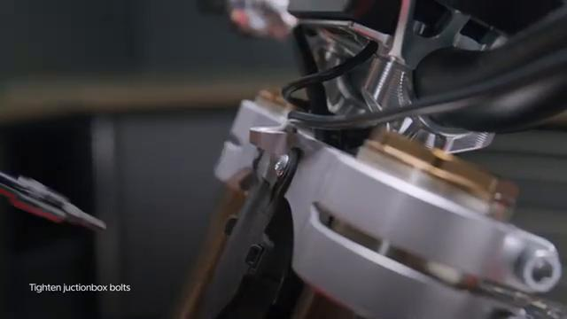

# Remove and Install Throttle - Stark VARG

Source video: `Remove and Install Throttle - Stark VARG` by Stark Future Official

Applicable models: `MX`

## Scope

This guide follows the original Stark Future video overlay sequence for the procedure shown in the original MX tutorial video. Each step below is aligned to the instruction text shown on screen.

## Preparation

- Place the bike on a stable stand or work area before starting the procedure.
- Prepare the correct tools for the fasteners, clips, brackets, and components shown in the video.
- Keep removed hardware organized in sequence so reassembly follows the same order as the video.
- Follow the torque values shown in the original Stark tutorial video wherever the video displays a torque on screen.

## Removal Procedure

### 1. Disconnect the handlebar controls

Disconnect the handlebar controls. Refer to: 06.030.07 Disconnect and reconnect handlebar controls ↗.

### 2. Remove the control switch wiring rubber strap

Remove the control switch wiring rubber strap.

### 3. Carefully pull the wiring out of the triple clamp routing channel

Carefully pull the wiring out of the triple clamp routing channel. If you feel excessive resistance when pulling the wiring out of the triple clamp, please check that you disconnected the correct plug or the wiring is not stuck.

### 4. Loosen the throttle clamp bolt

Loosen the throttle clamp bolt.

### 5. Slide the throttle out of the handlebar

Slide the throttle out of the handlebar.

## Installation Procedure

### 6. Slide the throttle onto the handlebar

Slide the throttle onto the handlebar. The bulky side of the throttle housing should be facing up to prevent impacting your knees on a tight turn.

### 7. Tighten the throttle clamp bolt to 3 Nm

Tighten the throttle clamp bolt to 3 Nm. Please ensure throttle can operate freely.

### 8. Fit the cable through the triple clamp routing channel

Fit the cable through the triple clamp routing channel.

### 9. Connect the handlebar controls

Connect the handlebar controls. Refer to: 06.030.07 Disconnect and reconnect handlebar controls ↗.

### 10. Fit the throttle wiring rubber strap to secure it to the handlebar

Fit the throttle wiring rubber strap to secure it to the handlebar. Turn ON the bike and connect to the Stark phone to check battery status and that the bike is operating normally after disconnecting electronic components.

## Torque Summary

| Component | Torque |
| --- | ---: |
| Tighten the throttle clamp bolt | 3 Nm |

Verified torque items:

- Tighten the throttle clamp bolt: **3 Nm** from the original Stark Future tutorial video text overlay.

## Critical Checks Before Riding

- Confirm the serviced components are fully seated and all fasteners are tightened in the correct order.
- Recheck all torque-critical hardware before riding.
- Make sure all routed cables, clips, brackets, and surrounding parts are returned to their original positions.
- Inspect the bike visually for any missing hardware before returning it to service.
