# Remove and Install Top Steering Bearing - Stark VARG

Source video: `Remove and Install Top Steering Bearing - Stark VARG` by Stark Future Official

Applicable models: `MX`

## Scope

This guide follows the original Stark Future video overlay sequence for the top steering bearing procedure. Each step below is aligned to the instruction text shown on screen in the original MX tutorial video.

## Preparation

- Place the bike on a stable stand or work area before starting the procedure.
- Prepare the correct tools for the fasteners, clamps, brackets, and front-end components shown in the video.
- Keep removed hardware organized in sequence so reassembly follows the same order as the video.
- Follow the torque values shown in the original Stark tutorial video wherever the video displays a torque on screen.

## Removal Procedure

### 1. Remove Stark phone

Remove the Stark phone from the docking station.

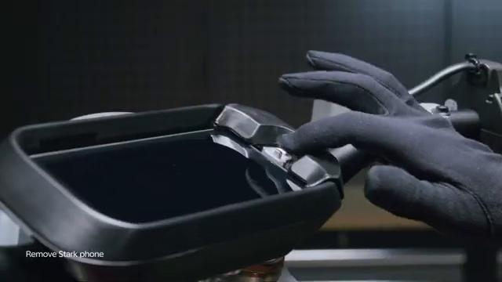

### 2. Remove number plate bolt

Remove the front number plate bolt.

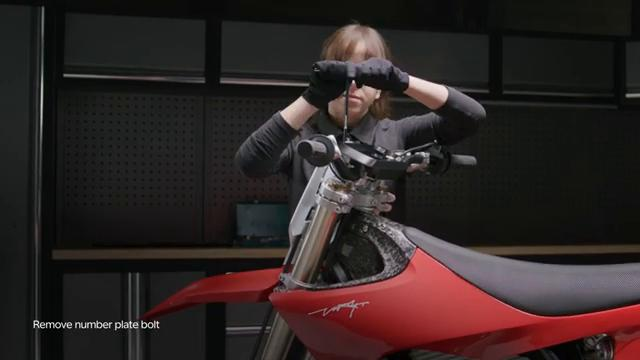

### 3. Remove bracket screws

Remove the bracket screws.

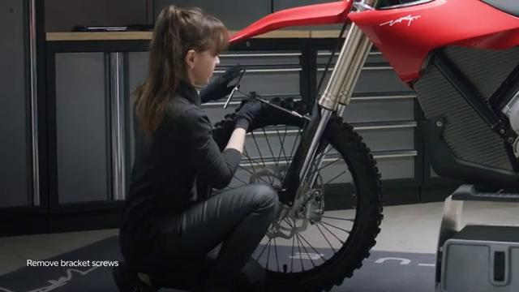

### 4. Remove brake line bracket

Remove the brake line bracket.

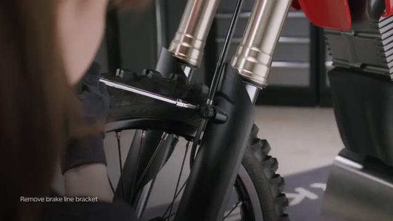

### 5. Remove caliper bolts

Remove the front brake caliper bolts.

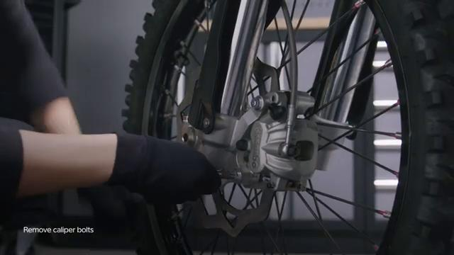

### 6. Remove junction box lid

Remove the junction box lid.

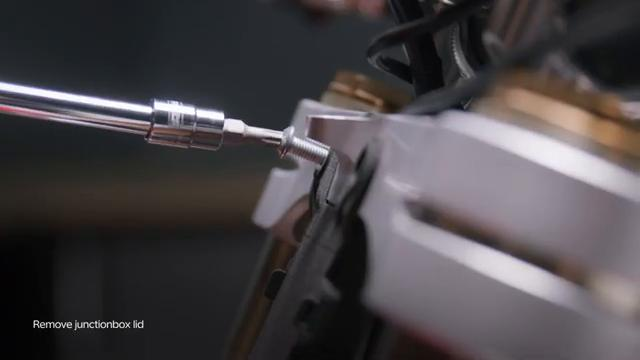

### 7. Disconnect the plugs

Disconnect the plugs from the junction box.

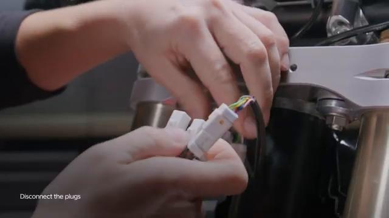

### 8. Take note of the handlebar angle before loosening docking station bolts

Note the handlebar angle before loosening the docking station bolts so it can be restored during assembly.

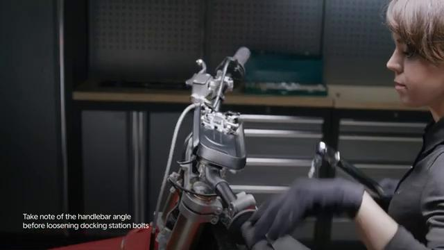

### 9. Remove docking station bolts

Remove the docking station bolts.

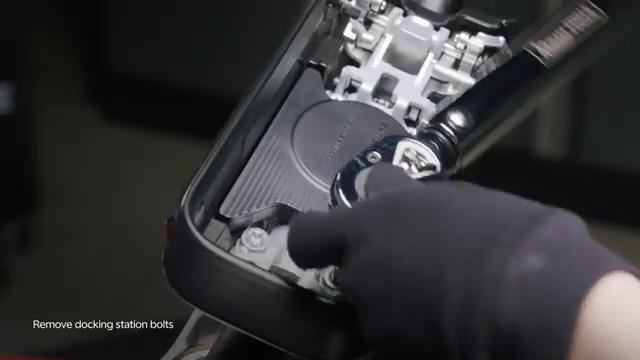

### 10. Remove handlebar

Remove the handlebar.

### 11. Remove fender bolts

Remove the front fender bolts.

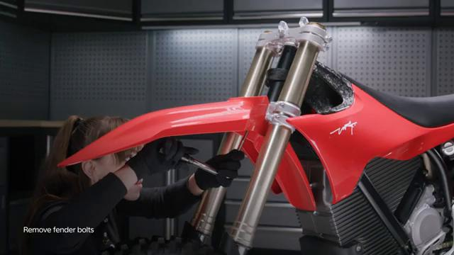

### 12. Loosen fork clamp bolts on the left fork

Loosen the fork clamp bolts on the left fork.

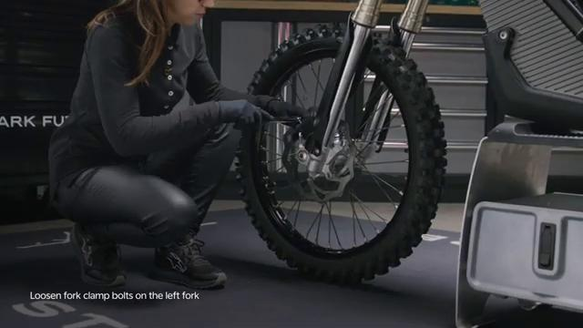

### 13. Loosen wheel axle lock nut

Loosen the wheel axle lock nut.

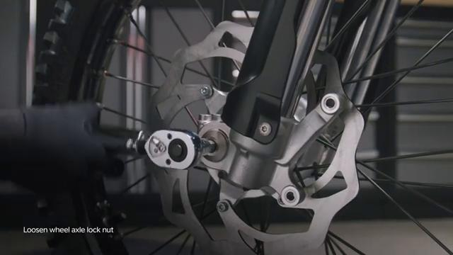

### 14. Loosen fork clamp bolts on the right fork

Loosen the fork clamp bolts on the right fork.

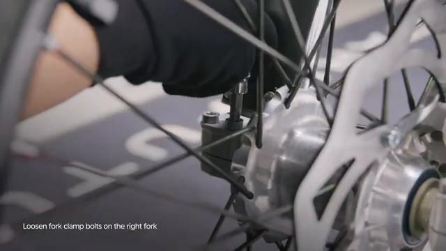

### 15. Remove axle lock nut

Remove the axle lock nut.

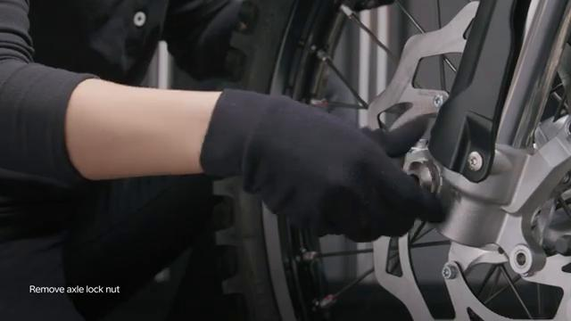

### 16. Lift the front of the bike and slide the wheel out between the forks

Lift the front of the bike to support the rear wheel on the floor, remove the axle, and slide the wheel out between the forks.

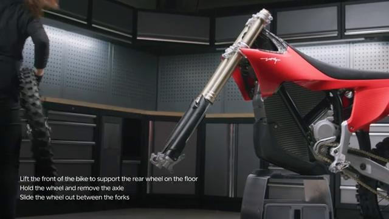

### 17. Hold the fork while loosening the last bolt

Hold the fork while loosening the last clamp bolt.

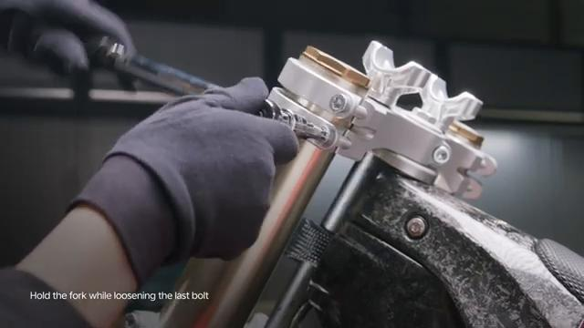

### 18. Loosen steering head clamp bolt

Loosen the steering head clamp bolt.

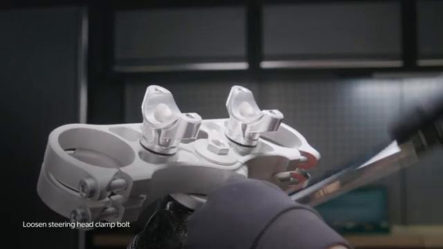

### 19. Loosen top lock nut but do not remove it completely

Loosen the top lock nut but do not remove it completely.

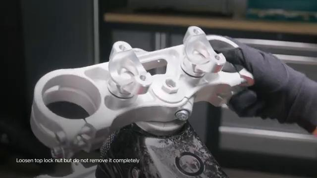

### 20. Remove the top triple clamp and slide the lower triple clamp downward

Hold the lower triple clamp, remove the lock nut, remove the top triple clamp upward, and slide the lower triple clamp downward.

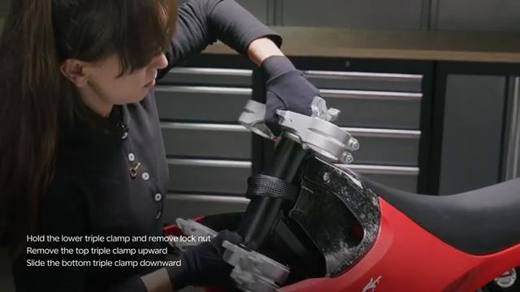

### 21. Remove the top cap, seal, and bearing

Remove the top cap, the seal, and the bearing.

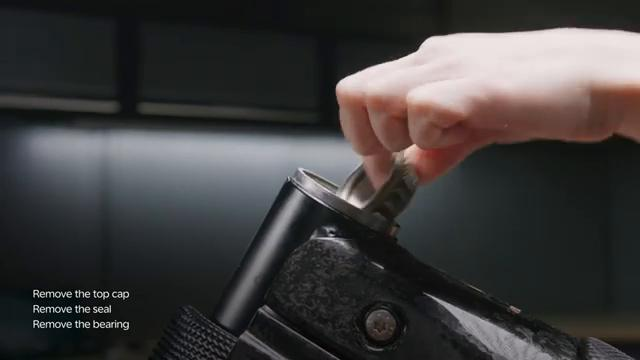

## Installation Procedure

### 22. Install bearing

Install the bearing.

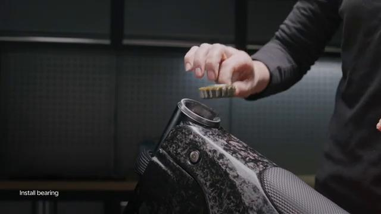

### 23. Install seal

Install the seal.

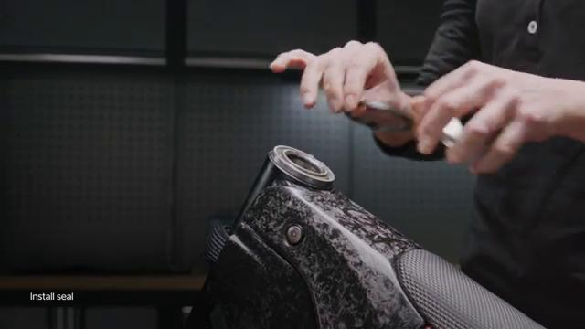

### 24. Install cap

Install the cap.

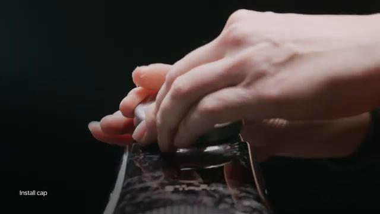

### 25. Insert top o-ring

Insert the top o-ring.

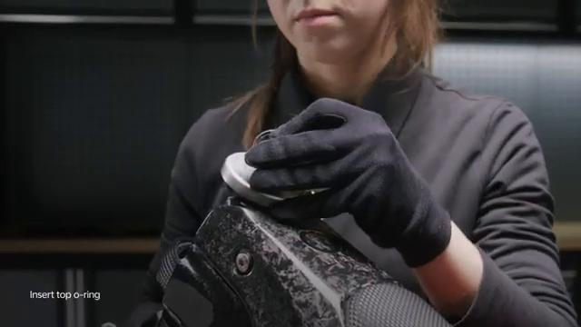

### 26. Install top triple clamp

Install the top triple clamp.

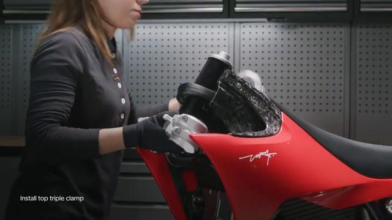

### 27. Hold the fork and tighten lower clamp bolts

Hold the fork and tighten the lower clamp bolts enough to support the fork. Final torque is applied in step 30.

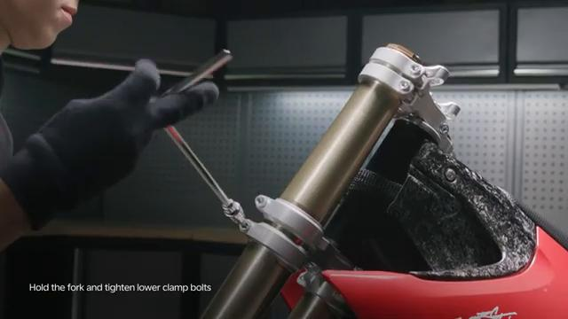

### 28. Ensure the fork holds in place before releasing it

Make sure the fork holds in place before releasing it.

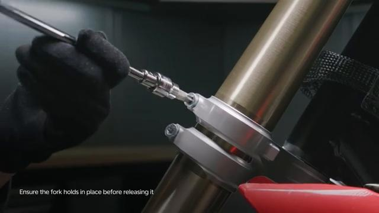

### 29. Tighten top lock nut to value engraved on the part

Tighten the top lock nut to the value engraved on the part.

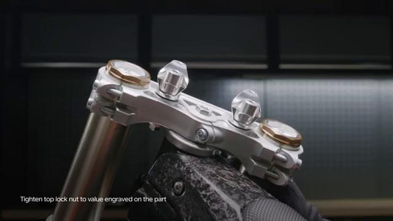

### 30. Tighten triple clamp bolts to value engraved on the part

Tighten the triple clamp bolts to the value engraved on the part.

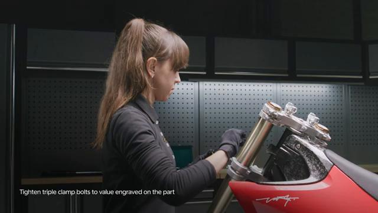

### 31. Tighten steering head clamp bolt to value engraved on the part

Tighten the steering head clamp bolt to the value engraved on the part.

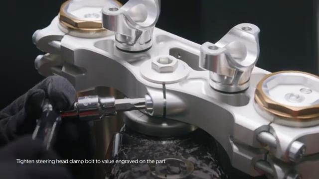

### 32. Insert the bolts in the docking station

Insert the bolts in the docking station.

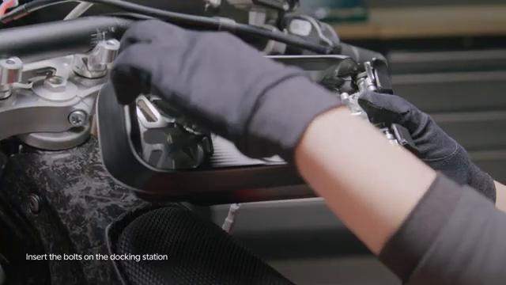

### 33. Tighten docking station bolts to 30 Nm

Tighten the docking station bolts to **30 Nm**.

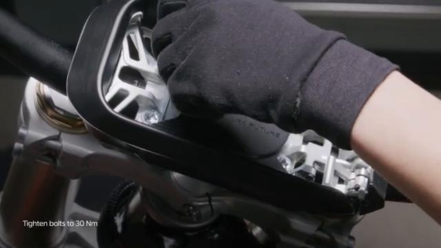

### 34. Connect the plugs

Connect the plugs.

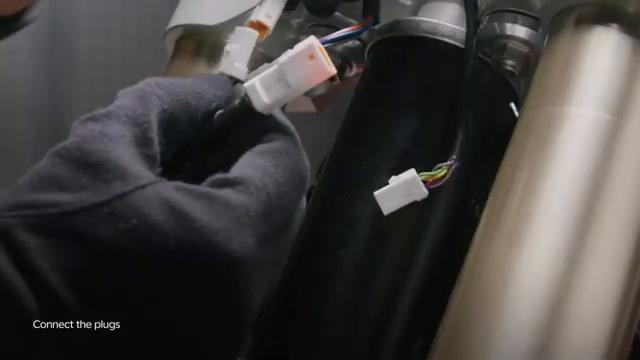

### 35. Clip connectors onto the junction box

Clip the connectors onto the junction box.

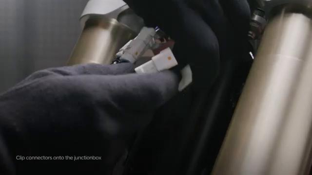

### 36. Tighten junction box bolts

Tighten the junction box bolts. The torque value is not shown in the video; verify the official Stark specification before final tightening.

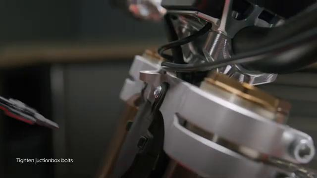

### 37. Install the fender between the forks

Install the fender between the forks.

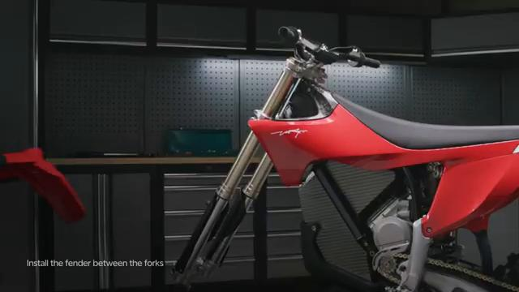

### 38. Hold the fender in place and install bolts

Hold the fender in place and install the bolts. Final torque is applied in step 39.

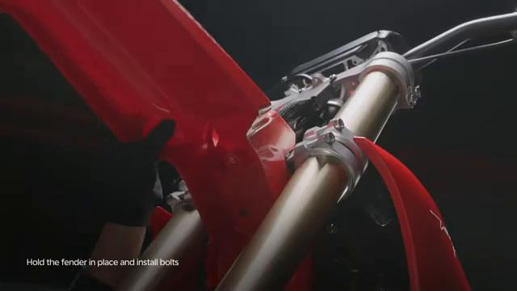

### 39. Tighten front fender bolts to 8 Nm

Tighten the front fender bolts to **8 Nm**.

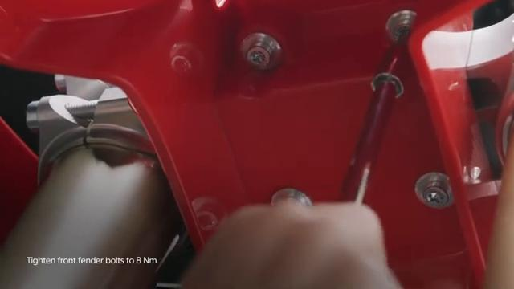

### 40. Wiggle the wheel and fork whilst pushing the axle inside

Wiggle the wheel and fork while pushing the axle inside.

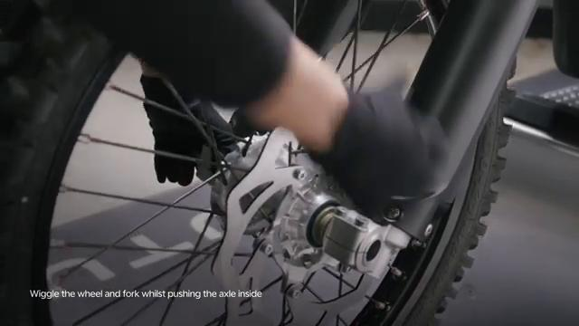

### 41. Ensure the front brake caliper holds in place before releasing it

Ensure the front brake caliper holds in place before releasing it.

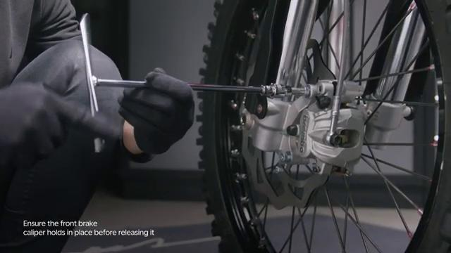

### 42. Tighten front brake caliper bolts to 25 Nm

Tighten the front brake caliper bolts to **25 Nm**.

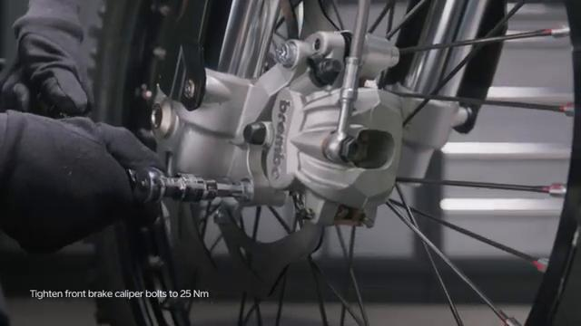

### 43. Install the bracket with the brake line inside

Install the bracket with the brake line inside.

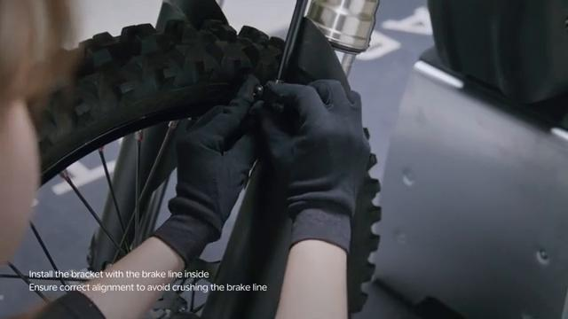

### 44. Ensure correct alignment to avoid crushing the brake line

Ensure correct alignment to avoid crushing the brake line.

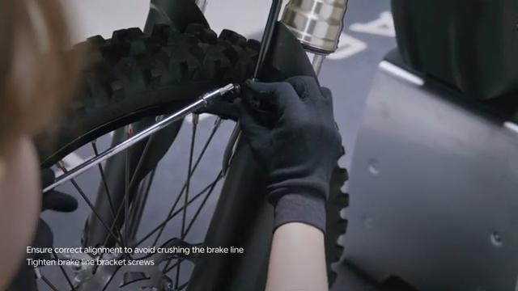

### 45. Tighten axle lock nut to 35 Nm

Tighten the axle lock nut to **35 Nm**.

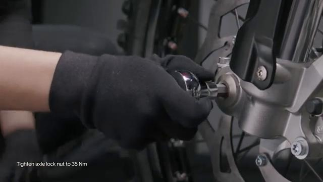

### 46. Loosen right fork clamp bolts

Loosen the right fork clamp bolts.

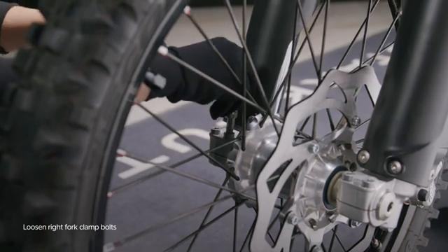

### 47. Tighten all fork clamp bolts to 15 Nm

Tighten all fork clamp bolts to **15 Nm**.

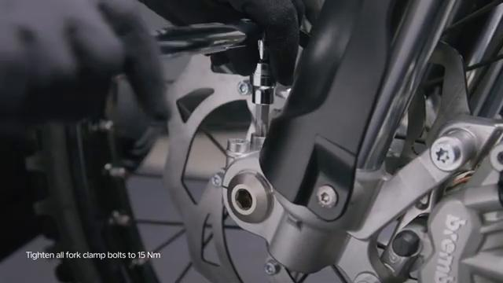

### 48. Tighten front number plate bolt to 8 Nm

Tighten the front number plate bolt to **8 Nm**.

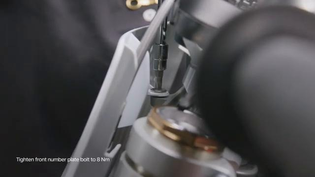

### 49. Insert phone in the docking station and lock it

Insert the phone in the docking station left side first, then lock it into place.

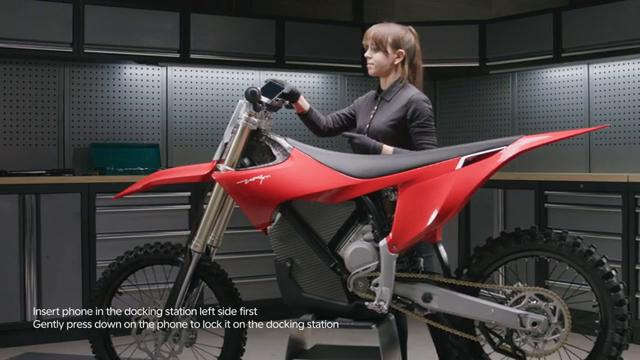

### 50. Check brake operation and ensure the phone is secure

Check brake operation before operating the bike and make sure the phone is secure in the docking station.

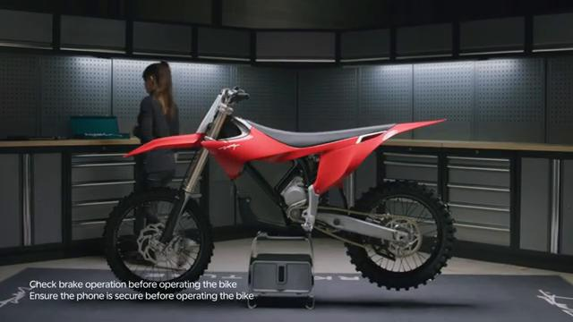

## Torque Summary

| Component | Torque |
| --- | ---: |
| Tighten docking station bolts | 30 Nm |
| Tighten front fender bolts | 8 Nm |
| Tighten front brake caliper bolts | 25 Nm |
| Tighten axle lock nut | 35 Nm |
| Tighten all fork clamp bolts | 15 Nm |
| Tighten front number plate bolt | 8 Nm |

Verified torque items:

- Tighten the top lock nut to the value engraved on the part from the original Stark Future tutorial video text overlay.
- Tighten the triple clamp bolts to the value engraved on the part from the original Stark Future tutorial video text overlay.
- Tighten the steering head clamp bolt to the value engraved on the part from the original Stark Future tutorial video text overlay.
- Tighten the docking station bolts: **30 Nm** from the original Stark Future tutorial video text overlay.
- Tighten the front fender bolts: **8 Nm** from the original Stark Future tutorial video text overlay.
- Tighten the front brake caliper bolts: **25 Nm** from the original Stark Future tutorial video text overlay.
- Tighten the axle lock nut: **35 Nm** from the original Stark Future tutorial video text overlay.
- Tighten all fork clamp bolts: **15 Nm** from the original Stark Future tutorial video text overlay.
- Tighten the front number plate bolt: **8 Nm** from the original Stark Future tutorial video text overlay.

## Critical Checks Before Riding

- Confirm the top steering bearing, clamps, handlebar, front wheel, brake components, and number plate are fully seated.
- Recheck all torque-critical hardware before riding.
- Make sure the brake line is routed correctly and not crushed in the bracket.
- Check brake operation and verify the phone is secure in the docking station before riding.
