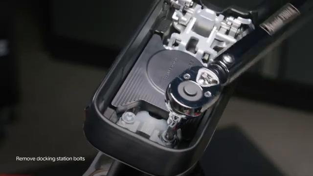
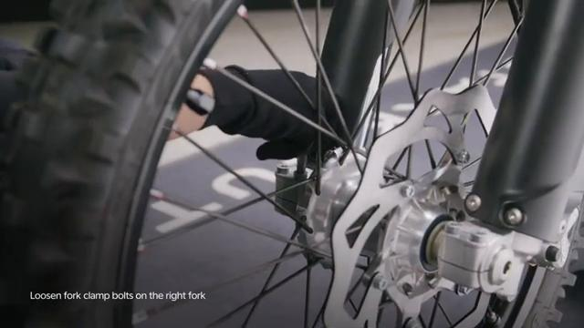
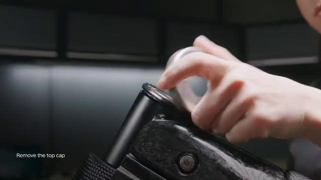
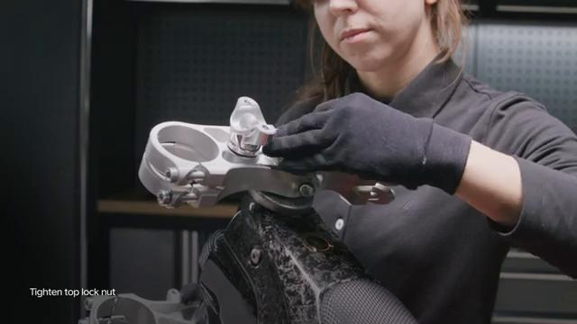
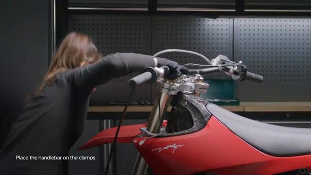
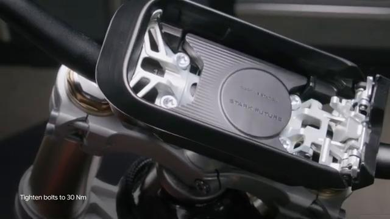
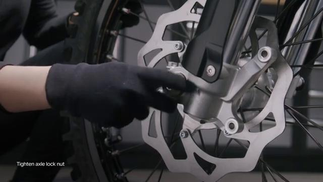
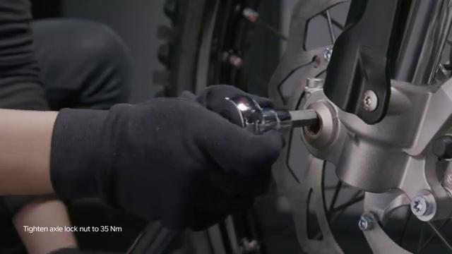

# Remove and Install Top Steering Bearing - Stark VARG

Source video: `Remove and Install Top Steering Bearing - Stark VARG` by Stark Future Official

Applicable models: `MX`

## Scope

This guide follows the same step-by-step workshop structure as the MX tutorials, but it is derived as a visual sequence from the official Stark Future ASMR video. Because the source video does not provide usable captions or narration, the procedure is documented through curated screenshots and concise action guidance.

## Preparation

- Place the bike on a stable stand or work area before starting the procedure.
- Prepare the correct tools for the fasteners, clips, brackets, and components shown in the video.
- Keep removed hardware organized in sequence so reassembly follows the same order as the video.
- Have a torque wrench ready for any tightening steps that specify a torque value.

## Removal Procedure

### 1. Prepare access to the Top Steering Bearing

Remove the surrounding hardware needed to expose the Top Steering Bearing and its clamping or axle points.

Keep the removed fasteners organized in sequence so reassembly matches the video.

### 2. Remove the visible retaining hardware for the Top Steering Bearing

Remove the visible Top Steering Bearing fasteners in the order shown and support the part as it comes free.

Support the component as the last fastener is removed.

### 3. Release any bracket, clip, or coupling attached to the Top Steering Bearing

Free any bracket, clip, spacer, linkage, or connector that still ties the Top Steering Bearing to the bike.

Note the orientation of these supporting pieces before setting them aside.

### 4. Remove the Top Steering Bearing from the bike

Slide the Top Steering Bearing free from the bike once the clamping hardware and support pieces are released.

Inspect the removed part and the mounting points before reassembly.

## Installation Procedure

### 5. Position the Top Steering Bearing for installation

Return the Top Steering Bearing to its mounting position and align the holes, tabs, or locating surfaces.

Hold the component in place until the first retaining hardware is started.

### 6. Reconnect or refit the support pieces for the Top Steering Bearing

Reinstall any bracket, clip, spacer, linkage, or coupling associated with the Top Steering Bearing.

Make sure each supporting piece is seated correctly before final tightening.

### 7. Install the retaining hardware for the Top Steering Bearing

Install the Top Steering Bearing retaining hardware by hand first and keep the part aligned as the hardware is tightened.

Check that the component remains aligned while the hardware is brought fully home.

### 8. Verify the completed installation of the Top Steering Bearing

Inspect the final position of the Top Steering Bearing and confirm that all hardware, clips, and surrounding parts are back in place.

Check the component for correct fit and movement before returning the bike to service.

## Critical Checks Before Riding

- Confirm the serviced component is fully seated and all fasteners are tightened in the correct order.
- Recheck all torque-critical hardware before riding.
- Make sure all routed cables, clips, brackets, and surrounding parts are returned to their original positions.
- Inspect the bike visually for any missing hardware before returning it to service.
