# Remove and Install VCU - Stark VARG

Source video: `Remove and Install VCU - Stark VARG` by Stark Future Official

Applicable models: `MX`

## Scope

This guide follows the original Stark Future video overlay sequence for the procedure shown in the original MX tutorial video. Each step below is aligned to the instruction text shown on screen.

## Preparation

- Place the bike on a stable stand or work area before starting the procedure.
- Prepare the correct tools for the fasteners, clips, brackets, and components shown in the video.
- Keep removed hardware organized in sequence so reassembly follows the same order as the video.
- Follow the torque values shown in the original Stark tutorial video wherever the video displays a torque on screen.

## Removal Procedure

### 1. Disconnect the handlebar controls

Disconnect the handlebar controls. Refer to: 06.030.07 Disconnect and reconnect handlebar controls ↗.

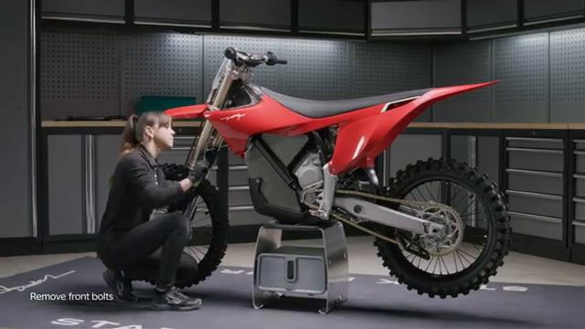

### 2. Remove the front fender

Remove the front fender. Refer to: 01.005.01 Remove and install front fender ↗.

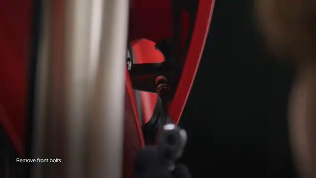

### 3. Remove the carbon fiber spoiler assembly

Remove the carbon fiber spoiler assembly. Refer to: 01.007.01 Remove and install carbon fiber spoiler assembly ↗. Please take all the necessary precautionary measures to handle high voltage components. High voltage components should only be handled by qualified personnel.

### 4. Disconnect the CAN BUS connector

Disconnect the CAN BUS connector.

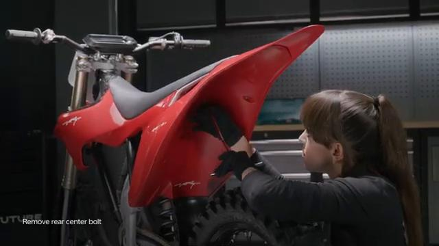

### 5. Install the protective cover onto the CAN BUS socket on the battery

Install the protective cover onto the CAN BUS socket on the battery.

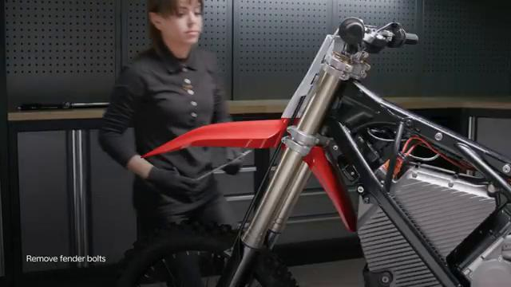

### 6. Disconnect the battery power plug

Disconnect the battery power plug.

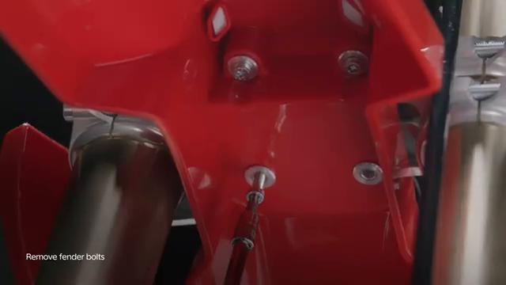

### 7. Install the protective cover onto the power socket on the battery

Install the protective cover onto the power socket on the battery.

### 8. Disconnect the main wiring harness VCU socket

Disconnect the main wiring harness VCU socket.

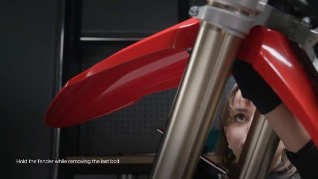

### 9. Untighten the VCU side bolts

Untighten the VCU side bolts.

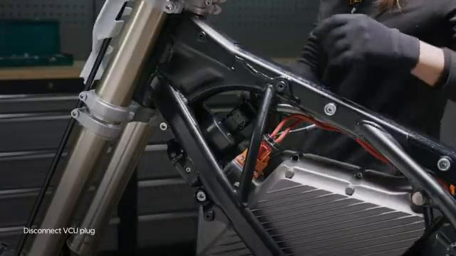

### 10. Untighten the VCU upper bolt

Untighten the VCU upper bolt.

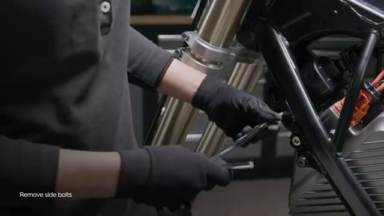

### 11. Remove VCU

Remove VCU.

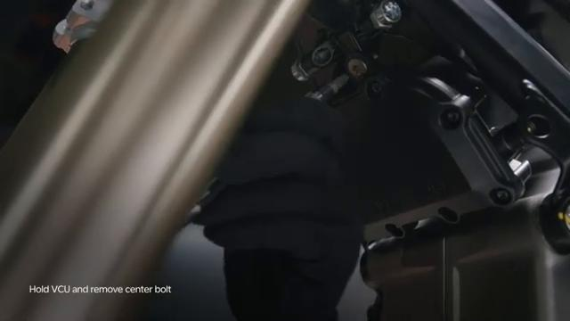

## Installation Procedure

### 12. Hold the VCU in place

Hold the VCU in place.

### 13. Tighten the VCU top bolt by hand until VCU is secured in place

Tighten the VCU top bolt by hand until VCU is secured in place.

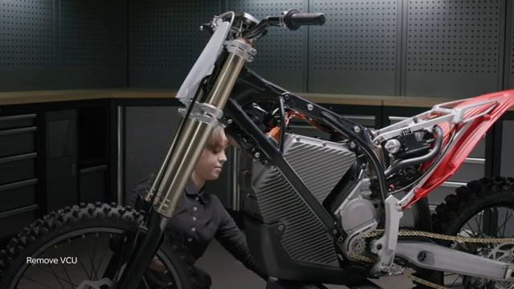

### 14. Tighten the VCU side bolts to 5 Nm

Tighten the VCU side bolts to 5 Nm.

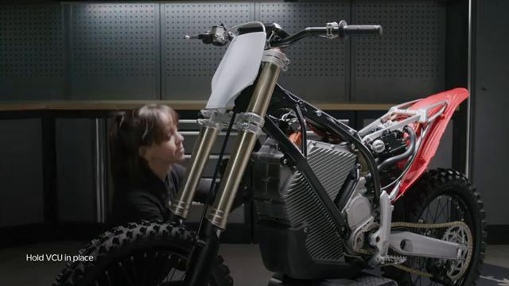

### 15. Tighten the VCU top bolt to 5 Nm

Tighten the VCU top bolt to 5 Nm.

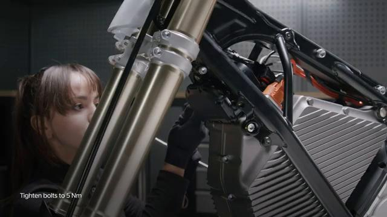

### 16. Connect the VCU socket

Connect the VCU socket. Please take all the necessary precautionary measures to handle high voltage components. High voltage components should only be handled by qualified personnel.

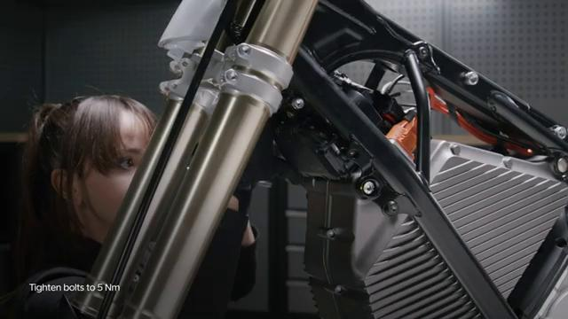

### 17. Remove the protective cover onto the power socket on the battery

Remove the protective cover onto the power socket on the battery.

### 18. Connect the battery power plug

Connect the battery power plug.

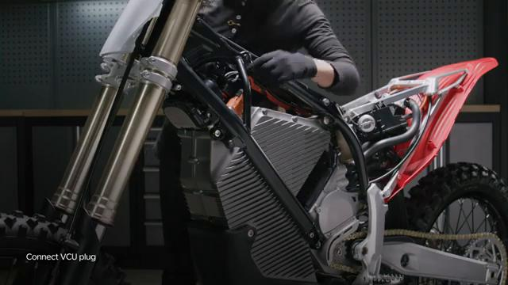

### 19. Remove the protective cover onto the CAN BUS socket on the battery

Remove the protective cover onto the CAN BUS socket on the battery.

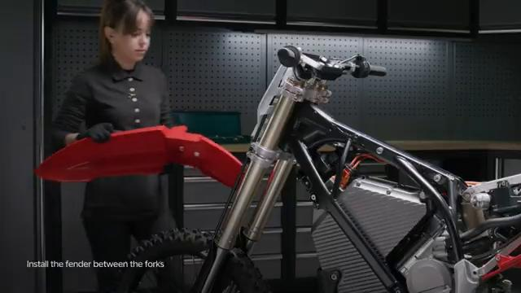

### 20. Connect the CAN BUS connector

Connect the CAN BUS connector.

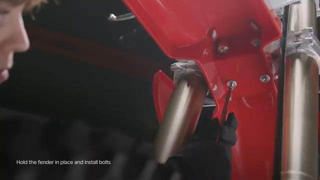

### 21. Install the carbon fiber spoiler assembly

Install the carbon fiber spoiler assembly. Refer to: 01.007.01 Remove and install carbon fiber spoiler assembly ↗.

### 22. Install the front fender

Install the front fender. Refer to: 01.005.01 Remove and install front fender ↗.

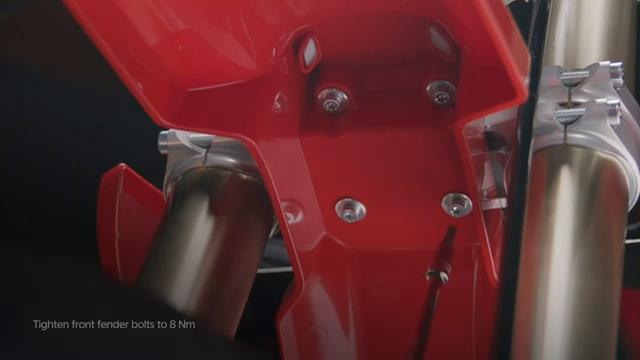

### 23. Reconnect the handlebar controls

Reconnect the handlebar controls. Refer to: 06.030.07 Disconnect and reconnect handlebar controls ↗. Turn ON the bike and connect to the Stark phone to check battery status and that the bike is operating normally after reconnecting electronic components.

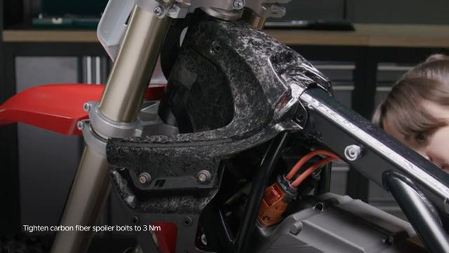

## Torque Summary

| Component | Torque |
| --- | ---: |
| Tighten the VCU side bolts | 5 Nm |
| Tighten the VCU top bolt | 5 Nm |

Verified torque items:

- Tighten the VCU side bolts: **5 Nm** from the original Stark Future tutorial video text overlay.
- Tighten the VCU top bolt: **5 Nm** from the original Stark Future tutorial video text overlay.

## Critical Checks Before Riding

- Confirm the serviced components are fully seated and all fasteners are tightened in the correct order.
- Recheck all torque-critical hardware before riding.
- Make sure all routed cables, clips, brackets, and surrounding parts are returned to their original positions.
- Inspect the bike visually for any missing hardware before returning it to service.
