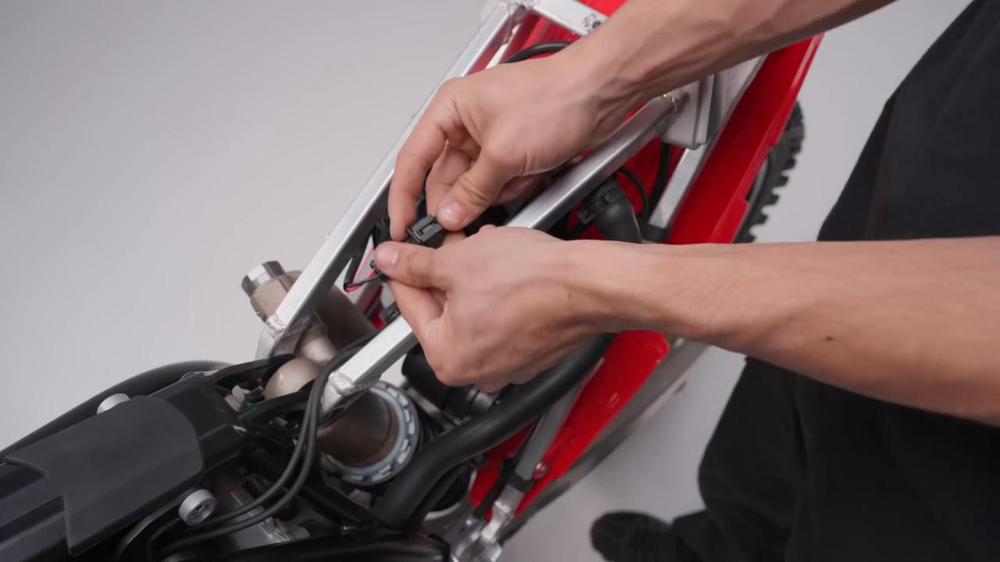
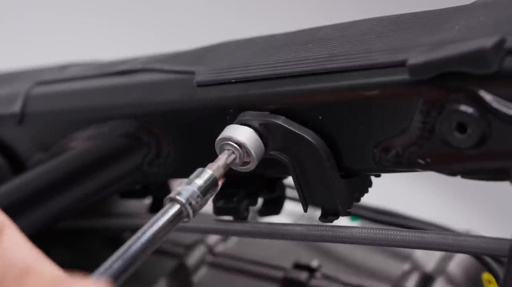
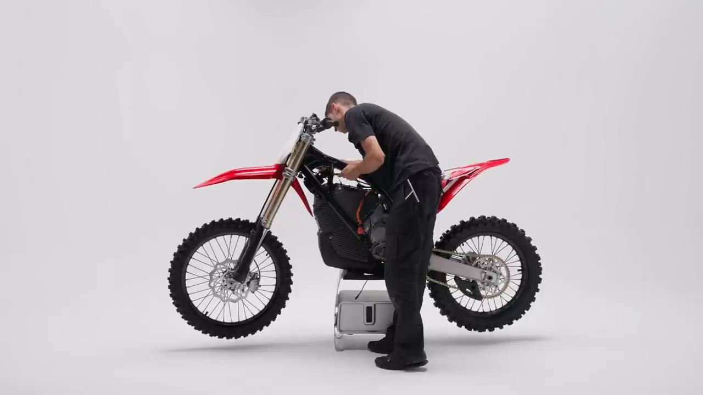
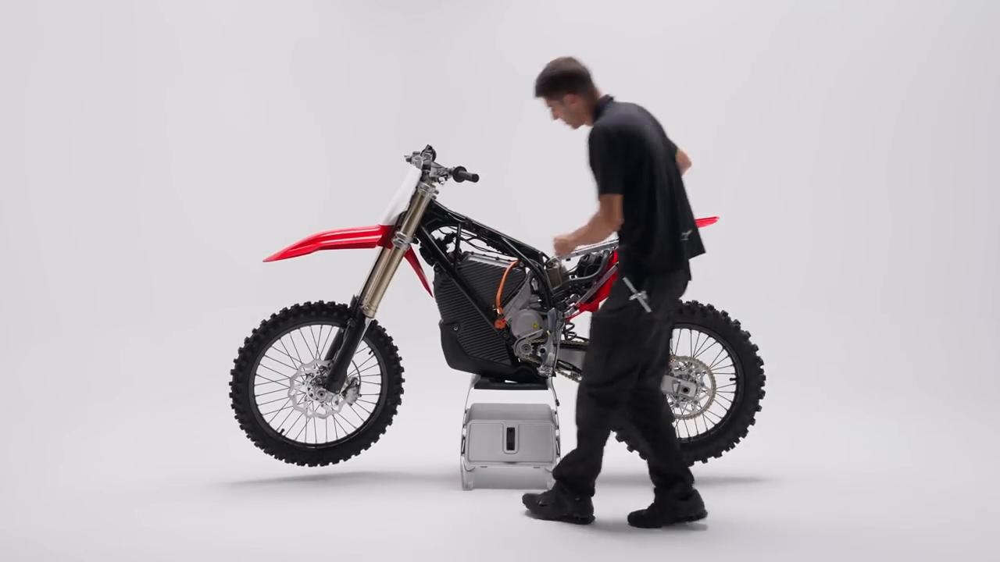
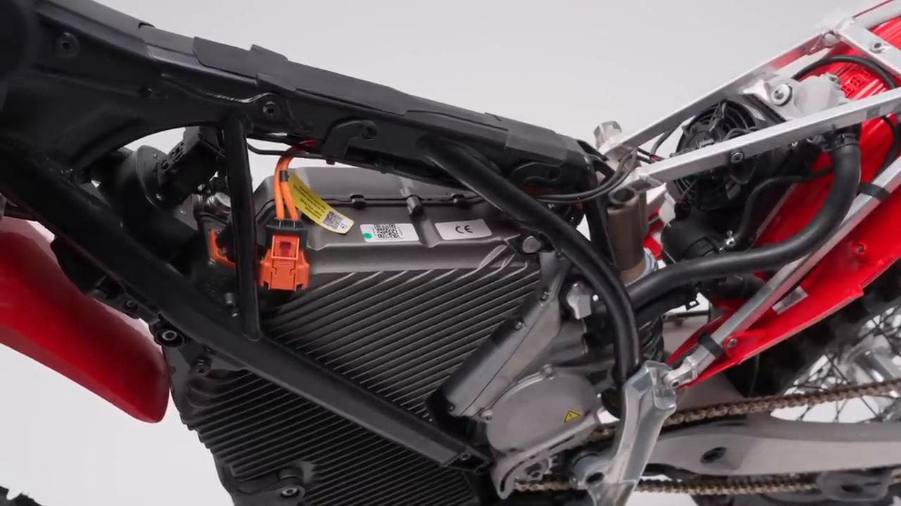
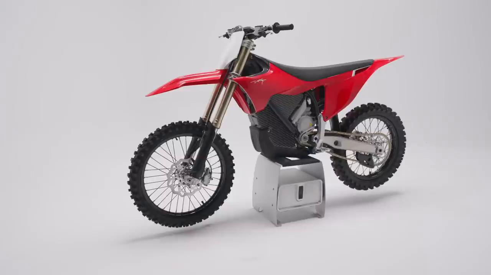

# Remove and Install Wiring Harness - Stark VARG MX 1.2

Source video: `Remove and Install Wiring Harness - Stark VARG MX 1.2` by Stark Future Official

## Scope

This guide is a visual step sequence derived directly from the official Stark Future ASMR tutorial video. The official video does not expose usable captions, so this version documents the procedure through curated screenshots and concise action guidance.

## Preparation

- Place the bike on a stable stand or work area before starting the procedure.
- Prepare the correct tools for the fasteners, clips, brackets, and components shown in the video.
- Keep removed hardware organized in sequence so reassembly follows the same order as the video.
- Have a torque wrench ready for any tightening steps that specify a torque value.

## Removal Procedure

### 1. Prepare access to the Wiring Harness

Prepare access to the Wiring Harness.

### 2. Remove the visible retaining hardware for the Wiring Harness

Remove the visible retaining hardware for the Wiring Harness.

### 3. Release the Wiring Harness from its mounting position

Release the Wiring Harness from its mounting position.

### 4. Disconnect or free any related clip, bracket, or connector

Disconnect or free any related clip, bracket, or connector.

## Installation Procedure

### 5. Position the Wiring Harness for reinstallation

Position the Wiring Harness for reinstallation.

### 6. Reinstall the hardware and verify alignment

Reinstall the hardware and verify alignment.

## Critical Checks Before Riding

- Confirm the serviced component is fully seated and all fasteners are tightened in the correct order.
- Recheck all torque-critical hardware before riding.
- Make sure all routed cables, clips, brackets, and surrounding parts are returned to their original positions.
- Inspect the bike visually for any missing hardware before returning it to service.
